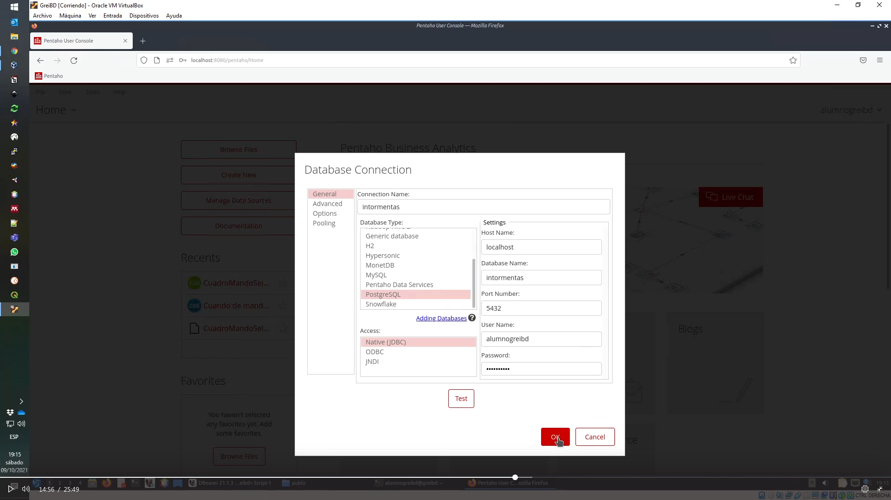

#### [Video tutorial]()
En la maquina virtual 
## 1 lanzamos el servidor pentaho

    ./pentaho/pentaho-server/start-pentaho.sh                                                                                                                                                                                                    
    ./pentaho/pentaho-server/start-pentaho.sh: 59: cd: can't cd to ./pentaho/pentaho-server                                                                                                                                                                             
    DEBUG: Using PENTAHO_JAVA_HOME                                                                                                                                                                                                                                      
    DEBUG: _PENTAHO_JAVA_HOME=/home/alumnogreibd/pentaho/jdk1.8.0_202                                                                                                                                                                                                   
    DEBUG: _PENTAHO_JAVA=/home/alumnogreibd/pentaho/jdk1.8.0_202/bin/java                                                                                                                                                                                               
    Using CATALINA_BASE:   /home/alumnogreibd/pentaho/pentaho-server/tomcat                                                                                                                                                                                             
    Using CATALINA_HOME:   /home/alumnogreibd/pentaho/pentaho-server/tomcat                                                                                                                                                                                             
    Using CATALINA_TMPDIR: /home/alumnogreibd/pentaho/pentaho-server/tomcat/temp                                                                                                                                                                                        
    Using JRE_HOME:        /usr                                                                                                                                                                                                                                         
    Using CLASSPATH:       /home/alumnogreibd/pentaho/pentaho-server/tomcat/bin/bootstrap.jar:/home/alumnogreibd/pentaho/pentaho-server/tomcat/bin/tomcat-juli.jar                                                                                                      
    Tomcat started.                                                                                                                                                  

## 2
    abrir dbeaver-cd
    crear una tabla vamos a tener viento maximo viento medio tiempo por mes año y vais

    dimension geografica pais/region temporal  ano/mes
    CREATE TABLE tormentas (
	ano int,
	mes int,
	pais varchar,
	region varchar,
	viento_max real,
	viento_medio real,
	tormentas int,
	primary key (ano, mes, pais, region)
    );

    luego cargamos los datos 
    copy tormentas from '/home/alumnogreibd/public/tormentas.csv' with csv;
    para visualizar los datos

    select * from tormentas
## 3 abrimos en el buscador 
    http://localhost:8080/pentaho/Login

    Usuario: alumnogreibd

    Contraseña: greibd2021
    
## 4  cargamos los datso en pentaho
    
#### generamos intormetas link con intormentas

<kbd>
  <a href="../images/praticese_1_1.png" target="_blank">
</kbd>
    

#### generamos datos tormentas1 que viene de la tabala de de datos de tormentas.csv

<kbd>
  <a href="../images/praticese_1_2.png" target="_blank">
</kbd>

Luego le damos a visualizar o a finish (si le damos a finish deberia dar un error)
