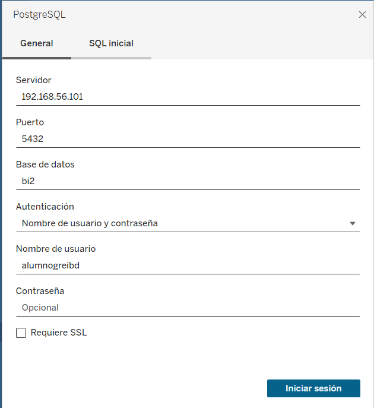

Para conesctarse en Tableu  hay que crear una red local en el virtual box con esto nos permite encontrar nuestra base de datos

luego podmos proceder a selecionar la relación entre los datos de tableu