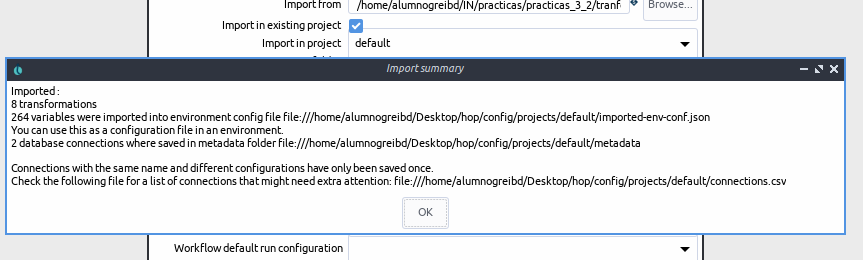
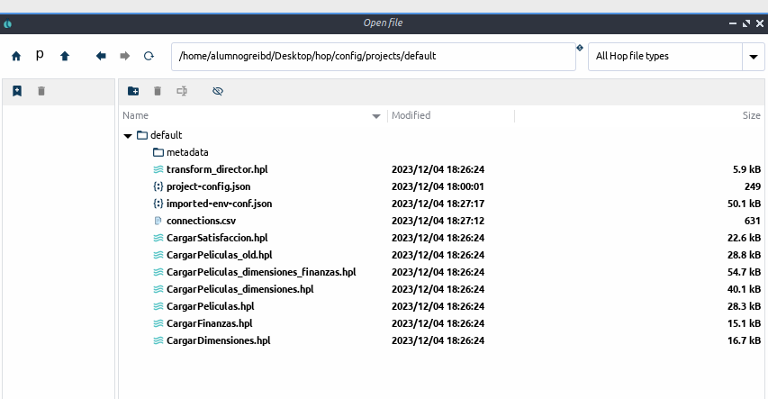
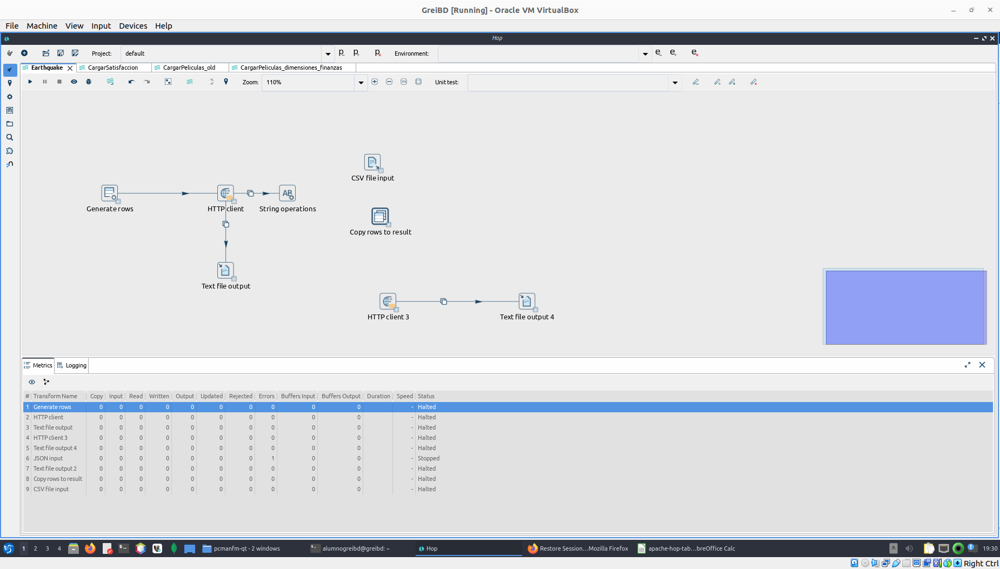

## Importar desde kittle

Se puede observar que se importo con exito:

Se puede observar funciona correctamete y conecta con la base de datos correctamente:

## earthquakes

url 

https://earthquake.usgs.gov/fdsnws/event/1/query?format=csv&starttime=2023-12-03&endtime=2023-12-04&minmagnitude=5

dandonos esta valores 

time,latitude,longitude,depth,mag,magType,nst,gap,dmin,rms,net,id,updated,place,type,horizontalError,depthError,magError,magNst,status,locationSource,magSource
2023-12-03T23:25:12.776Z,8.4198,126.783,62.474,5.1,mb,94,84,1.795,0.84,us,us7000lg0a,2023-12-04T00:32:05.306Z,"Mindanao, Philippines",earthquake,9.71,6.

ul
https://api.open-meteo.com/forecast?latitude=1¬longitude=1&daily=temperature_2m_min

result
{"type":"FeatureCollection","metadata":{"generated":1701713857000,"url":"https://earthquake.usgs.gov/fdsnws/event/1/query?format=geojson&starttime=2023-12-03&endtime=2023-12-04&minmagnitude=5","title":"USGS Earthquakes","status":200,"api":"1.14.0","count":26},"features":[{"type":"Feature","properties":{"mag":5.1,"place":"Mindanao, Philippines","time":1701645912776,"updated":1701649925306,"tz":null,"url":"https://earthquake.usgs.gov/earthquakes/eventpage/us7000lg0a","detail":"https://earthquake.usgs.gov/fdsnws/event/1/query?eventid=us7000lg0a&format=geojson","felt":1,"cdi":2,"mmi":null,"alert":null,"status":"reviewed","tsunami":0,"sig":400,"net":"us","code":"7000lg0a","ids":",us7000lg0a,","sources":",us,","types":",dyfi,origin,phase-data,","nst":94,"dmin":1.795,"rms":0.84,"gap":84,"magType":"mb","type":"earthquake","title":"M 5.1 - Mindanao, Philippines"},"geometry":{"type":"Point","coordinates":[126.783,8.4198,62.474]},"id":"us7000lg0a"},

no se llego a terminar pero seria tratar la cadena de caracteres para poder obtener los valores del csv luego generar una tabla quef contenga los valores de las url con al id de latitud y longitud de tal manera que este enlazado y si intentar poder obtener todo 