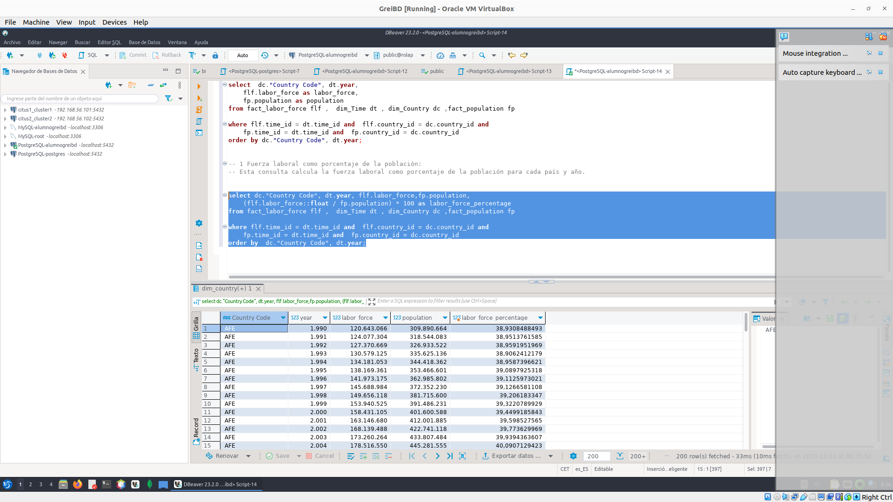
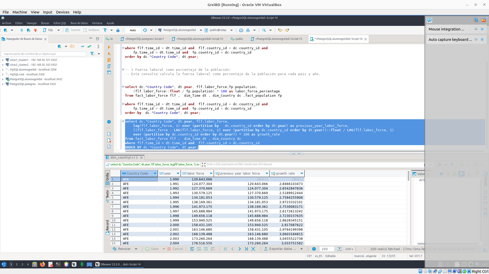
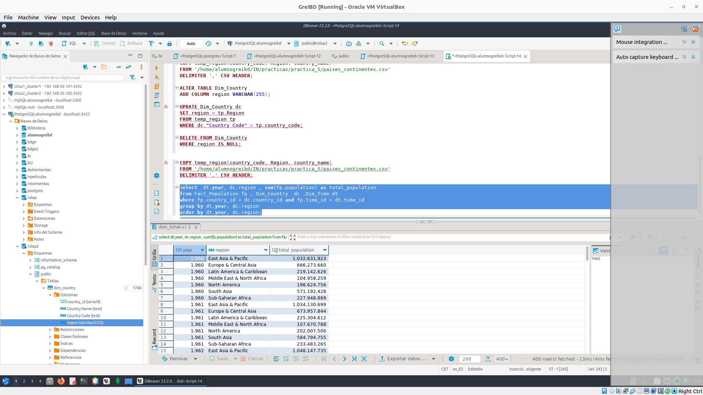

### OLAP cina


1. Análisis de Ingresos y Costos Totales por Año y por Mes (Usando ROLLUP)

Obtener los ingresos y costos totales por año y por mes para todas las productoras.

**MOTIVACIÓN**
Esta consulta es crucial para analizar cómo varían los ingresos y los costos de una productora a lo largo del tiempo, tanto anual como mensualmente. Ayuda a identificar tendencias y periodos de mayor rentabilidad o gasto.


```sql

select p.nombre as productora, t.ano as ano, t.mes as mes, 
       SUM(ingresos) as ingresos_totales, SUM(coste) as costos_totales
from finanzas f, productoras p, tiempo t 
where f.productora = p.id and f.tiempo = t.id 
group by rollup (p.nombre, t.ano, t.mes)
order by productora, ano, mes;
```


2. Comparación de Beneficios Totales y Promedio por director (Usando CUBE)


Comparar los beneficios totales y promedio de cada director por año.

**MOTIVACIÓN**
Esta consulta permite a los directores ver cómo se comparan en términos de beneficios totales y promedio, lo que es útil para evaluar el rendimiento y la eficiencia en diferentes años.

```sql

select d.nombre as director, t.ano as ano, 
       SUM(ingresos - coste) as beneficio_total,
       AVG(ingresos - coste) as beneficio_promedio
from finanzas f, director d, tiempo t 
where f.director = d.id and f.tiempo = t.id 
group by  cube (d.nombre, t.ano)
order by director, ano;

```

3. calcular el porcentaje que representa el beneficio de cada director en relación con el beneficio total de todas las productoras, en lugar de solo las productoras 'Walt Disney Pictures' y 'New Line Cinema' entre 2010 y 2016 (Usando funciones de ventana)

```sql
create view beneficio_director_actualizado as
select p.nombre as productora, d.nombre as director,
 t.ano as año, sum(f.ingresos - f.coste) as beneficios
from   director  d, productora  p, finanzas  f, tiempo  t
where d.id = f.director and p.id = f.productora
 and f.tiempo = t.id and t.ano between 2010 and 2016
group by d.nombre, p.nombre, t.ano;

select *, (beneficios / SUM(beneficios) over ()) * 100 as porcentaje_beneficio_director
from beneficio_director_actualizado
order by productora, año, director;
```

3. calcular el porcentaje que representa el beneficio de cada director en relación con el beneficio total de todas las productoras, en lugar de solo las productoras 'Walt Disney Pictures' y 'New Line Cinema' entre 2010 y 2016 (Usando funciones de ventana).

**MOTIVACIÓN**

Esta consulta ayuda a identificar la contribución de cada director a los beneficios totales en la industria en los ultimos 6 años , proporcionando una perspectiva actualizada sobre su impacto en el mercado. Al enfocarse en un rango de años recientes, permite a las productoras evaluar el rendimiento y el atractivo comercial de los directores, lo cual es clave para planificar colaboraciones y proyectos futuros, en un entorno cinematográfico que cambia rápidamente.

```sql
create view beneficio_director_actualizado as
select p.nombre as productora, d.nombre as director,
 t.ano as año, sum(f.ingresos - f.coste) as beneficios
from   director  d, productora  p, finanzas  f, tiempo  t
where d.id = f.director and p.id = f.productora
 and f.tiempo = t.id and t.ano between 2010 and 2016
group by d.nombre, p.nombre, t.ano;

select *, (beneficios / SUM(beneficios) over ()) * 100 as porcentaje_beneficio_director
from beneficio_director_actualizado
order by productora, año, director;
```


4. Comparación de Satisfacción de Usuarios por Productora y Director a lo Largo del Tiempo

**MOTIVACIÓN**

Esta consulta permite  comprender cómo el público recibe las películas de diferentes directores y productoras a lo largo de los años, lo que puede informar decisiones sobre futuras producciones y colaboraciones.

```sql

select  p.nombre as productora,  d.nombre as director, 
    t.ano as año, avg(s.satisfaccion) as satisfaccion_media
from satisfaccion_usuarios s, director d ,  productora p , tiempo t 

where  s.director = d.id and s.productora = p.id and 
    s.tiempo_votacion = t.id
group by cube(p.nombre, d.nombre, t.ano)
having p.nombre is not null and d.nombre is not null and t.ano is not null
order by productora, director, año;

```

5. Obtener votos recibidos por películas de diferentes productoras, mes a mes y año a año, incluyendo varias mediciones y comparaciones útiles.

**MOTIVACIÓN**

esta consulta permite comprender la evolución de la popularidad y el interés del público en sus películas. Al analizar cómo cambian los votos a lo largo del tiempo, las productoras pueden identificar tendencias, temporadas de éxito y períodos de menor atracción.

```sql
select productora, t.ano, t.mes, s.votos,
    s.votos / lag(s.votos, 1, null) over (partition by productora order by  t.ano, t.mes) as ratio_incremento_satisfaccion,
    first_value(s.votos) over (partition by productora, t.ano order by s.votos desc) as mejor_valoracion_por_ano,
    first_value(s.votos) over (partition by productora, t.ano order by s.votos asc) as peor_valoracion_por_ano,
    rank() over (order by s.votos desc) as ranking_total,
    rank() over (partition by productora order by s.votos desc) as ranking_productora
from satisfaccion_usuarios s ,director d , productora p ,tiempo t
where s.director = d.id and s.productora = p.id and s.tiempo_votacion = t.id
group by rollup(productora, t.ano, t.mes , s.votos)
having s.productora is not null and t.ano is not null and  t.mes is not null  and 
s.votos is not null 
order by productora, t.ano, t.mes;


```
### What is the difference with previous ROLLUP query??

Población Total por País y Subtotales Anuales:
Esta consulta calcula la población total de cada país por año y también proporciona subtotales por cada año. La función ROLLUP se usa para generar subtotales junto con los totales principales, lo cual es útil para un resumen jerárquico de los datos.

Población Total con CUBE:
Esta consulta es similar a la anterior, pero utiliza CUBE en lugar de ROLLUP. CUBE genera subtotales para todas las combinaciones posibles de las columnas agrupadas (en este caso, país y año), así como un total general. La función COALESCE se usa para reemplazar los valores nulos con una etiqueta significativa. Esta consulta es más completa en términos de resumen en comparación con la consulta ROLLUP.

Diferencia Entre ROLLUP y CUBE:
La principal diferencia entre los dos está en el nivel de detalle en el resumen. ROLLUP crea una jerarquía de subtotales desde el más detallado al menos, mientras que CUBE proporciona subtotales para todas las combinaciones posibles de las columnas agrupadas.

## Exercises

### E1- Choose and apply an alternative method to insert the CSV file into PostgreSQL dimension and fact tables.

Se pude usar una ETL para que cargar los datos se adjunta 


### E2- Add another fact and propose a couple of analytical queries. Show the results.

```bash

gawk -F',' -v FPAT='([^,]*)|("[^"]+")' -v OFS=, '{split($2,a,"\""); printf "%s,%s\n", $1, a[2]}' API_SL.TLF.TOTL.IN_DS2_en_csv_v2_5996631.csv > input.csv

```

usar el  force.py  para tranformar los datos 


```sql
-- creamos las tablas 
CREATE TABLE Fact_labor_force(
country_id INT REFERENCES
Dim_Country(country_id),
time_id INT REFERENCES
Dim_Time(time_id),
labor_force BIGINT,
PRIMARY KEY (country_id, time_id) );

-- the fact table (this staging table contains the labor_force but could also be used 
-- as input to country dimension earlier)
CREATE TABLE staging_labor_force (
"Country Name" TEXT,
"Country Code" TEXT,
year INTEGER, labor_force BIGINT );


-- rellenamos las tablas 

COPY staging_labor_force("Country Name", "Country Code", year, labor_force) 
FROM '/home/alumnogreibd/IN/practicas/practica_5/Labor_force_transformed.csv' DELIMITER ',' CSV HEADER;


INSERT INTO Fact_labor_force (country_id, time_id, population)
SELECT DISTINCT c.country_id, y.time_id, s.population
FROM staging_labor_force s 
JOIN dim_country c ON c."Country Code" = CONCAT(' ',s."Country Code")
JOIN dim_time y ON y.year = s.year
WHERE NOT EXISTS (
    SELECT 1 FROM Fact_population fp
    WHERE fp.country_id = c.country_id AND fp.time_id = y.time_id
);

-- hacemos una query para comprobar

select  dc."Country Code", dt.year,
    flf.labor_force as labor_force,
    fp.population as population
from fact_labor_force flf ,  dim_Time dt , dim_Country dc ,fact_population fp
    
where flf.time_id = dt.time_id and  flf.country_id = dc.country_id and
    fp.time_id = dt.time_id and  fp.country_id = dc.country_id
order by dc."Country Code", dt.year;
```
```sql

-- fuerza laboral como porcentaje de la población: 
-- Esta consulta calcula la fuerza laboral como porcentaje de la población para cada país y año.


select dc."Country Code", dt.year, flf.labor_force,fp.population,
    (flf.labor_force::float / fp.population) * 100 as labor_force_percentage
from fact_labor_force flf ,  dim_Time dt , dim_Country dc ,fact_population fp
    
where flf.time_id = dt.time_id and  flf.country_id = dc.country_id and
    fp.time_id = dt.time_id and  fp.country_id = dc.country_id
order by  dc."Country Code", dt.year;
```



```sql
--Crecimiento interanual de la fuerza laboral: 
--Esta consulta calcula la tasa de crecimiento interanual de la fuerza laboral de cada país.
select dc."Country Code", dt.year, flf.labor_force,
    lag(flf.labor_force, 1) over (partition by   dc.country_id order by dt.year) as previous_year_labor_force,
    ((flf.labor_force - LAG(flf.labor_force, 1) over (partition by dc.country_id order by dt.year))::float / LAG(flf.labor_force, 1) 
    over (partition by dc.country_id order by dt.year)) * 100 as growth_rate
from fact_labor_force flf ,  dim_Time dt , dim_Country dc 
where flf.time_id = dt.time_id and  flf.country_id = dc.country_id 
ORDER BY dc."Country Code", dt.year;

```




### E3- We are only interested in data from real countries. What would you change to make it possible?

1. Filtrado en las Consultas SQL

Puedes incluir condiciones en tus consultas SQL para excluir datos que no pertenezcan a países reales. Esto se puede hacer verificando el nombre del país o utilizando un identificador específico que distinga a los países reales de otros tipos de entidades (como regiones o agrupaciones económicas).

Ejemplo de Consulta SQL con Filtrado:

```sql

SELECT * FROM Fact_Population AS fp
JOIN Dim_Country AS dc ON fp.country_id = dc.country_id
WHERE dc."Country Name" NOT IN ('Mundo', 'Unión Europea', 'África', etc.);
```

**NOTA** Se puede manténe una lista actualizada de países reconocidos internacionalmente (por ejemplo, los miembros de la ONU) y úsala para filtrar tus datos. Esto puede implicar la creación de una tabla adicional en tu base de datos que contenga solo los nombres o códigos de los países reconocidos. Y Si es posible, integra tu base de datos con fuentes de datos externas confiables que ya tengan esta distinción hecha. Por ejemplo, podrías utilizar APIs o bases de datos públicas que proporcionen información actualizada y verificada sobre países.


2. Limpieza y Preparación de Datos

Antes de cargar los datos en tu base de datos, realiza una limpieza y preparación de los mismos. Esto puede incluir la eliminación o marcado de registros que no correspondan a países reales.

3. Estructura de la Base de Datos

Modifica la estructura de tu base de datos para incluir un campo que indique si un registro pertenece a un país real o no. Por ejemplo, puedes agregar una columna is_real_country en tu tabla Dim_Country.

Ejemplo de Modificación de la Tabla:

```sql

ALTER TABLE Dim_Country
ADD COLUMN region VARCHAR(255);

```

Luego, actualiza esta columna según corresponda y utiliza este campo en tus consultas para filtrar los datos. con la consulta de abajo 
nos permite saber cuales son los paises reales

### E4- I want the annual population by continent. How would you do it?


Paso 1: Modificar la Estructura de la Base de Datos

Antes de eso usamos el generate_paises_continetes.py para poder tratar los datos de entrada 

1. Agregar una Columna de Continente en Dim_Country:
2. Añade una nueva columna en tu tabla Dim_Country que indique el continente de cada país.

```sql

CREATE TEMPORARY TABLE temp_region(
    country_code VARCHAR(255),
    Region VARCHAR(255),
    country_name VARCHAR(255)
);

COPY temp_region(country_code, Region, country_name)
FROM '/home/alumnogreibd/IN/practicas/practica_5/paises_continentes.csv'
DELIMITER ',' CSV HEADER;

ALTER TABLE Dim_Country
ADD COLUMN region VARCHAR(255);

UPDATE Dim_Country dc
SET region = tp.Region
FROM temp_region tp
WHERE dc."Country Code" = tp.country_code;

DELETE FROM Dim_Country
WHERE region IS NULL;

```
Después de añadir esta columna, tendrás que actualizar cada fila con el continente correspondiente.

Paso 2: Consultas SQL para la Población por Continente

Esta consulta suma la población de todos los países por continente y año, agrupando los datos primero por año y luego por continente.

```sql
select  dt.year, dc.region , sum(fp.population) as total_population
from Fact_Population fp , Dim_Country  dc ,Dim_Time dt
where fp.country_id = dc.country_id and fp.time_id = dt.time_id
group by dt.year, dc.region
order by dt.year, dc.region;
```


