#### Tarea 1: Añadir al cluster un servidor de Backup y un TimeLineServer

##### 1.1 Servidor de Backup

El servidor de backup realiza una tarea doble:

    Mantiene una copia de seguridad permanentemente actualizada de los metadatos del NameNode
    Realiza tareas de Checkpoint sobre estos metadatos.

Más información sobre este servicio en [link](https://hadoop.apache.org/docs/stable3/hadoop-project-dist/hadoop-hdfs/HdfsUserGuide.html#Backup_Node)

**Importante: Antes de iniciar el servicio de backup inicia el cluster, ve al NameNode y obten una captura de pantalla el la que se vean los ficheros del directorio de metadatos del NameNode (dentro de current).**
 

<kbd>
  <a href="./images/metadatos_namenode.png" target="_blank">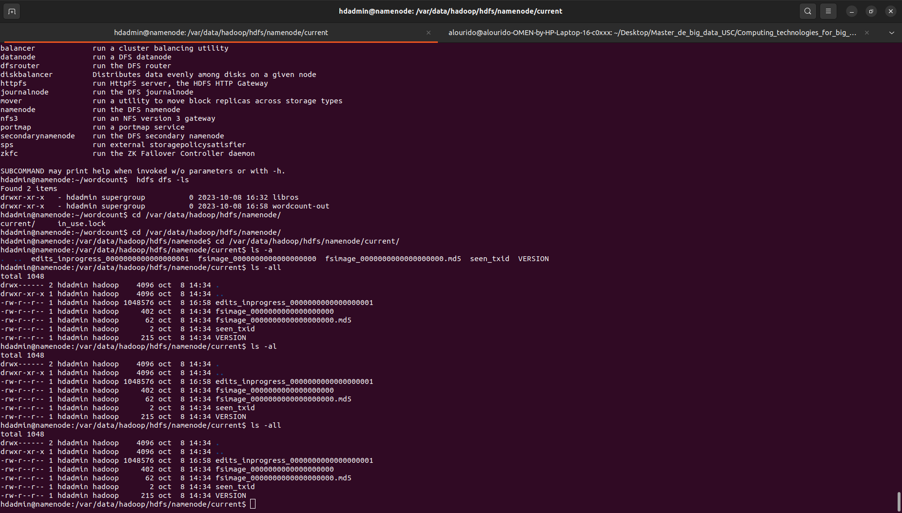</a>
</kbd>
    


Para añadir el servidor de backup, tenéis que seguir los siguientes pasos (con el cluster funcionando):

1. Inicia un nuevo Docker a partir de la imagen hadoop-base de la siguiente forma:
 
    ```bash
    docker container run -ti --name backupnode --network=hadoop-cluster --hostname backupnode --cpus=1 --memory=3072m --expose 50100 -p 50105:50105 tfpena/hadoop-base /bin/bash
    ```
2. Crea un directorio donde se guardarán los backups. Haz que el propietario de ese directorio sea hdadmin y crea dentro del mismo la carpeta dfs/name

    - En este caso se hizo un Dockerfile  para el apartado 1 y 2 

    ```dockerfile
    # FROM hpcnube-base-image:latest
    FROM  tfpena/hadoop-base:latest
    #MAINTAINER

    # Switch 

    USER root

    ENV HADOOP_VERSION 3.3.1
    ENV LOG_TAG "[Name Node Hadoop_${HADOOP_VERSION}]:"
    ENV BASE_DIR /opt/bd
    ENV HADOOP_HOME ${BASE_DIR}/hadoop
    ENV HADOOP_CONF_DIR ${HADOOP_HOME}/etc/hadoop
    ENV DATA_DIR /var/data/hadoop/hdfs


    # 2. Crea los directoriso para los datos de HDFS del NameNode y propietario hdadmin donde se guardaran los backups
    
    RUN echo "$LOG_TAG creamos los directoriso " &&\
        mkdir -p ${DATA_DIR}/backup &&  mkdir -p ${DATA_DIR}/backup/dfs/name && chown -R hdadmin:hadoop ${DATA_DIR}

    # Creamos el directorio de logs hdoop

    RUN mkdir ${HADOOP_HOME}/logs


    # Copia los ficheros de configuracion
    COPY  ../hadoop_backupnode/core-site.xml $HADOOP_CONF_DIR/core-site.xml
    COPY  ../hadoop_backupnode/hdfs-site.xml $HADOOP_CONF_DIR/hdfs-site.xml
    COPY  ../hadoop_backupnode/mapred-site.xml $HADOOP_CONF_DIR/mapred-site.xml
    COPY  ../hadoop_backupnode/yarn-site.xml $HADOOP_CONF_DIR/yarn-site.xml

    # copiamos el elscro de imio 


    # establecemos los permisos de 
    RUN  chown -R hdadmin:hadoop ${BASE_DIR}
    RUN  chown -R hdadmin:hadoop ${DATA_DIR}


    # definomos los valores de entorno
    ENV JAVA_HOME /usr/lib/jvm/java-8-openjdk-amd64/
    ENV BASE_DIR /opt/bd
    ENV HADOOP_HOME ${BASE_DIR}/hadoop
    ENV HADOOP_CONF_DIR ${HADOOP_HOME}/etc/hadoop
    ENV PATH ${PATH}:${HADOOP_HOME}/bin/:${HADOOP_HOME}/sbin

    ```


3. Como usuario hdadmin, añade al fichero core-site.xml las siguentes propiedades

    fs.defaultFS: Nombre del filesystem por defecto. Dale el valor hdfs://namenode:9000/.
    hadoop.tmp.dir: Indica el directorio donde se guardarán las copias de seguridad. Dale el valor del directorio que has creado (sin incluir dfs/name).


    **core-site.xml:**

    ```xml
    <?xml version="1.0" encoding="UTF-8"?>
    <?xml-stylesheet type="text/xsl" href="configuration.xsl"?>
    <!--
    Licensed under the Apache License, Version 2.0 (the "License");
    you may not use this file except in compliance with the License.
    You may obtain a copy of the License at

        http://www.apache.org/licenses/LICENSE-2.0

    Unless required by applicable law or agreed to in writing, software
    distributed under the License is distributed on an "AS IS" BASIS,
    WITHOUT WARRANTIES OR CONDITIONS OF ANY KIND, either express or implied.
    See the License for the specific language governing permissions and
    limitations under the License. See accompanying LICENSE file.
    -->

    <!-- Put site-specific property overrides in this file. -->

    <configuration>

    <property>
        <!-- Nombre del filesystem por defecto -->
        <!-- Como queremos usar HDFS tenemos que indicarlo con hdfs:// y el servidor y puerto en el que corre el NameNode -->
        <name>fs.defaultFS</name>
        <value>hdfs://namenode:9000/</value>
        <final>true</final>
    </property>

    <property>
        <!-- Directorio para almacenamiento temporal (debe tener suficiente espacio) -->
        <name>hadoop.tmp.dir</name>
        <value>/var/data/hadoop/hdfs/backup</value>
        <final>true</final>
    </property>

    </configuration>


    ```

4. Como usuario hdadmin, añade al fichero hdfs-site.xml las siguentes propiedades

    dfs.namenode.backup.address: Dirección y puerto del nodo de backup. Dale el valor backupnode:50100
    dfs.namenode.backup.http-address:  Dirección y puerto del servicio web del nodo de backup. Dale el valor backupnode:50105
    
    **hdfs-site.xml:**

    ```xml
    <?xml version="1.0" encoding="UTF-8"?>
    <?xml-stylesheet type="text/xsl" href="configuration.xsl"?>
    <!--
    Licensed under the Apache License, Version 2.0 (the "License");
    you may not use this file except in compliance with the License.
    You may obtain a copy of the License at

        http://www.apache.org/licenses/LICENSE-2.0

    Unless required by applicable law or agreed to in writing, software
    distributed under the License is distributed on an "AS IS" BASIS,
    WITHOUT WARRANTIES OR CONDITIONS OF ANY KIND, either express or implied.
    See the License for the specific language governing permissions and
    limitations under the License. See accompanying LICENSE file.
    -->

    <!-- Put site-specific property overrides in this file. -->

    <configuration>

    <!--  Propiedad para configurar la dirección y puerto del nodo de backup -->
    <property>
    <name>dfs.namenode.backup.address</name>
    <value>backupnode:50100</value>
    <final>true</final>
    </property>

    <!-- Dirección y puerto del interfaz web del NameNode -->
    <!-- Especifica la dirección y el puerto donde se puede 
    acceder a la interfaz web del NameNode. -->
    <property>
        <name>dfs.namenode.backup.http-address</name>
        <value>backupnode:50105</value>
        <final>true</final>
    </property>

    </configuration>

    ```

5. Inicia el servidor de backup ejecutando:

  ``` bash
  $ hdfs namenode -backup
  ```

6. Analiza el directorio de backup para ver lo que se ha creado. Compáralo con el directorio con los metadatos del NameNode

    <kbd>
    <a href="./images/metadatos_buckup.png" target="_blank">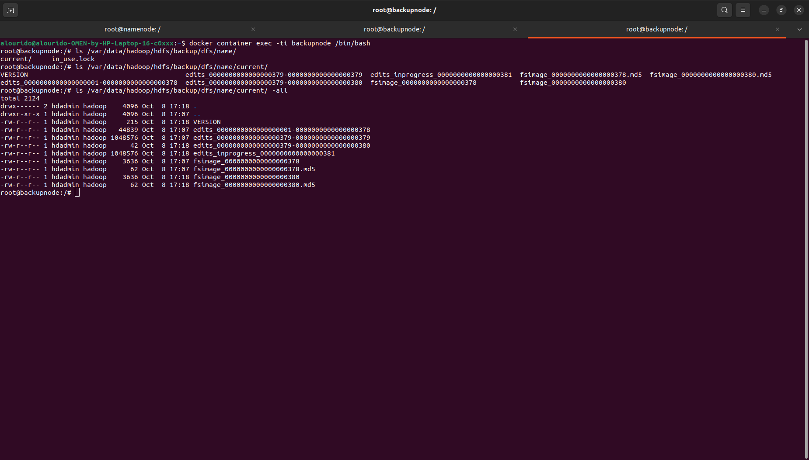</a>
    </kbd>
    


7. Mira en los mensajes del servicio de backup información que indique que se ha realizado un checkpoint

    - Captura de pantalla en la que se vean los mensajes que genera el servicio de backup, destacando aquellos en los que se vea como se hace el checkpoint
    
    <kbd>
    <a href="./images/backup_nose.png" target="_blank">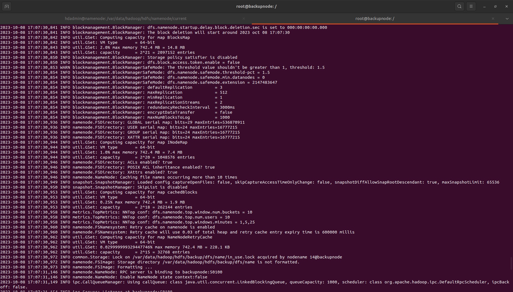</a>
    </kbd>
    
    <kbd>
    <a href="./images/backup_terminal.png" target="_blank">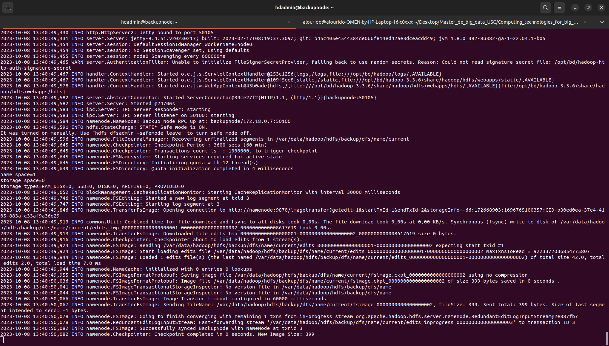</a>
    </kbd>

**Nota:** Una vez obtenidos los datos para la memoria, puedes parar el servicio de backup. Si quieres poder reiniciarlo de forma facil, sal del Docker, guárdalo como una imagen e inícialo haciendo:

``` bash
docker container run -d --name backupnode --network=hadoop-cluster --hostname backupnode --cpus=1 --memory=3072m --expose 50100 -p 50105:50105 backupnode-image \
su hdadmin -c "JAVA_HOME=/usr/lib/jvm/java-8-openjdk-amd64 /opt/bd/hadoop/bin/hdfs namenode -backup"
 ```

Y para comprobar que se está ejecutando correctamente el servicio de backup, haz:


    docker container logs backupnode

- Captura de pantalla en la que se compare el contenido del directorio del backup con el directorio con los metadatos de NameNode, antes y una vez que el servicio de backup se ha completado

**Metadatos del NODENAME**

<a href="./images/metadoatos_namenode_depues_backup_2.png" target="_blank">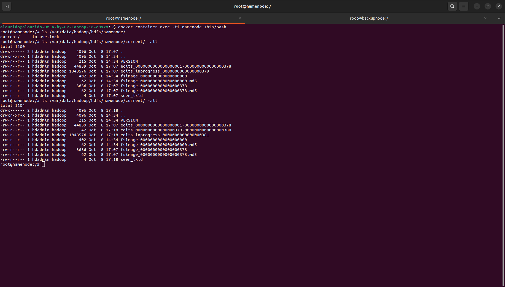</a>
</kbd>

**Metadatos del BUCKUP**

<kbd>
<a href="./images/metadatos_buckup.png" target="_blank"></a>
</kbd>

- Captura de pantalla del interfaz web del nodo de backup

<kbd>
<a href="./images/backup_web_2.png" target="_blank">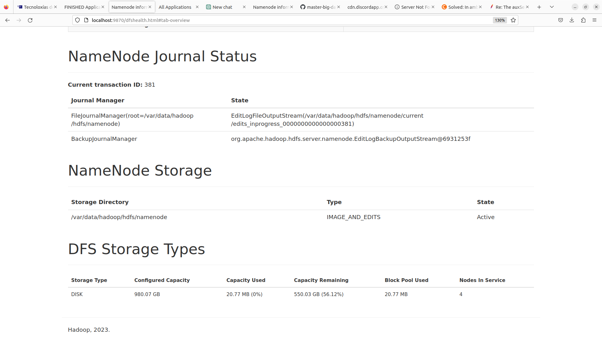</a>
</kbd>


##### 1.2 TimeLineServer

El servidor de línea temporal de YARN mantiene un histórico y proporciona métricas de las aplicaciones ejecutadas mediante YARN (es similar a la funcionalidad del Job History Server porporcionado por MapReduce).
Proporciona tanto información genérica acerca de aplicaciones completadas (contenedores en los que se ejecutó la aplicación, intentos de ejecución, el nombre del usuario, de la cola, etc)  como información específica del framework concreto de la aplicación (por ejemplo, el framework MapReduce puede publicar información sobre el número de maps y reduces, u otros contadores). La información es accesible a través de un interfaz web o vía una API REST.
El Timeline Server se ejecuta como un demonio standalone que puede correr en un nodo del cluster o colocarse con el ResourceManager. Más información sobre el servicio en https://hadoop.apache.org/docs/current/hadoop-yarn/hadoop-yarn-site/TimelineServer.html.

Para añadir el TimeLineServer, tenéis que seguir los siguientes pasos (con el cluster funcionando):

1. Ve al NameNode/ResourceManager y detén el servicio ResourceManager

    ``` bash
    su hdadmin -c "$HADOOP_HOME/bin/yarn --daemon stop resourcemanager"

    # O 

    $yarn --daemon stop resourcemanager 
    ``` 

2. En este sistema, edita el fichero yarn-site.xml y añade las siguentes propiedades

    ```xml

    <?xml version="1.0"?>
    <!--
    Licensed under the Apache License, Version 2.0 (the "License");
    you may not use this file except in compliance with the License.
    You may obtain a copy of the License at

        http://www.apache.org/licenses/LICENSE-2.0

    Unless required by applicable law or agreed to in writing, software
    distributed under the License is distributed on an "AS IS" BASIS,
    WITHOUT WARRANTIES OR CONDITIONS OF ANY KIND, either express or implied.
    See the License for the specific language governing permissions and
    limitations under the License. See accompanying LICENSE file.
    -->
    <configuration>

    <!-- Site specific YARN configuration properties -->
    <property>
        <!-- Nombre del equipo que ejecuta el demonio ResourceManager -->
        <name>yarn.resourcemanager.hostname</name>
        <value>resourcemanager</value>
        <final>true</final>
    </property>

    <property>
        <!-- Número máximo de vcores que un ApplicationMaster puede pedir al RM (por defecto: 4) -->
        <!-- Peticiones mayores lanzan una InvalidResourceRequestException -->
        <name>yarn.scheduler.maximum-allocation-vcores</name>
        <value>1</value>
        <final>true</final>
    </property>

    <property>
        <!-- Memoria minima (MB) que un ApplicationMaster puede solicitar al RM (por defecto: 1024) -->
        <!-- La memoria asignada a un contenedor será múltiplo de esta cantidad -->
        <name>yarn.scheduler.minimum-allocation-mb</name>
        <value>128</value>
        <final>true</final>
    </property>

    <property>
        <!-- Memoria maxima (MB) que un ApplicationMaster puede solicitar al RM (por defecto: 8192 MB) -->
        <!-- Peticiones mayores lanzan una InvalidResourceRequestException -->
        <!-- Puedes aumentar o reducir este valor en funcion de la memoria de la que dispongas -->
        <name>yarn.scheduler.maximum-allocation-mb</name>
        <value>2048</value>
        <final>true</final>
    </property>

    <!-- Configuración del hostname del servicio de línea de tiempo de YARN -->
    <property>
        <name>yarn.timeline-service.hostname</name> <!-- Nombre del parámetro -->
        <value>timelineserver</value> <!-- Valor del parámetro (en este caso, el nombre del servidor de línea de tiempo) -->
        <final>true</final>
    </property>

    <!-- Habilitar el servicio de línea de tiempo de YARN -->
    <property>
        <name>yarn.timeline-service.enabled</name> <!-- Nombre del parámetro -->
        <value>true</value> <!-- Valor del parámetro (habilitar el servicio) -->
        <final>true</final>
    </property>

    <!-- Habilitar el publicador de métricas del sistema de YARN -->
    <property>
        <name>yarn.system-metrics-publisher.enabled</name> <!-- Nombre del parámetro -->
        <value>true</value> <!-- Valor del parámetro (habilitar el publicador de métricas del sistema) -->
        <final>true</final>
    </property>


    </configuration>


    ```


3. Reinicia el servicio ResourceManager

    ``` bash
    su hdadmin -c "$HADOOP_HOME/bin/yarn --daemon start  resourcemanager "

    # O 

    $yarn --daemon start resourcemanager 
    ```

3. Inicia un nuevo Docker a partir de la imagen hadoop-base de la siguiente forma:
 
    ``` bash
    docker container run -ti --name timelineserver --network=hadoop-cluster --hostname timelineserver --cpus=1 --memory=3072m --expose 10200 -p 8188:8188 tfpena/hadoop-base /bin/bash
    ``` 

4. En este nuevo Docker, levanta el servicio timelineserver ejecutando:

    ``` bash
    $ yarn --daemon start timelineserver
    ```


5. Vuelve al NameNode/ResourceManager y ejecuta una aplicación con yarn (la de el cálculo de pi o el wordcount).

    ``` bash

    su hdadmin -c "echo 'export MAPRED_EXAMPLES=$HADOOP_HOME/share/hadoop/mapreduce' >> ~/.bashrc && . ~/.bashrc"

    su hdadmin -c "$HADOOP_HOME/bin/yarn jar $MAPRED_EXAMPLES/hadoop-mapreduce-examples-*.jar pi 16 1000"

    ```

6. Comprueba en el servidor web del [TimeLineServer](http://localhost:8188) que se recoge la información de la ejecución
    LINK: http://localhost:8188 

    - Captura de pantalla del interfaz web del TimeLineServer en la que se vea que se ha recogido la información de la ejecución de una o más tareas

        <kbd>
        <a href="./images/StartTime_web_2.png" target="_blank">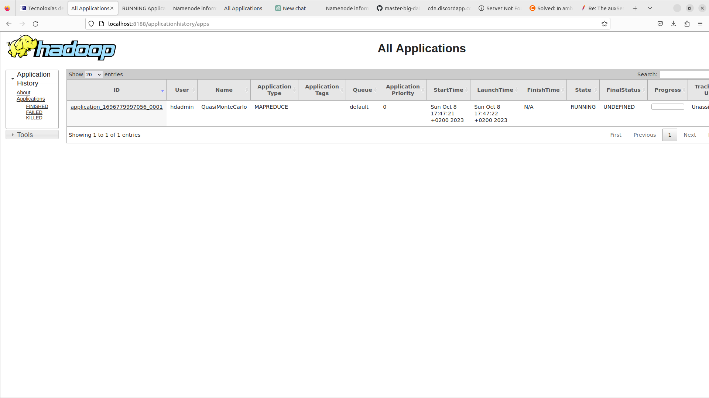</a>
        </kbd>


### Tarea 2: Retirar un DataNode/NodeManager

#### 2.1. Creación de ficheros de nodos incluidos y excluidos

1. Para los demonios del NameNode y del ResourceManager.

    ``` bash
    $ yarn --daemon stop resourcemanager
    $ hdfs --daemon stop namenode
    ``` 

2. Crea cuatro ficheros: ${HADOOP_HOME}/etc/hadoop/dfs.include, ${HADOOP_HOME}/etc/hadoop/dfs.exclude, ${HADOOP_HOME}/etc/hadoop/yarn.include y ${HADOOP_HOME}/etc/hadoop/yarn.exclude (inicialmente vacíos).

    ``` bash
    $nano {HADOOP_HOME}/etc/hadoop/dfs.include
    $nano {HADOOP_HOME}/etc/hadoop/dfs.exclude
    $nano {HADOOP_HOME}/etc/hadoop/yarn.include
    $nano {HADOOP_HOME}/etc/hadoop/yarn.exclude 
    ``` 

3. En los fichero dfs.include y yarn.include, poned los nombres de todos los DataNodes/NodeManagers que querramos que estén en el cluster (datanode1, datanode2, datanode3 y datanode4, un nombre por línea) . Deja los ficheros dfs.exclude y yarn.exclude vacíos.
    
    - En el fichero de configuración hdfs-site.xml, añade dos propiedades:
       
       ```xml
        <property>
        <name>dfs.hosts</name>
        <value>/opt/bd/hadoop/etc/hadoop/dfs.include</value>
        </property>
        <property>
            <name>dfs.hosts.exclude</name>
            <value>/opt/bd/hadoop/etc/hadoop/dfs.exclude</value>
        </property>
       ```
    - En el fichero yarn-site.xml, añade dos propiedades:
        
        ```xml
        <property>
        <name>yarn.resourcemanager.nodes.include-path</name>
        <value>/opt/bd/hadoop/etc/hadoop/yarn.include</value>
        </property>

        <property>
            <name>yarn.resourcemanager.nodes.exclude-path</name>
            <value>/opt/bd/hadoop/etc/hadoop/yarn.exclude</value>
        </property>

       ```


#### Tarea 2: Retirar un datanode/nodemanager


1. Sigue los siguiente pasos para eliminar, por ejemplo, el datanode4.

    Pon el nombre del nodo o nodos que queremos retirar en los fichero dfs.exclude y yarn.exclude y ejecutar
    /docker/change_config.sh /docker/include_node $HADOOP_HOME/etc/hadoop

    $ hdfs dfsadmin -refreshNodes
    $ yarn rmadmin -refreshNodes

    Comprueba que al cabo de un rato, usando el interfaz web y mediante los comandos los comandos hdfs dfsadmin -report y yarn node -list, que el/los nodo(s) excluido(s) aparece(n) que está(n) Decomissioned en HDFS y YARN

- Ya podríamos parar los demonios en el nodo decomisionado y parar el contenedor asociado. Si no queremos volver a incluirlo en el cluster:

    Eliminar el/los nodo(s) de los ficheros include y exclude y ejecutar otra vez

    $ hdfs dfsadmin -refreshNodes
    $ yarn rmadmin -refreshNodes

**Comprueba en los ficheros de log que se han incluido al HDFS y al YARN los nodos datanode.**

- YARN

    <kbd>
    <a href="./images/yarn_include_datanode.png" target="_blank">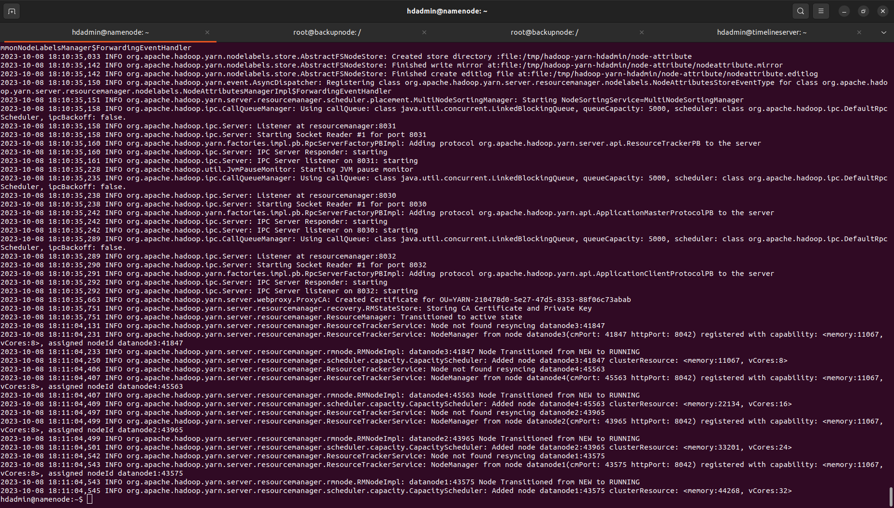</a>
    </kbd>

    <kbd>
    <a href="./images/node4_descomisionado.png" target="_blank">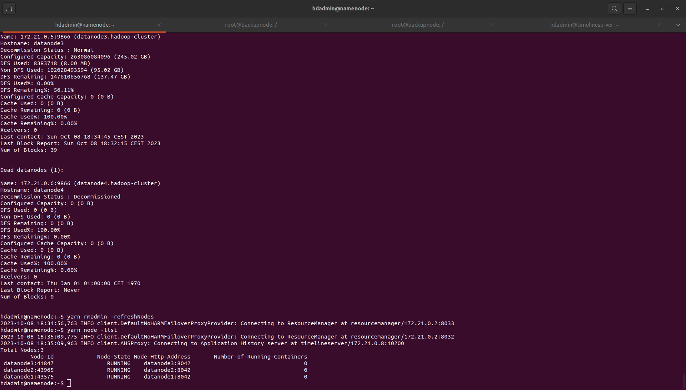</a>
    </kbd>


    ```bash
    yarn node -list
    2023-10-07 20:56:41,760 INFO client.DefaultNoHARMFailoverProxyProvider: Connecting to ResourceManager at resourcemanager/172.19.0.2:8032
    Total Nodes:3
            Node-Id	     Node-State	Node-Http-Address	Number-of-Running-Containers
    datanode1:42323	        RUNNING	   datanode1:8042	                           0
    datanode3:40433	        RUNNING	   datanode3:8042	                           0
    datanode2:33417	        RUNNING	   datanode2:8042	                           0
    ```
    
    <kbd>
    <a href="./images/node_4_descomisinado_web_yarn.png" target="_blank">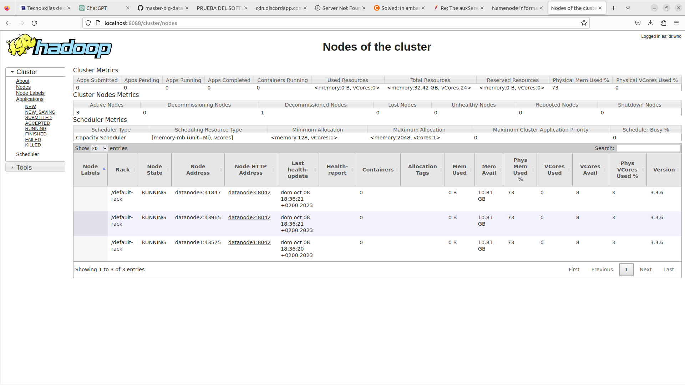</a>
    </kbd>


- HDFS **Nota hdfs dfsadmin -reporten este tambien se ven 5 y 6 que son del siguiente ejercicio pero se pude ver como se no se incluye el data node 4**

    <kbd>
    <a href="./images/hdf_node.png" target="_blank">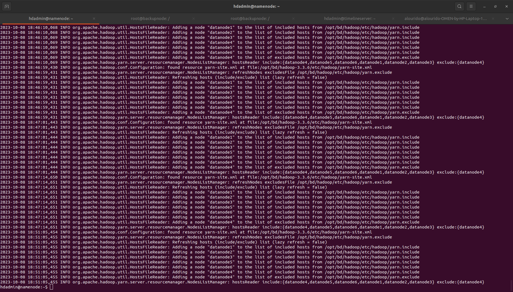</a>
    </kbd>

    <kbd>
    <a href="./images/add_node_web_hdfs.png" target="_blank">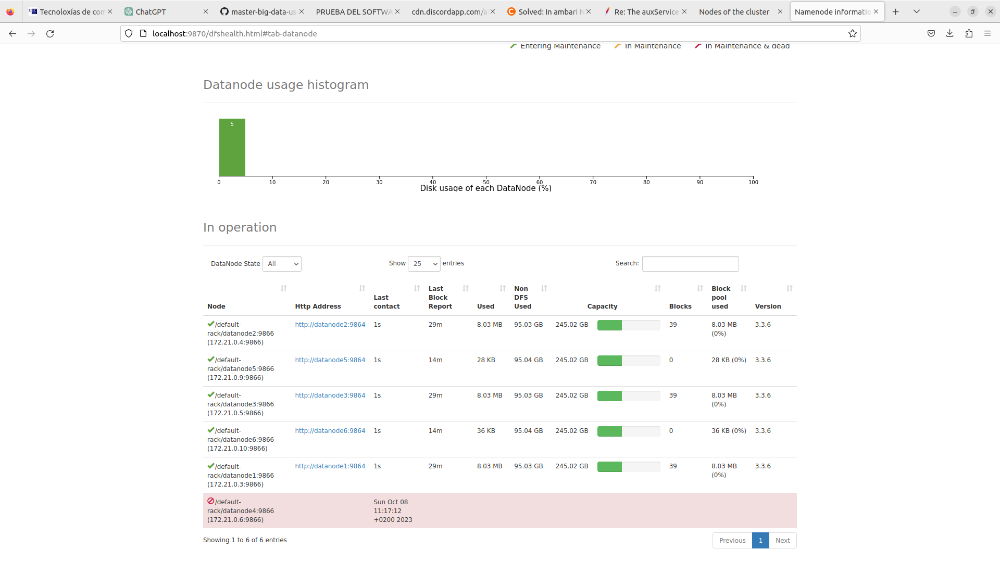</a>
    </kbd>


### Tarea 3: Añadir un nuevo DataNode/NodeManager

1. Añadir dos nuevos DataNode/NodeManager al cluster:

    1. En el NameNode, añade los nombres de dos nuevos nodos (datanode5,datanode6) en los ficheros dfs.include y yarn.include.
    Actualiza el NameNode y el ResourceManager con el nuevo NodeManager ejecutando:

        ```bash
        $ hdfs dfsadmin -refreshNodes
        $ yarn rmadmin -refreshNodes
        ```

    2. Iniciar los dos nuevos contenedores para hacer de DataNodes/NodeManagers:

        ```bash
        docker container run -d --name datanode5 --network=hadoop-cluster --hostname datanode5 --cpus=1 --memory=3072m \
        --expose 8000-10000 --expose 50000-50200 datanode-image /inicio.sh
        
        docker container run -d --name datanode6 --network=hadoop-cluster --hostname datanode6 --cpus=1 --memory=3072m \
        --expose 8000-10000 --expose 50000-50200 datanode-image /inicio.sh
        ```

    <kbd>
    <a href="./images/hdf_node.png" target="_blank"></a>
    </kbd>


Los nuevos nodo inicialmente están vacíos (no tienen datos de HDFS), con lo que el cluster estará desbalanceado. Se puede forzar el balanceo ejecutando, en el NameNode:

     $ hdfs balancer -threshold 1

Comprueba ahora cuánto espacio, en bytes y en bloques, tienen ocupados los dos nuevos DataNodes.

#### Antes del rebalanceo

<kbd>
<a href="./images/rebalanceo.png" target="_blank">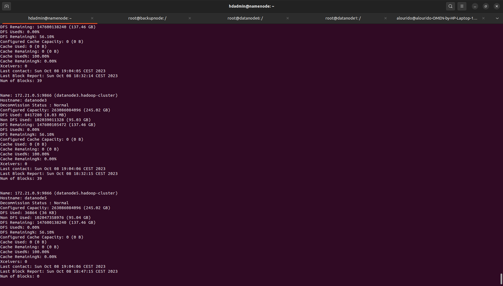</a>
</kbd>

#### Despues del rebalanceo


```bash
hdadmin@namenode:~$ hdfs balancer -threshold 1
2023-10-08 19:07:01,063 INFO balancer.Balancer: Using a threshold of 1.0
2023-10-08 19:07:01,063 INFO balancer.Balancer: namenodes  = [hdfs://namenode:9000]
2023-10-08 19:07:01,064 INFO balancer.Balancer: parameters = Balancer.BalancerParameters [BalancingPolicy.Node, threshold = 1.0, max idle iteration = 5, #excluded nodes = 0, #included nodes = 0, #source nodes = 0, #blockpools = 0, run during upgrade = false]
2023-10-08 19:07:01,064 INFO balancer.Balancer: included nodes = []
2023-10-08 19:07:01,064 INFO balancer.Balancer: excluded nodes = []
2023-10-08 19:07:01,064 INFO balancer.Balancer: source nodes = []
Time Stamp               Iteration#  Bytes Already Moved  Bytes Left To Move  Bytes Being Moved  NameNode
2023-10-08 19:07:01,066 INFO balancer.NameNodeConnector: getBlocks calls for hdfs://namenode:9000 will be rate-limited to 20 per second
2023-10-08 19:07:01,976 INFO balancer.Balancer: dfs.namenode.get-blocks.max-qps = 20 (default=20)
2023-10-08 19:07:01,976 INFO balancer.Balancer: dfs.balancer.movedWinWidth = 5400000 (default=5400000)
2023-10-08 19:07:01,976 INFO balancer.Balancer: dfs.balancer.moverThreads = 1000 (default=1000)
2023-10-08 19:07:01,976 INFO balancer.Balancer: dfs.balancer.dispatcherThreads = 200 (default=200)
2023-10-08 19:07:01,976 INFO balancer.Balancer: dfs.balancer.getBlocks.size = 2147483648 (default=2147483648)
2023-10-08 19:07:01,976 INFO balancer.Balancer: dfs.balancer.getBlocks.min-block-size = 10485760 (default=10485760)
2023-10-08 19:07:01,976 INFO balancer.Balancer: dfs.datanode.balance.max.concurrent.moves = 100 (default=100)
2023-10-08 19:07:01,976 INFO balancer.Balancer: dfs.datanode.balance.bandwidthPerSec = 104857600 (default=104857600)
2023-10-08 19:07:01,980 INFO balancer.Balancer: dfs.balancer.max-size-to-move = 10737418240 (default=10737418240)
2023-10-08 19:07:01,980 INFO balancer.Balancer: dfs.blocksize = 67108864 (default=134217728)
2023-10-08 19:07:01,986 INFO net.NetworkTopology: Adding a new node: /default-rack/172.21.0.9:9866
2023-10-08 19:07:01,986 INFO net.NetworkTopology: Adding a new node: /default-rack/172.21.0.5:9866
2023-10-08 19:07:01,986 INFO net.NetworkTopology: Adding a new node: /default-rack/172.21.0.4:9866
2023-10-08 19:07:01,986 INFO net.NetworkTopology: Adding a new node: /default-rack/172.21.0.10:9866
2023-10-08 19:07:01,986 INFO net.NetworkTopology: Adding a new node: /default-rack/172.21.0.3:9866
2023-10-08 19:07:01,988 INFO balancer.Balancer: 0 over-utilized: []
2023-10-08 19:07:01,988 INFO balancer.Balancer: 0 underutilized: []
08-oct-2023 19:07:01              0                  0 B                 0 B                0 B                  0  hdfs://namenode:9000
The cluster is balanced. Exiting...
08-oct-2023 19:07:02     Balancing took 1.178 seconds
hdadmin@namenode:~$ hdfs dfsadmin -report
Configured Capacity: 1315430420480 (1.20 TB)
Present Capacity: 738021732409 (687.34 GB)
DFS Remaining: 737996406784 (687.31 GB)
DFS Used: 25325625 (24.15 MB)
DFS Used%: 0.00%
Replicated Blocks:
	Under replicated blocks: 0
	Blocks with corrupt replicas: 0
	Missing blocks: 0
	Missing blocks (with replication factor 1): 0
	Low redundancy blocks with highest priority to recover: 0
	Pending deletion blocks: 1
Erasure Coded Block Groups: 
	Low redundancy block groups: 0
	Block groups with corrupt internal blocks: 0
	Missing block groups: 0
	Low redundancy blocks with highest priority to recover: 0
	Pending deletion blocks: 0

-------------------------------------------------
Live datanodes (5):

Name: 172.21.0.10:9866 (datanode6.hadoop-cluster)
Hostname: datanode6
Decommission Status : Normal
Configured Capacity: 263086084096 (245.02 GB)
DFS Used: 36883 (36.02 KB)
Non DFS Used: 102048219117 (95.04 GB)
DFS Remaining: 147599278080 (137.46 GB)
DFS Used%: 0.00%
DFS Remaining%: 56.10%
Configured Cache Capacity: 0 (0 B)
Cache Used: 0 (0 B)
Cache Remaining: 0 (0 B)
Cache Used%: 100.00%
Cache Remaining%: 0.00%
Xceivers: 0
Last contact: Sun Oct 08 19:07:03 CEST 2023
Last Block Report: Sun Oct 08 18:47:15 CEST 2023
Num of Blocks: 0


Name: 172.21.0.3:9866 (datanode1.hadoop-cluster)
Hostname: datanode1
Decommission Status : Normal
Configured Capacity: 263086084096 (245.02 GB)
DFS Used: 8417299 (8.03 MB)
Non DFS Used: 102039830509 (95.03 GB)
DFS Remaining: 147599286272 (137.46 GB)
DFS Used%: 0.00%
DFS Remaining%: 56.10%
Configured Cache Capacity: 0 (0 B)
Cache Used: 0 (0 B)
Cache Remaining: 0 (0 B)
Cache Used%: 100.00%
Cache Remaining%: 0.00%
Xceivers: 0
Last contact: Sun Oct 08 19:07:02 CEST 2023
Last Block Report: Sun Oct 08 18:32:14 CEST 2023
Num of Blocks: 39
```

- Indica también cuántos datos se han movido y cuánto espacio, en bytes y en bloques, tienen ocupados los dos nuevos DataNodes.

    - En mi caso se quedo igual esto puede ser debido a que la cantidad de datos dentro de los datanode no es significativo para necesitar un revalanceo.
    Los datanode estan conformados por 39 blockes que tienen cada uno 64megabytes (MB). lo que indica que el tamaño total el 39*64

    ```xml
    <name>dfs.blocksize</name>
    <value>64m</value>
    <final>true</final>
    ```


1. Las líneas de los ficheros de log del namenode y del resourcemanager que muestran que se han incluido los nodos indicados en los ficheros include (punto 4 del apartado 1 Creación de ficheros de nodos incluidos y excluidos).


- YARN

    En este caso no se capruto el yanr -list a la hora de incluir el  el nodo 5 y 6 por lo que no se pude mostrar pero si capturo la visualización web

    <kbd>
    <a href="./images/yanr_incude_5_6.png" target="_blank"></a>
    </kbd>
    
    <kbd>
    <a href="./images/add_node_web_yarn.png" target="_blank">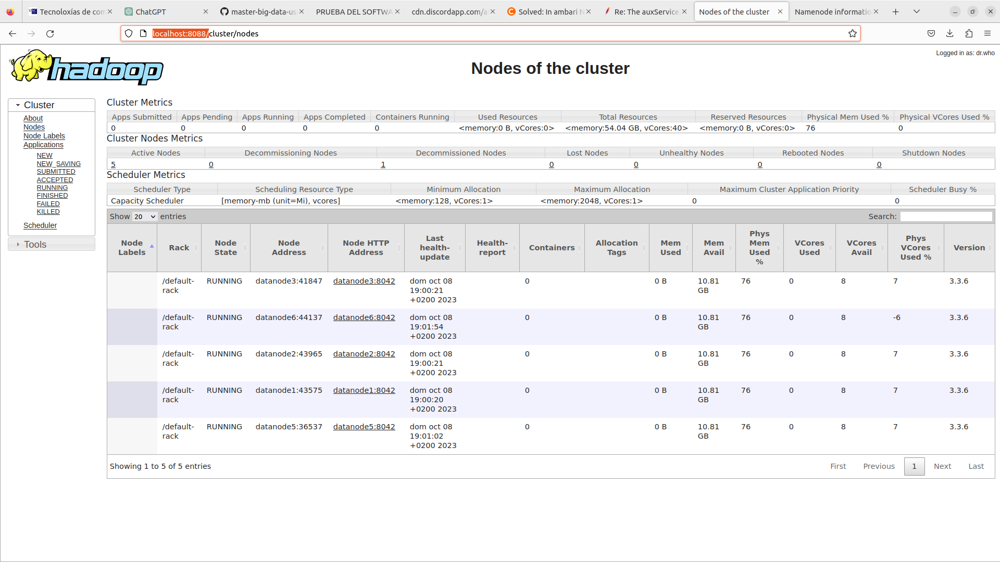</a>
    </kbd>


- HDFS 

    <kbd>
    <a href="./images/hdf_node.png" target="_blank"></a>
    </kbd>


    <kbd>
    <a href="./images/add_node_web_hdfs.png" target="_blank"></a>
    </kbd>


### Tarea 4: Rack awareness

Para obtener el máximo rendimiento, es importante configurar Hadoop para para que conozca la topología de nuestra red. Por defecto, Hadoop considera que todos los DataNodes/NodeManagers son iguales y están situados en un único rack, que se identifica como /default-rack.

Para clusters multirack, debemos indicar a Hadoop en que rack está cada nodo, para mejorar la eficiencia y la fiabilidad.

En la imagen, se muestra una arquitectura típica en 2 niveles de un cluster Hadoop. Esta topología puede describirse en forma de árbol, como /switch1/rack1 y /switch1/rack2, o, simplificando /rack1 y /rack2. Para indicarle esta topología a Hadoop, es necesario utilizar un script que mapee los nombres de los nodos al rack en el que se encuentran.

En nuestro caso, vamos a suponer que tenemos 3 racks (rack1, rack2 y rack3) y que tenemos dos nodos en cada rack. Haced lo siguiente en el NameNode (como usuario hdadmin):

1. Ejecuta el comando hdfs dfsadmin -printTopology para ver como es la topología actual. Apunta las IPs (sin los puertos) de los datanodos. Apaga el demonio NameNode
```bash
$ hdfs --daemon stop namenode
```    


2. Crea un fichero $HADOOP_HOME/etc/hadoop/topology.data que tenga en cada linea la IP de uno de los DataNodes y el rack donde está, como en este ejemplo (cambiando las IPs por las tuyas)

    - **NOTAS** Sacar ips primera, sin los dos puntos, Para mirar las ip 
        ```bash 
        $ hdfs dfsadmin -report
        ```
    
    ```txt
    IPdatanode1     /rack1
    IPdatanode2     /rack1
    IPdatanode3     /rack2
    IPdatanode5     /rack3
    IPdatanode6     /rack3
    # mi caso particular 
    172.21.0.3     /rack1
    172.21.0.4     /rack1
    172.21.0.5     /rack2
    172.21.0.9     /rack3
    172.21.0.10     /rack3
    ```

3. Crea un script de bash $HADOOP_HOME/etc/hadoop/topology.script como el siguiente (fuente: https://cwiki.apache.org/confluence/display/HADOOP2/Topology+rack+awareness+scripts). Dar permisos de ejecución (chmod +x topology.script).

    ```script
    #!/bin/bash

    HADOOP_CONF=$HADOOP_HOME/etc/hadoop 
    while [ $# -gt 0 ] ; do
      nodeArg=$1
      exec< ${HADOOP_CONF}/topology.data 
      result="" 
      while read line ; do
        ar=( $line ) 
        if [ "${ar[0]}" = "$nodeArg" ] ; then
          result="${ar[1]}"
        fi
      done 
      shift 
      if [ -z "$result" ] ; then
        echo -n "/default-rack "
      else
        echo -n "$result "
      fi
    done
    ```

4. Define en el fichero core-site.xml la propiedad net.topology.script.file.name y darle como valor el path completo al script

    add 
    ```xml 
    <property>
    <!-- Directorio para almacenamiento informacion sobre la topologia-->
    <name>net.topology.script.file.name</name>
    <value>$HADOOP_HOME/etc/hadoop/topology.script</value>
    <final>true</final>
    </property>
    ```

    - **NOTA** Es un script que permite cambiar los archivos de la configuración de docker al copiar la nueva configuración en $HADOOP_HOME/etc/hadoop
    ```bash
    /docker/change_config.sh /docker/hadoop_ResourceManager $HADOOP_HOME/etc/hadoop
    ```

5. Inicia los demonios y comprueba que se han identificado los racks ejecutando hdfs dfsadmin -printTopology

    ```bash

    $ hdfs --daemon start namenode

    ```
    - **NOTA** no se saco captura pero si se muestra la salida de terminal en este caso tambien se excluyo el datanode4 directamente 

    ```bash
    
    hdadmin@namenode:~$ hdfs dfsadmin -printTopology
    Rack: /default-rack
    172.21.0.10:9866 (datanode6.hadoop-cluster) In Service
    172.21.0.6:9866 (datanode4.hadoop-cluster) Decommissioned
    172.21.0.3:9866 (datanode1.hadoop-cluster) In Service
    172.21.0.4:9866 (datanode2.hadoop-cluster) In Service
    172.21.0.5:9866 (datanode3.hadoop-cluster) In Service
    172.21.0.9:9866 (datanode5.hadoop-cluster) In Service


    hdadmin@namenode:~$ hdfs dfsadmin -printTopology 
    Rack: /rack1
    172.21.0.3:9866 (datanode1.hadoop-cluster) In Service
    172.21.0.4:9866 (datanode2.hadoop-cluster) In Service

    Rack: /rack2
    172.21.0.5:9866 (datanode3.hadoop-cluster) In Service

    Rack: /rack3
    172.21.0.10:9866 (datanode6.hadoop-cluster) In Service
    172.21.0.9:9866 (datanode5.hadoop-cluster) In Service


    ```