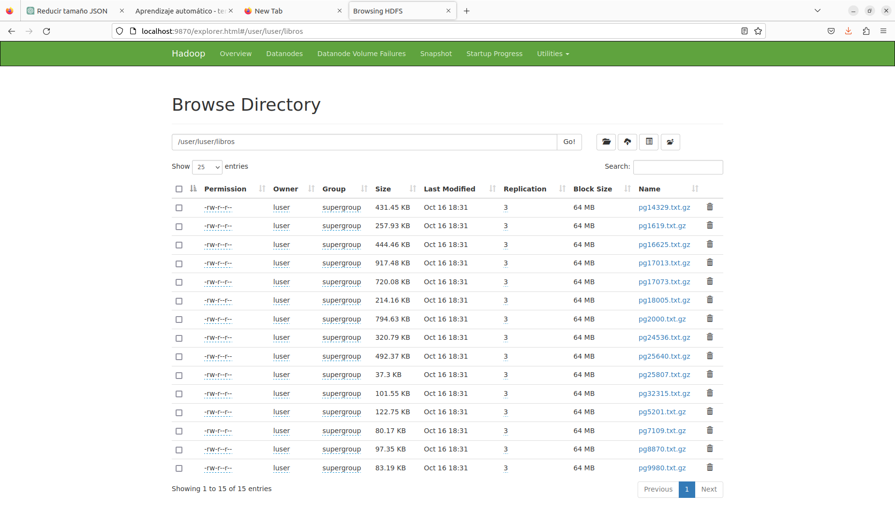

# Pasos de ejecución

1 lanzamos el cluster [mas informacion](./docs/Practice.md) de como se creo este cluster
```bash 

./run_cluster.sh

```

comprobamos que este bien 


- [http://localhost:9870](http://localhost:9870) interfaz web del HDFS
- [http://localhost:8088](http://localhost:8088) interfaz web del YARN
- [http://localhost:50105](http://localhost:50105) interfaz web del backup

2 lanzamos el timelineserver
```bash 

docker container run -ti --name timelineserver --network=hadoop-cluster --hostname timelineserver --cpus=1 --memory=3072m --expose 10200 -p 8188:8188 tfpena/hadoop-base /bin/bash

   
```

Dentro del docker 'timelineserver'

```bash 

root@timelineserver:/# su - hdadmin

hdadmin@timelineserver:~$  yarn --daemon start timelineserver

WARNING: /opt/bd/hadoop/logs does not exist. Creating.

```
- [http://localhost:8188](http://localhost:8188) interfaz web del TimeLineServer


3 Cargamos datos del hdf

accedemos al docker 'namenode'

```bash
docker container exec -ti namenode /bin/bash
```
Dentro del docker 'namenode' añadimos los datos de libros al user: 'luser'
```bash

/docker/hdfs_user.sh 


```
comprobar en la base de datos hdfs 

- [http://localhost:9870/explorer.html#/user/luser/libros](http://localhost:9870/explorer.html#/user/luser/libros) interfaz web del HDFS


<kbd>
<a href="./images/load_hdfs.png" target="_blank"></a>
</kbd>
    