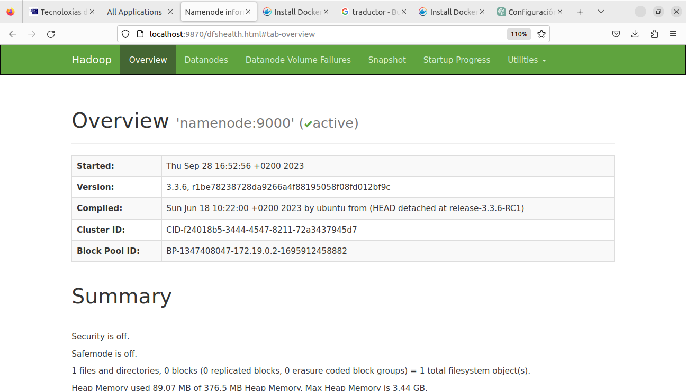
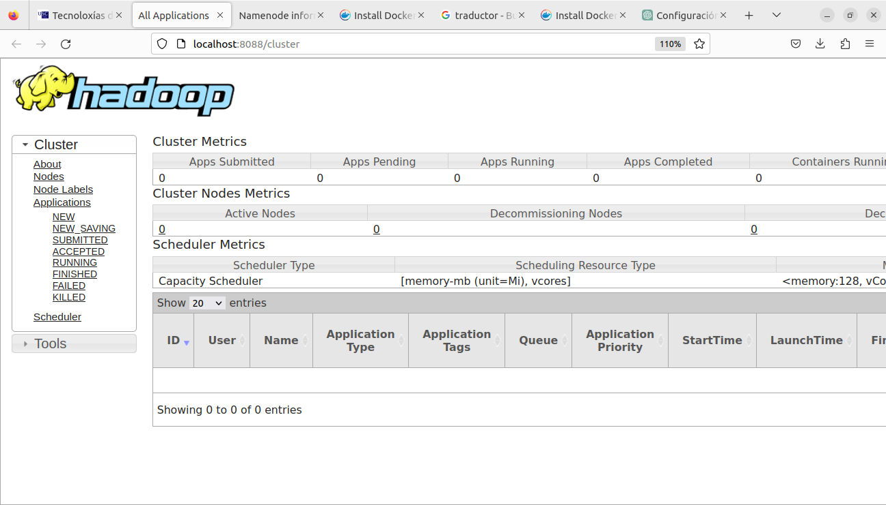

1.  Crea una red en la que iniciaremos los contenedores Docker para simular el docker:

    docker network create hadoop-cluster

2. Servicio NameNode/ResourceManager

Inicia un contenedor para esos servicios ejecutando:

    - Imagen base: tfpena/hadoop-base

    docker container run -ti --name namenode --network=hadoop-cluster --hostname namenode --net-alias resourcemanager --expose 8000-10000 -p 9870:9870 -p 8088:8088 tfpena/hadoop-base /bin/bash

El contenedor se identifica con ambos nombres namenode y resourcemanager y es accesible desde el host a través de los puertos 9870 (NameNode) y 8088 (ResourceManager).

2.1. Creación de directorios para los datos del NameNode

Debemos especificar el directorio o directorios en el que el NameNode guardará la metainformación de HDFS. En un sistema real se deben usar incluir por lo menos dos directorios:  uno en el disco local del NameNode (preferible disponer de varios discos configurados en RAID) y otro remoto (por ejemplo, montado por NFS).

En nuestro caso, crearemos un único directorio y haremos que sea propiedad del usuario hdadmin, que será el que ejecute los demonios del NameNode y del ResourceManager, ejecutando en el docker, como root, los comandos:

    mkdir -p /var/data/hdfs/namenode
    chown hdadmin:hadoop /var/data/hdfs/namenode

El resto de la configuración la haremos como usuario hdadmin. Para convertirte en ese usuario, ejecuta:

    su - hdadmin

Para editar los ficheros de configuración, puedes hacerlo en el terminal usando el editor nano.

1.1.2 Configuración los demonios NameNode/ResourceManager

Todos los demonios de Hadoop se configuran, principalmente, mediante cuatro ficheros, localizados en $HADOOP_HOME/etc/hadoop/, en los que se pueden indicar un gran número de propiedades (ver http://hadoop.apache.org/docs/stable3/hadoop-project-dist/hadoop-common/ClusterSetup.html para más información):

    core-site.xml: configuración principal, valores por defecto en http://hadoop.apache.org/docs/stable3/hadoop-project-dist/hadoop-common/core-default.xml

    hdfs-site.xml: configuración del HDFS, valores por defecto en http://hadoop.apache.org/docs/stable3/hadoop-project-dist/hadoop-hdfs/hdfs-default.xml

    yarn-site.xml: configuración del YARN, valores por defecto en http://hadoop.apache.org/docs/stable3/hadoop-yarn/hadoop-yarn-common/yarn-default.xml

    mapred-site.xml: configuración del MapReduce, valores por defecto en http://hadoop.apache.org/docs/stable3/hadoop-mapreduce-client/hadoop-mapreduce-client-core/mapred-default.xml

Para nuestro NameNode/ResourceManager (recuerda que tiene que ser como usuario hdadmin) cambia los siguientes ficheros en el directorio $HADOOP_HOME/etc/hadoop/: 

1.1.3 Inicializa el HDFS

Es necesario inicializar el sistema HDFS ejecutando, como usuario hdadmin:

    $ hdfs namenode -format

Al finalizar el proceso de inicialización, si todo fue bien debería aparecer, entre otros mensajes, lo siguiente (en [hdfs_name_format.log](./hdfs_name_format.log) se puede ver la salida completa del comando anterior):

    Storage directory /var/data/hdfs/namenode has been successfully formatted.

Revisa ese directorio para comprobar qué se ha creado. Comprueba también que se ha creado un directorio para los logs en $HADOOP_HOME/logs:

    comado: ls $HADOOP_HOME/logs 
    salida terminal: SecurityAuth-hdadmin.audit

1.1.4 Inicio de los demonios

$ cat $HADOOP_HOME/logs/hadoop-hdadmin-resourcemanager-namenode.log

a. Inicia el demonio NodeManager ejecutando (como usuario hdadmin):

    $ hdfs --daemon start namenode

Mira los ficheros creados en el directorio de logs ($HADOOP_HOME/logs) para comprobar que todo ha ido bien y que no aparecen errores. Ejecuta el comando jps para ver que la JVM está corriendo.

    $ cat $HADOOP_HOME/logs/hadoop-hdadmin-namenode-namenode.log

b. Inicia el demonio ResourceManager ejecutando (como usuario hdadmin):

    $ yarn --daemon start resourcemanager

Mira de nuevo  los ficheros creados en el directorio de logs ($HADOOP_HOME/logs) para comprobar que todo ha ido bien y que no aparecen errores. Ejecuta el comando jps para ver que la JVM está corriendo.

    $ ls $HADOOP_HOME/logs 

    hadoop-hdadmin-namenode-namenode.log  hadoop-hdadmin-resourcemanager-namenode.log  SecurityAuth-hdadmin.audit
    hadoop-hdadmin-namenode-namenode.out  hadoop-hdadmin-resourcemanager-namenode.out

    $ cat $HADOOP_HOME/logs/hadoop-hdadmin-resourcemanager-namenode.log

1.1.5 Acceso a los interfaces web de los demonios

Los diferentes servicios de Hadoop ofrecen una interfaz web de control. Abre un navegador en tu PC  y comprueba los siguientes enlaces:

- http://localhost:9870 interfaz web del HDFS

<kbd>
  
</kbd>

- http://localhost:8088 interfaz web de YARN

<kbd>
  
</kbd>

###### NOTA PARA LOS QUE USÁIS UNA INSTANCIA EN AWS Y LA RED EDUROAM
La red eduroam tiene limitados los puertos a los que puedes acceder (solo al 22, 80, o 443).
Desde esa red no vamos a poder acceder a los puertos 9870 o 8088 de la instancia EC2.
Para solventar ese problema, es posible hacer un túnel SSH. Ejecuta, en un terminal de tu PC lo siguiente:

    $ ssh -i "tuclave.pem" -fNT -L 9870:localhost:9870 -L 8088:localhost:8088 ec2-user@nombre_publico_instancia

reemplazando la clave y el nombre de la instancia por los tuyos. Ahora deberías poder acceder a los interfaces usando
http://localhost:9870 para interfaz web del HDFS y http://localhost:8088 para interfaz web de YARN.

1.1.6  Parar los demonios

Para detener los demonios, ejecutamos las instrucciones anteriores en cambiando start por stop:

    $ yarn --daemon stop resourcemanager
    $ hdfs --daemon stop namenode

1.1.7 Automatización del inicio

Para que podamos parar y reiniciar los contenedores y que los demonios sigan funcionando, vamos a salvar el contenedor como imagen, pero antes vamos a preparar un script para iniciar los demonios de forma automática cuando iniciemos el docker. Para ello, crea, como root, el fichero /inicio.sh en el directorio raíz, con el siguiente contenido:

    #!/bin/bash
    export JAVA_HOME=/usr/lib/jvm/java-8-openjdk-amd64
    export HADOOP_HOME=/opt/bd/hadoop

    # Inicio el NameNode y el ResourceManager
    su hdadmin -c "$HADOOP_HOME/bin/hdfs --daemon start namenode"
    su hdadmin -c "$HADOOP_HOME/bin/yarn --daemon start resourcemanager"

    # Lazo para mantener activo el contenedor
    while true; do sleep 10000; done

Además, dale permisos de ejecución al fichero:

    # chmod +x /inicio.sh

1.1.8 Creación de la imagen Docker para el NameNode/ResourceManager

Sal del contenedor y crea una imagen a partir del mismo, haciendo:

      docker container commit namenode namenode-image

Comprueba que la imagen se han creado (ejecuta docker images) y si todo está bien, borra el contenedor:

      docker container rm namenode

1.1.8 Dockerizar.

    docker build -t namenode-image -f ResourceManager.Dockerfile .

    docker network create hadoop-cluster
    
    docker container run -ti --name datanode --network=hadoop-cluster --hostname datanode --expose 8000-10000 --expose 50000-50200 -i namenode-image  /bin/bash

1.2 Servicio DataNode/NodeManager

El proceso es muy similar al del caso anterior. Empieza iniciando  un contenedor para esos servicios ejecutando:

    docker container run -ti --name datanode --network=hadoop-cluster --hostname datanode --expose 8000-10000 --expose 50000-50200 tfpena/hadoop-base /bin/bash

El contenedor se identifica en la red con el nombre datanode y no publica ningún puerto.

1.2.1 Creación de directorios para los datos de los DataNodes

Debemos especificar el directorio o directorios en el que los DataNodes guardarán los bloques HDFS. Lo ideal es diponer de un  nodos con varios discos y crear un directorio en cada uno de los discos locales para mejorar el rendimiento en los accesos. No es conveniente usar RAID, ya que HDFS garantiza la redundancia.

En nuestro caso, crearemos un único directorio, ejecutando en el docker, como root, los comandos:

    # mkdir -p /var/data/hdfs/datanode
    # chown hdadmin:hadoop /var/data/hdfs/datanode

