# Tema 3 :Gestión de HDFS

### Primera parte: Ver como se dividen y replican los ficheros

1. crea un fichero grande con el siguiente comando:

```bash
#Como usuario luser, crea un archivo grande usando dd
dd if=/dev/urandom of=fichero_grande bs=1M count=350
```

2. Mover el archivo al HDFS con hdfs dfs -moveFromLocal

```bash
# Mueve el archivo al HDFS usando hdfs dfs -moveFromLocal
hdfs dfs -moveFromLocal fichero_grande /user/luser/
```

3. Acceder a la interfaz web del [NameNode](http://localhost:9870/explorer.html#/user/luser)

¿En cuántos bloques se ha dividido el fichero? 
Para cada uno de estos bloques ¿en que DataNodes se encuentran sus réplicas

Como se puede observar se divide en 6 bloques que tienencada uno 3 replicas en sus respectivos data nodes

<kbd>
  <a href="./images/1_3_interfaz_ficheros_2.png" target="_blank">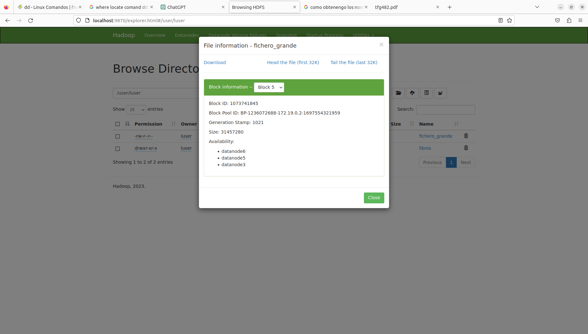</a>
</kbd>
    
4.  Obtén la misma información usando el comando hdfs fsck con las opciones adecuadas (busca en la ayuda de hdfs fsck cuáles son esas opciones).
**NOTA** la imagen hace referencia a una ejecución anterior pero se entiende que el comportamiento es el mismo


```bash
# comando 
hdfs fsck /user/luser/fichero_grande -files -blocks -locations
```


<kbd>
  <a href="./images/1_4_fichero_cmd.png" target="_blank">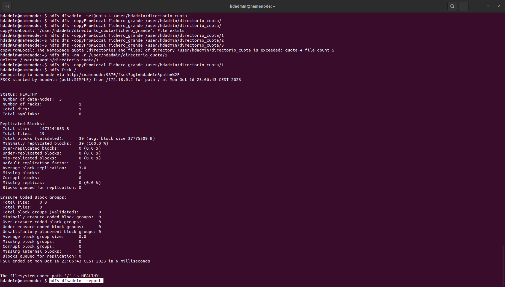</a>
</kbd>
    
```bash
# salida de hdfs fsck /user/luser/fichero_grande -files -blocks -locations
/user/luser/fichero_grande 367001600 bytes, replicated: replication=3, 6 block(s):  OK
0. BP-1236072688-172.19.0.2-1697554321959:blk_1073741840_1016 len=67108864 Live_repl=3  [DatanodeInfoWithStorage[172.19.0.3:9866,DS-1c8d33ec-1e5a-4d13-b70e-2a51861f9dd4,DISK], DatanodeInfoWithStorage[172.19.0.4:9866,DS-3f03c651-9a22-4ac5-9464-2f2424757a1a,DISK], DatanodeInfoWithStorage[172.19.0.7:9866,DS-3a40a112-5daf-4397-842b-f5b093b577cb,DISK]]
# salida de la interfaz grafica 
Block ID: 1073741840
Block Pool ID: BP-1236072688-172.19.0.2-1697554321959
Generation Stamp: 1016
Size: 67108864
Availability:

    datanode5
    datanode1
    datanode2

1. BP-1236072688-172.19.0.2-1697554321959:blk_1073741841_1017 len=67108864 Live_repl=3  [DatanodeInfoWithStorage[172.19.0.4:9866,DS-3f03c651-9a22-4ac5-9464-2f2424757a1a,DISK], DatanodeInfoWithStorage[172.19.0.3:9866,DS-1c8d33ec-1e5a-4d13-b70e-2a51861f9dd4,DISK], DatanodeInfoWithStorage[172.19.0.8:9866,DS-26d06ad2-99c7-4ddc-a364-076c70c31b44,DISK]]

Block ID: 1073741841
Block Pool ID: BP-1236072688-172.19.0.2-1697554321959
Generation Stamp: 1017
Size: 67108864
Availability:

    datanode6
    datanode2
    datanode1

2. BP-1236072688-172.19.0.2-1697554321959:blk_1073741842_1018 len=67108864 Live_repl=3  [DatanodeInfoWithStorage[172.19.0.4:9866,DS-3f03c651-9a22-4ac5-9464-2f2424757a1a,DISK], DatanodeInfoWithStorage[172.19.0.3:9866,DS-1c8d33ec-1e5a-4d13-b70e-2a51861f9dd4,DISK], DatanodeInfoWithStorage[172.19.0.8:9866,DS-26d06ad2-99c7-4ddc-a364-076c70c31b44,DISK]]

Block ID: 1073741841
Block Pool ID: BP-1236072688-172.19.0.2-1697554321959
Generation Stamp: 1017
Size: 67108864
Availability:

    datanode6
    datanode2
    datanode1

3. BP-1236072688-172.19.0.2-1697554321959:blk_1073741843_1019 len=67108864 Live_repl=3  [DatanodeInfoWithStorage[172.19.0.3:9866,DS-1c8d33ec-1e5a-4d13-b70e-2a51861f9dd4,DISK], DatanodeInfoWithStorage[172.19.0.4:9866,DS-3f03c651-9a22-4ac5-9464-2f2424757a1a,DISK], DatanodeInfoWithStorage[172.19.0.7:9866,DS-3a40a112-5daf-4397-842b-f5b093b577cb,DISK]]

Block ID: 1073741843
Block Pool ID: BP-1236072688-172.19.0.2-1697554321959
Generation Stamp: 1019
Size: 67108864
Availability:

    datanode5
    datanode1
    datanode2

4. BP-1236072688-172.19.0.2-1697554321959:blk_1073741844_1020 len=67108864 Live_repl=3  [DatanodeInfoWithStorage[172.19.0.3:9866,DS-1c8d33ec-1e5a-4d13-b70e-2a51861f9dd4,DISK], DatanodeInfoWithStorage[172.19.0.4:9866,DS-3f03c651-9a22-4ac5-9464-2f2424757a1a,DISK], DatanodeInfoWithStorage[172.19.0.7:9866,DS-3a40a112-5daf-4397-842b-f5b093b577cb,DISK]]

Block ID: 1073741844
Block Pool ID: BP-1236072688-172.19.0.2-1697554321959
Generation Stamp: 1020
Size: 67108864
Availability:

    datanode5
    datanode2
    datanode1

5. BP-1236072688-172.19.0.2-1697554321959:blk_1073741845_1021 len=31457280 Live_repl=3  [DatanodeInfoWithStorage[172.19.0.5:9866,DS-5bc0f6e2-6c36-4474-97a6-43d54fed1154,DISK], DatanodeInfoWithStorage[172.19.0.8:9866,DS-26d06ad2-99c7-4ddc-a364-076c70c31b44,DISK], DatanodeInfoWithStorage[172.19.0.7:9866,DS-3a40a112-5daf-4397-842b-f5b093b577cb,DISK]]

Block ID: 1073741845
Block Pool ID: BP-1236072688-172.19.0.2-1697554321959
Generation Stamp: 1021
Size: 31457280
Availability:

    datanode6
    datanode5
    datanode3

```


### Segunda parte: Probar el comando hdfs dfsadmin

En el NameNode, como usuario hdadmin, crea un directorio en HDFS y ponle una cuota de solo 4 ficheros. Comprueba cuántos ficheros puedes copiar a ese directorio. Explica a qué se debe este comportamiento.

1.  Inicia sesión como el usuario hdfsadmin en el NameNode. Debes tener privilegios administrativos en el clúster Hadoop para poder utilizar el comando hdfs dfsadmin.

```bash
su - hdadmin
```

2. Crea un directorio en HDFS y establece una cuota de solo 4 ficheros. Puedes hacerlo con el siguiente comando:

```bash

hdfs dfs -mkdir /user/hdadmin/directorio_cuota
# Establece el tamaño maximo 
# hdfs dfsadmin -setSpaceQuota 4 /user/hdadmin/directorio_cuota
# hdfs dfs -rm -r /user/hdfsadmin/directorio_cuota
# Establecer una cuota de 4 ficheros para el directorio
hdfs dfsadmin -setQuota 4 /user/hdadmin/directorio_cuota

```
En este ejemplo, hemos creado un directorio llamado directorio_cuota en el directorio del usuario hdfsadmin y le hemos asignado una cuota de 4 ficheros.

```bash

for i in $(seq 1 $(($Quota + 1))); do
su hdadmin -c "$HADOOP_HOME/bin/hdfs dfs -copyFromLocal fichero_grande /user/hdadmin/directorio_cuota/$i"; done

```

Error  

<kbd>
  <a href="./images/2_1_quotes.png" target="_blank">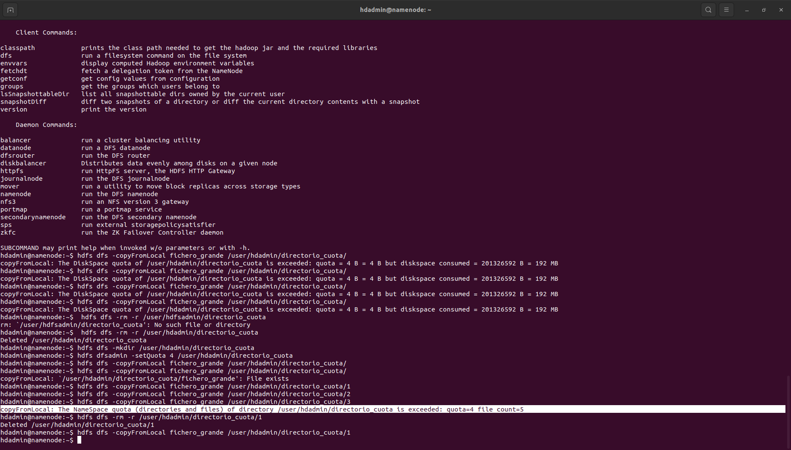</a>
</kbd>

indica que has superado la cuota de espacio en disco (DiskSpace quota) asignada al directorio /user/hdadmin/directorio_cuota.

- quota=4: Indica cuál es la cuota del espacio de nombres que se ha establecido para el directorio. En este caso, es de 4, lo que significa que puedes tener un máximo de 4 ficheros o directorios en ese directorio.

- file count=5: Muestra cuántos ficheros o directorios ya se han creado en el directorio /user/hdadmin/directorio_cuota. En este caso, ya se han creado 5, lo que supera la cuota establecida.

### Tercera parte: Probar el comando hdfs fsck


1. Chequeo de todo el HDFS y resolución de errores

    - Para realizar un chequeo completo de todo el HDFS y verificar si hay errores, utiliza el comando hdfs fsck. Ejecuta el siguiente comando como usuario hdadmin:

    ```bash
    hdfs fsck / -files -blocks -locations
    # para nuestro dato en especifico
    hdfs fsck /user/luser/ficher_grande -files -blocks -locations
    ```

    <kbd>
    <a href="./images/3_1_comprobacion.png" target="_blank">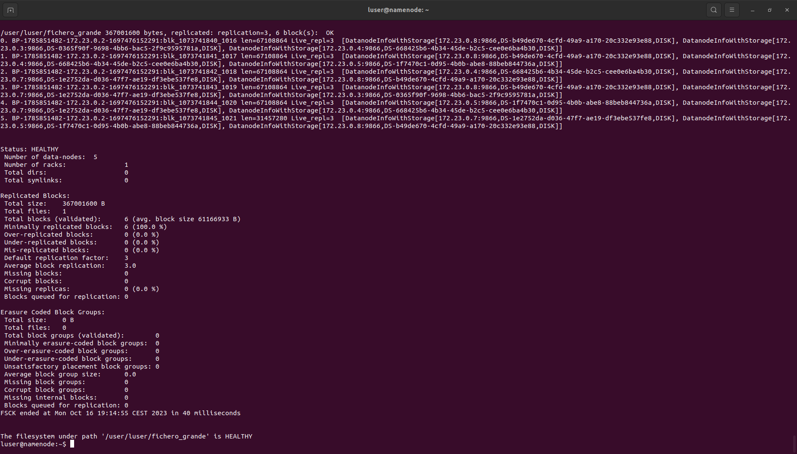</a>
    </kbd>

2. Detener DataNodes y comprobar la disponibilidad de bloques

    1. ccede al servidor o máquina donde se ejecutan los DataNodes en tu clúster Hadoop. Puedes utilizar comandos como docker container stop o los comandos específicos de tu configuración para detener los DataNodes. Asegúrate de detener suficientes DataNodes para que queden solo 2 activos en racks diferentes.

    Ejemplo (Para nuestra distribución):
    
    - Configuración:
        ```bash
            IPdatanode1     /rack1
            IPdatanode2     /rack1
            IPdatanode3     /rack2
            IPdatanode5     /rack3
            IPdatanode6     /rack3
        ```
    ```bash
    # comando 
    docker container stop datanode1 datanode3 datanode5
    ```

    **Nota** Espera al menos 10 minutos (En nuestro caso por la configuración que implementamos) para que el NameNode detecte que los DataNodes se han vuelto inactivos. 

    2. Comprobar la disponibilidad de bloques

        - Acceder a la interfaz web del [NameNode](http://localhost:9870/)

            <kbd>
            <a href="./images/3_1_2_deletedatanode.png" target="_blank">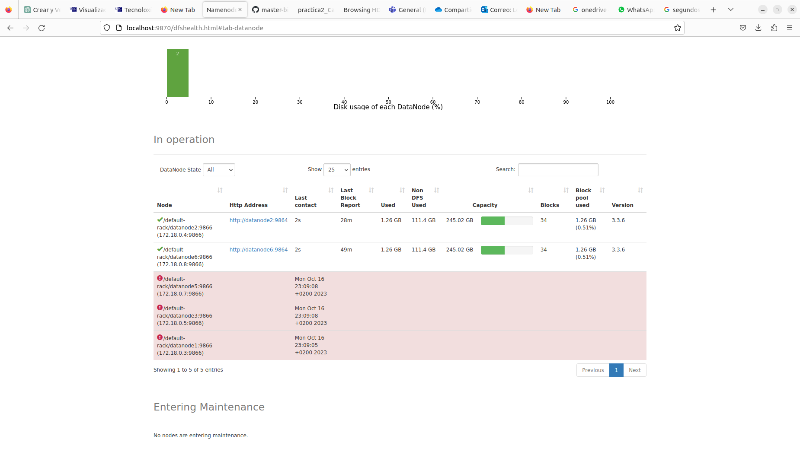</a>
            </kbd>
            
        - Para verificar cuántos DataNodes están actualmente activos y la disponibilidad de bloques, ejecuta el siguiente comando en el NameNode como usuario hdadmin:
            ```bash
            hdadmin@namenode:~$ hdfs dfsadmin -report
            Configured Capacity: 526172168192 (490.04 GB)
            Present Capacity: 261374874674 (243.42 GB)
            DFS Remaining: 258404917248 (240.66 GB)
            DFS Used: 2969957426 (2.77 GB)
            DFS Used%: 1.14%
            Replicated Blocks:
                Under replicated blocks: 39
                Blocks with corrupt replicas: 0
                Missing blocks: 0
                Missing blocks (with replication factor 1): 0
                Low redundancy blocks with highest priority to recover: 0
                Pending deletion blocks: 0
            Erasure Coded Block Groups: 
                Low redundancy block groups: 0
                Block groups with corrupt internal blocks: 0
                Missing block groups: 0
                Low redundancy blocks with highest priority to recover: 0
                Pending deletion blocks: 0

            -------------------------------------------------
            Live datanodes (2):

            Name: 172.19.0.4:9866 (datanode2.hadoop-cluster)
            Hostname: datanode2
            Rack: /rack1
            Decommission Status : Normal
            Configured Capacity: 263086084096 (245.02 GB)
            DFS Used: 1485032458 (1.38 GB)
            Non DFS Used: 118960042998 (110.79 GB)
            DFS Remaining: 129202458624 (120.33 GB)
            DFS Used%: 0.56%
            DFS Remaining%: 49.11%
            Configured Cache Capacity: 0 (0 B)
            Cache Used: 0 (0 B)
            Cache Remaining: 0 (0 B)
            Cache Used%: 100.00%
            Cache Remaining%: 0.00%
            Xceivers: 0
            Last contact: Tue Oct 17 17:12:51 CEST 2023
            Last Block Report: Tue Oct 17 16:52:15 CEST 2023
            Num of Blocks: 39


            Name: 172.19.0.8:9866 (datanode6.hadoop-cluster)
            Hostname: datanode6
            Decommission Status : Normal
            Configured Capacity: 263086084096 (245.02 GB)
            DFS Used: 1484924968 (1.38 GB)
            Non DFS Used: 118960150488 (110.79 GB)
            DFS Remaining: 129202458624 (120.33 GB)
            DFS Used%: 0.56%
            DFS Remaining%: 49.11%
            Configured Cache Capacity: 0 (0 B)
            Cache Used: 0 (0 B)
            Cache Remaining: 0 (0 B)
            Cache Used%: 100.00%
            Cache Remaining%: 0.00%
            Xceivers: 0
            Last contact: Tue Oct 17 17:12:51 CEST 2023
            Last Block Report: Tue Oct 17 16:52:15 CEST 2023
            Num of Blocks: 39


            Dead datanodes (3):

            Name: 172.19.0.3:9866 (172.19.0.3)
            Hostname: datanode1
            Rack: /rack1
            Decommission Status : Normal
            Configured Capacity: 263086084096 (245.02 GB)
            DFS Used: 1082055435 (1.01 GB)
            Non DFS Used: 118382572789 (110.25 GB)
            DFS Remaining: 130182905856 (121.24 GB)
            DFS Used%: 0.41%
            DFS Remaining%: 49.48%
            Configured Cache Capacity: 0 (0 B)
            Cache Used: 0 (0 B)
            Cache Remaining: 0 (0 B)
            Cache Used%: 100.00%
            Cache Remaining%: 0.00%
            Xceivers: 0
            Last contact: Tue Oct 17 16:57:00 CEST 2023
            Last Block Report: Tue Oct 17 16:52:15 CEST 2023
            Num of Blocks: 0


            Name: 172.19.0.5:9866 (172.19.0.5)
            Hostname: datanode3
            Rack: /rack2
            Decommission Status : Normal
            Configured Capacity: 263086084096 (245.02 GB)
            DFS Used: 402748595 (384.09 MB)
            Non DFS Used: 119061879629 (110.89 GB)
            DFS Remaining: 130182905856 (121.24 GB)
            DFS Used%: 0.15%
            DFS Remaining%: 49.48%
            Configured Cache Capacity: 0 (0 B)
            Cache Used: 0 (0 B)
            Cache Remaining: 0 (0 B)
            Cache Used%: 100.00%
            Cache Remaining%: 0.00%
            Xceivers: 0
            Last contact: Tue Oct 17 16:57:00 CEST 2023
            Last Block Report: Tue Oct 17 16:52:15 CEST 2023
            Num of Blocks: 0


            Name: 172.19.0.7:9866 (172.19.0.7)
            Hostname: datanode5
            Decommission Status : Normal
            Configured Capacity: 263086084096 (245.02 GB)
            DFS Used: 977628379 (932.34 MB)
            Non DFS Used: 118486999845 (110.35 GB)
            DFS Remaining: 130182905856 (121.24 GB)
            DFS Used%: 0.37%
            DFS Remaining%: 49.48%
            Configured Cache Capacity: 0 (0 B)
            Cache Used: 0 (0 B)
            Cache Remaining: 0 (0 B)
            Cache Used%: 100.00%
            Cache Remaining%: 0.00%
            Xceivers: 0
            Last contact: Tue Oct 17 16:57:00 CEST 2023
            Last Block Report: Tue Oct 17 16:52:15 CEST 2023
            Num of Blocks: 0
            ```

3. chequeo de disco en el NameNode y comprueba la salida. ¿Cuántos bloques aparecen under-replicated? ¿aparecen bloques perdidos y ficheros corruptos? En el caso de que haya bloques perdidos, determina a qué fichero/s corresponden (busca en la ayuda de hdfs fsck --help cómo encontrarlos).


<kbd>
    <a href="./images/3_1_3_hdf_fdk.png" target="_blank">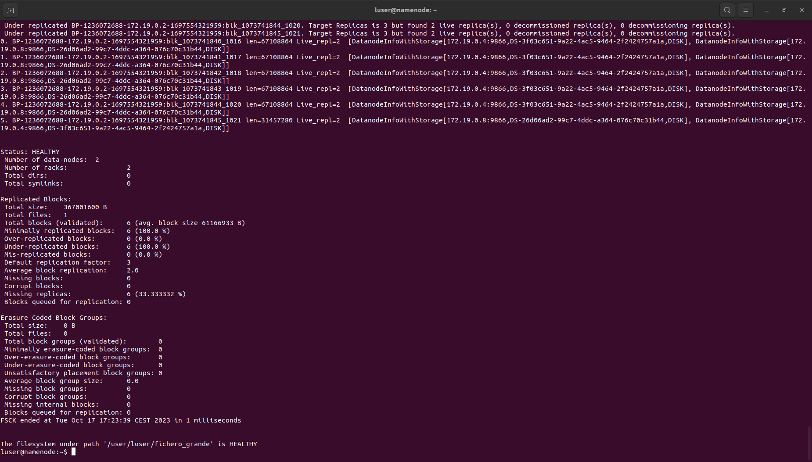</a>
</kbd>
            

**NOTA**  '/user/hdadmin/directorio_cuota/1' es el mismo archivo que  /user/luser/ficher_grande, es una copia que se generó en apartados anteriores


```bash
$ hdfs fsck /user/hdadmin/directorio_cuota/1 -files -blocks -locations


Status: HEALTHY
 Number of data-nodes:	2
 Number of racks:		2
 Total dirs:			0
 Total symlinks:		0

Replicated Blocks:
 Total size:	367001600 B
 Total files:	1
 Total blocks (validated):	6 (avg. block size 61166933 B)
 Minimally replicated blocks:	6 (100.0 %)
 Over-replicated blocks:	0 (0.0 %)
 Under-replicated blocks:	6 (100.0 %)
 Mis-replicated blocks:		0 (0.0 %)
 Default replication factor:	3
 Average block replication:	2.0
 Missing blocks:		0
 Corrupt blocks:		0
 Missing replicas:		6 (33.333332 %)
 Blocks queued for replication:	0

Erasure Coded Block Groups:
 Total size:	0 B
 Total files:	0
 Total block groups (validated):	0
 Minimally erasure-coded block groups:	0
 Over-erasure-coded block groups:	0
 Under-erasure-coded block groups:	0
 Unsatisfactory placement block groups:	0
 Average block group size:	0.0
 Missing block groups:		0
 Corrupt block groups:		0
 Missing internal blocks:	0
 Blocks queued for replication:	0
FSCK ended at Tue Oct 17 17:21:44 CEST 2023 in 1 milliseconds


The filesystem under path '/user/hdadmin/directorio_cuota/1' is HEALTHY

```

La información más crítica aquí es que todos los bloques están under-replicated y faltan réplicas en un 33.33% (6) de los bloques. Esto podria ser un problema importante ya que significa que no tienes suficientes réplicas de datos para garantizar la disponibilidad y la tolerancia a fallos.

Para identificar si hay  archivos afectados por los bloques under-replicated, se utiliza el comando hdfs fsck con la opción -list-corruptfileblocks, 

```bash

hdfs fsck /user/hdadmin/directorio_cuota/1 -list-corruptfileblocks


hdfs fsck /user/hdadmin/directorio_cuota/1 -list-corruptfileblocks
Connecting to namenode via http://namenode:9870/fsck?ugi=hdadmin&listcorruptfileblocks=1&path=%2Fuser%2Fhdadmin%2Fdirectorio_cuota%2F1
The filesystem under path '/user/hdadmin/directorio_cuota/1' has 0 CORRUPT files

```
```bash
# donde se almacena cada parte del fichero que venduan a ser datanode2 y datanode6 
/user/hdadmin/directorio_cuota/1 367001600 bytes, replicated: replication=3, 6 block(s):  Under replicated BP-1236072688-172.19.0.2-1697554321959:blk_1073741846_1022. Target Replicas is 3 but found 2 live replica(s), 0 decommissioned replica(s), 0 decommissioning replica(s).
 Under replicated BP-1236072688-172.19.0.2-1697554321959:blk_1073741847_1023. Target Replicas is 3 but found 2 live replica(s), 0 decommissioned replica(s), 0 decommissioning replica(s).
 Under replicated BP-1236072688-172.19.0.2-1697554321959:blk_1073741848_1024. Target Replicas is 3 but found 2 live replica(s), 0 decommissioned replica(s), 0 decommissioning replica(s).
 Under replicated BP-1236072688-172.19.0.2-1697554321959:blk_1073741849_1025. Target Replicas is 3 but found 2 live replica(s), 0 decommissioned replica(s), 0 decommissioning replica(s).
 Under replicated BP-1236072688-172.19.0.2-1697554321959:blk_1073741850_1026. Target Replicas is 3 but found 2 live replica(s), 0 decommissioned replica(s), 0 decommissioning replica(s).
 Under replicated BP-1236072688-172.19.0.2-1697554321959:blk_1073741851_1027. Target Replicas is 3 but found 2 live replica(s), 0 decommissioned replica(s), 0 decommissioning replica(s).
0. BP-1236072688-172.19.0.2-1697554321959:blk_1073741846_1022 len=67108864 Live_repl=2  [DatanodeInfoWithStorage[172.19.0.4:9866,DS-3f03c651-9a22-4ac5-9464-2f2424757a1a,DISK], DatanodeInfoWithStorage[172.19.0.8:9866,DS-26d06ad2-99c7-4ddc-a364-076c70c31b44,DISK]]
1. BP-1236072688-172.19.0.2-1697554321959:blk_1073741847_1023 len=67108864 Live_repl=2  [DatanodeInfoWithStorage[172.19.0.8:9866,DS-26d06ad2-99c7-4ddc-a364-076c70c31b44,DISK], DatanodeInfoWithStorage[172.19.0.4:9866,DS-3f03c651-9a22-4ac5-9464-2f2424757a1a,DISK]]
2. BP-1236072688-172.19.0.2-1697554321959:blk_1073741848_1024 len=67108864 Live_repl=2  [DatanodeInfoWithStorage[172.19.0.8:9866,DS-26d06ad2-99c7-4ddc-a364-076c70c31b44,DISK], DatanodeInfoWithStorage[172.19.0.4:9866,DS-3f03c651-9a22-4ac5-9464-2f2424757a1a,DISK]]
3. BP-1236072688-172.19.0.2-1697554321959:blk_1073741849_1025 len=67108864 Live_repl=2  [DatanodeInfoWithStorage[172.19.0.8:9866,DS-26d06ad2-99c7-4ddc-a364-076c70c31b44,DISK], DatanodeInfoWithStorage[172.19.0.4:9866,DS-3f03c651-9a22-4ac5-9464-2f2424757a1a,DISK]]
4. BP-1236072688-172.19.0.2-1697554321959:blk_1073741850_1026 len=67108864 Live_repl=2  [DatanodeInfoWithStorage[172.19.0.8:9866,DS-26d06ad2-99c7-4ddc-a364-076c70c31b44,DISK], DatanodeInfoWithStorage[172.19.0.4:9866,DS-3f03c651-9a22-4ac5-9464-2f2424757a1a,DISK]]
5. BP-1236072688-172.19.0.2-1697554321959:blk_1073741851_1027 len=31457280 Live_repl=2  [DatanodeInfoWithStorage[172.19.0.8:9866,DS-26d06ad2-99c7-4ddc-a364-076c70c31b44,DISK], DatanodeInfoWithStorage[172.19.0.4:9866,DS-3f03c651-9a22-4ac5-9464-2f2424757a1a,DISK]]

```

Por lo que se ve no se ha corrompido los archivos de tal forma que se podrian recuperar el archivo tampoco se obserban ficheros perdidos .

**NOTA** las perdidas de manera general para el HDFS es similar a la expicada anteriormente  

<kbd>
    <a href="./images/3_1_4_perdida_datos.png" target="_blank">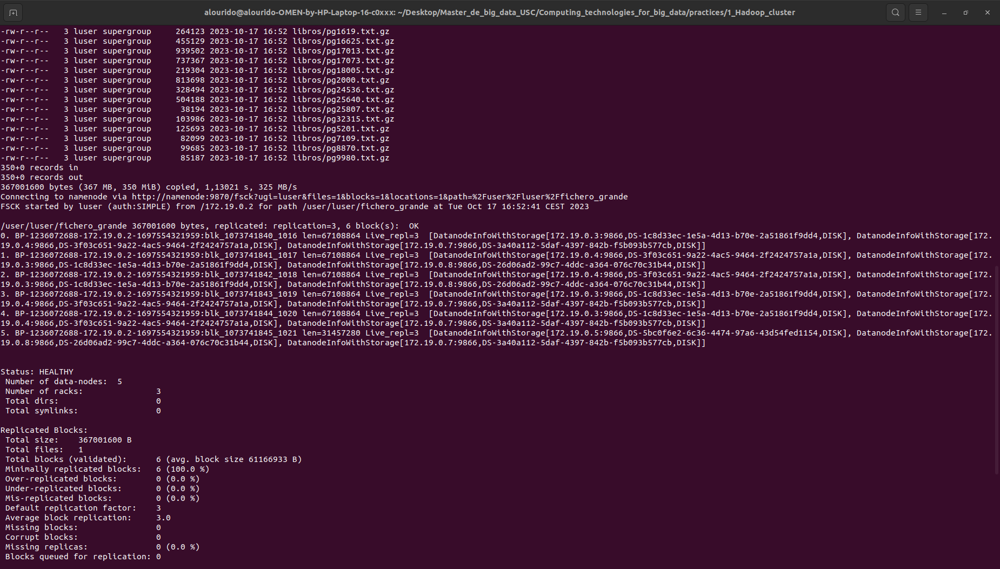</a>
</kbd>


4. Agregar un nuevo DataNode (datanode7)

    1. Editamos dfs.include y yarn.include y refrecamos el sistema

        ```bash
        $ /docker/change_config.sh /docker/include_node $HADOOP_HOME/etc/hadoop

        $ hdfs dfsadmin -refreshNodes
        $ yarn rmadmin -refreshNodes

        ```
    2. lanzamos del DataNode7

        ```bash
        docker container run -d --name datanode7 --network=hadoop-cluster --hostname datanode$i \
        --cpus=1 --memory=3072m --expose 8000-10000 --expose 50000-50200 -v ./docker/docker_volumen:/docker  \
        datanode-image  /docker/inicio_NodeManager.sh format start
        ```
    
    3. Comprobamos las modificaciones

        - Como comprobamos en el bash de abajo aumento el 'Average block replication:' a 2.5 y se redujo el 'Under-replicated blocks:' a 3 (50.0 %) asi como  'Missing replicas:' a 3 (16.666666 %)

        ```bash
        hdfs fsck /user/hdadmin/directorio_cuota/1 -files -blocks -locations
        Connecting to namenode via http://namenode:9870/fsck?ugi=hdadmin&files=1&blocks=1&locations=1&path=%2Fuser%2Fhdadmin%2Fdirectorio_cuota%2F1
        FSCK started by hdadmin (auth:SIMPLE) from /172.19.0.2 for path /user/hdadmin/directorio_cuota/1 at Tue Oct 17 17:46:46 CEST 2023

        /user/hdadmin/directorio_cuota/1 367001600 bytes, replicated: replication=3, 6 block(s):  Under replicated BP-1236072688-172.19.0.2-1697554321959:blk_1073741846_1022. Target Replicas is 3 but found 2 live replica(s), 0 decommissioned replica(s), 0 decommissioning replica(s).
        Under replicated BP-1236072688-172.19.0.2-1697554321959:blk_1073741847_1023. Target Replicas is 3 but found 2 live replica(s), 0 decommissioned replica(s), 0 decommissioning replica(s).
        Under replicated BP-1236072688-172.19.0.2-1697554321959:blk_1073741848_1024. Target Replicas is 3 but found 2 live replica(s), 0 decommissioned replica(s), 0 decommissioning replica(s).
        0. BP-1236072688-172.19.0.2-1697554321959:blk_1073741846_1022 len=67108864 Live_repl=2  [DatanodeInfoWithStorage[172.19.0.4:9866,DS-3f03c651-9a22-4ac5-9464-2f2424757a1a,DISK], DatanodeInfoWithStorage[172.19.0.8:9866,DS-26d06ad2-99c7-4ddc-a364-076c70c31b44,DISK]]
        1. BP-1236072688-172.19.0.2-1697554321959:blk_1073741847_1023 len=67108864 Live_repl=2  [DatanodeInfoWithStorage[172.19.0.8:9866,DS-26d06ad2-99c7-4ddc-a364-076c70c31b44,DISK], DatanodeInfoWithStorage[172.19.0.4:9866,DS-3f03c651-9a22-4ac5-9464-2f2424757a1a,DISK]]
        2. BP-1236072688-172.19.0.2-1697554321959:blk_1073741848_1024 len=67108864 Live_repl=2  [DatanodeInfoWithStorage[172.19.0.8:9866,DS-26d06ad2-99c7-4ddc-a364-076c70c31b44,DISK], DatanodeInfoWithStorage[172.19.0.4:9866,DS-3f03c651-9a22-4ac5-9464-2f2424757a1a,DISK]]
        3. BP-1236072688-172.19.0.2-1697554321959:blk_1073741849_1025 len=67108864 Live_repl=3  [DatanodeInfoWithStorage[172.19.0.8:9866,DS-26d06ad2-99c7-4ddc-a364-076c70c31b44,DISK], DatanodeInfoWithStorage[172.19.0.4:9866,DS-3f03c651-9a22-4ac5-9464-2f2424757a1a,DISK], DatanodeInfoWithStorage[172.19.0.3:9866,DS-1d7fc3ec-b0c4-43d3-b67f-8edb04cd6c5d,DISK]]
        4. BP-1236072688-172.19.0.2-1697554321959:blk_1073741850_1026 len=67108864 Live_repl=3  [DatanodeInfoWithStorage[172.19.0.8:9866,DS-26d06ad2-99c7-4ddc-a364-076c70c31b44,DISK], DatanodeInfoWithStorage[172.19.0.4:9866,DS-3f03c651-9a22-4ac5-9464-2f2424757a1a,DISK], DatanodeInfoWithStorage[172.19.0.3:9866,DS-1d7fc3ec-b0c4-43d3-b67f-8edb04cd6c5d,DISK]]
        5. BP-1236072688-172.19.0.2-1697554321959:blk_1073741851_1027 len=31457280 Live_repl=3  [DatanodeInfoWithStorage[172.19.0.8:9866,DS-26d06ad2-99c7-4ddc-a364-076c70c31b44,DISK], DatanodeInfoWithStorage[172.19.0.4:9866,DS-3f03c651-9a22-4ac5-9464-2f2424757a1a,DISK], DatanodeInfoWithStorage[172.19.0.3:9866,DS-1d7fc3ec-b0c4-43d3-b67f-8edb04cd6c5d,DISK]]


        Status: HEALTHY
        Number of data-nodes:	3
        Number of racks:		2
        Total dirs:			0
        Total symlinks:		0

        Replicated Blocks:
        Total size:	367001600 B
        Total files:	1
        Total blocks (validated):	6 (avg. block size 61166933 B)
        Minimally replicated blocks:	6 (100.0 %)
        Over-replicated blocks:	0 (0.0 %)
        Under-replicated blocks:	3 (50.0 %)
        Mis-replicated blocks:		0 (0.0 %)
        Default replication factor:	3
        Average block replication:	2.5
        Missing blocks:		0
        Corrupt blocks:		0
        Missing replicas:		3 (16.666666 %)
        Blocks queued for replication:	0

        Erasure Coded Block Groups:
        Total size:	0 B
        Total files:	0
        Total block groups (validated):	0
        Minimally erasure-coded block groups:	0
        Over-erasure-coded block groups:	0
        Under-erasure-coded block groups:	0
        Unsatisfactory placement block groups:	0
        Average block group size:	0.0
        Missing block groups:		0
        Corrupt block groups:		0
        Missing internal blocks:	0
        Blocks queued for replication:	0
        FSCK ended at Tue Oct 17 17:46:46 CEST 2023 in 0 milliseconds


        The filesystem under path '/user/hdadmin/directorio_cuota/1' is HEALTHY
        ```

        - Visualizamos las modificaciones que sufre el datanode7 en el que se obserba que tiene  39 para todo el HDFS que seria al intento de generar una 3 replica de los datos que ya teniamos.

            ```bash 

                Name: 172.19.0.3:9866 (datanode7.hadoop-cluster)
                Hostname: datanode
                Rack: /rack1
                Decommission Status : Normal
                Configured Capacity: 263086084096 (245.02 GB)
                DFS Used: 1484779454 (1.38 GB)
                Non DFS Used: 120444977218 (112.17 GB)
                DFS Remaining: 127717777408 (118.95 GB)
                DFS Used%: 0.56%
                DFS Remaining%: 48.55%
                Configured Cache Capacity: 0 (0 B)
                Cache Used: 0 (0 B)
                Cache Remaining: 0 (0 B)
                Cache Used%: 100.00%
                Cache Remaining%: 0.00%
                Xceivers: 0
                Last contact: Tue Oct 17 17:47:39 CEST 2023
                Last Block Report: Tue Oct 17 17:46:27 CEST 2023
                Num of Blocks: 39

            ```


### Tercera parte: Probar el uso de códigos de borrado (erasure codes o EC)

1.  Asegúrate de que tus nodos de datos estén en funcionamiento y que el HDFS se haya recuperado de los problemas mencionados anteriormente antes de comenzar.

```bash
# recuperamos los datanode parados
docker start datanode1 datanode3 datanode5
# Rrefrescamos los nodos para que el namende pueda encontrarlos desde el usuario hdadmin
$ hdfs dfsadmin -refreshNodes
$ yarn rmadmin -refreshNodes
#Espera a que todos los bloques se recuperen y el HDFS deje de estar corrupto.
```

- Verificamos que los datos se han recuperado


    <kbd>
    <a href="./images/3_2_recuperacion.png" target="_blank">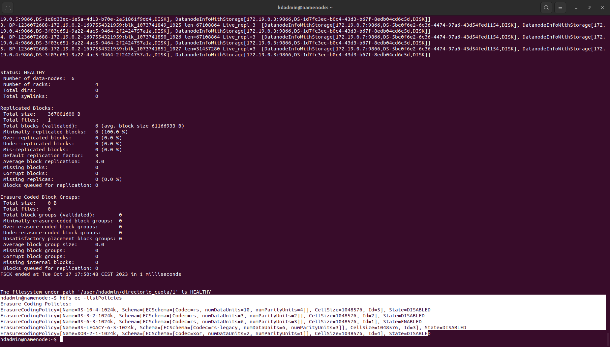</a>
    </kbd>


3. Verificar Políticas Disponibles y Habilita la politica "RS-3-2-1024k": 

    ```bash 
    hdfs ec -enablePolicy -policy RS-3-2-1024k
    ```

    <kbd>
    <a href="./images/3_2_politicas.png" target="_blank">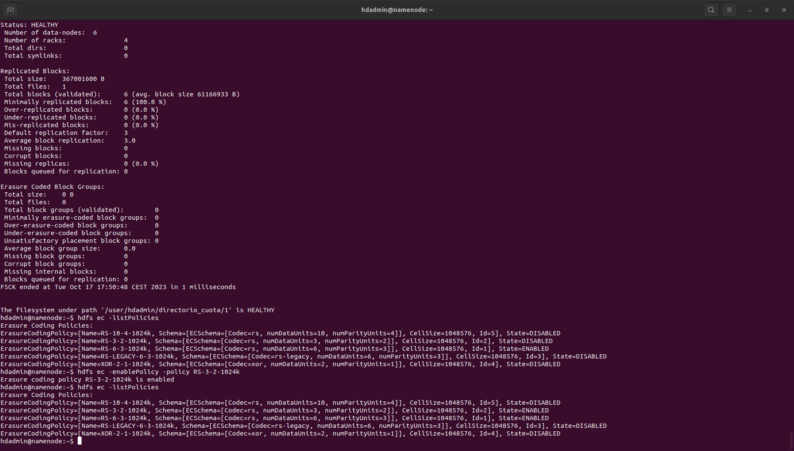</a>
    </kbd>

4. Crea una carpeta en HDFS (por ejemplo, /user/grandes) y aplica la política EC habilitada (RS-3-2-1024k) a esa carpeta con el siguiente comando:

hdfs dfs -mkdir -p /user/grandes

    ```bash

    hdfs dfs -mkdir -p /user/grandes

    hdfs ec -setPolicy -path /user/grandes -policy RS-3-2-1024k

    hdadmin@namenode:~$ hdfs ec -setPolicy -path /user/grandes -policy RS-3-2-1024k
    Set RS-3-2-1024k erasure coding policy on /user/grandes
    ```

Ahora, cualquier archivo que sea colocado en esta carpeta utilizará la política EC especificada.

- Con esos pasos, aplicamos la política EC indicada en el directorio /user/grandes. Vamos a ver que funciona. Ejecuta los siguientes pasos en el NameNode como hdadmin:

    1. Comprueba con hdfs dfsadmin -report el espacio ocupado en DFS, y apunta el valor (captura de pantalla). Anota también el número de bloques que tiene cada datanode.
       
        <kbd>
        <a href="./images/3_2_4_antes_protocolo.png" target="_blank">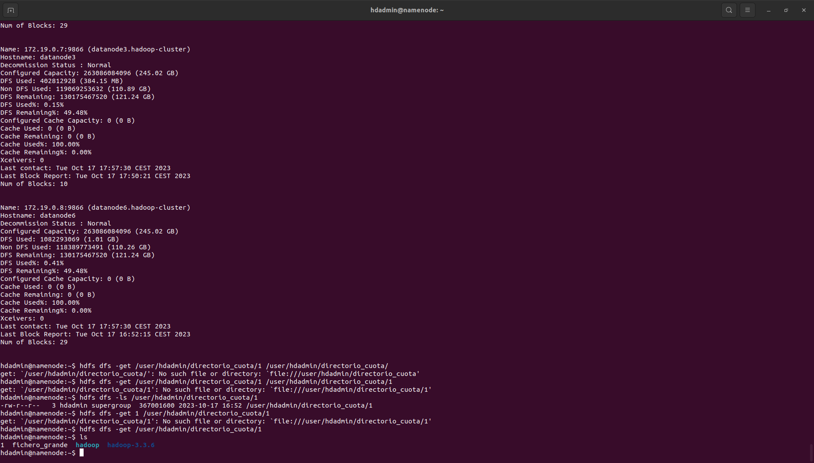</a>
        </kbd>

    2. Recupera al disco local (con hdfs dfs -get) el fichero_grande, bórralo (con hdfs dfs -rm) y vacía la papelera (hdfs dfs -expunge). Y muevelo del disco local  a la carpeta /user/grandes (da un warning, pero la copia se realiza igual)

        <kbd>
        <a href="./images/3_2_4_get_move.png" target="_blank">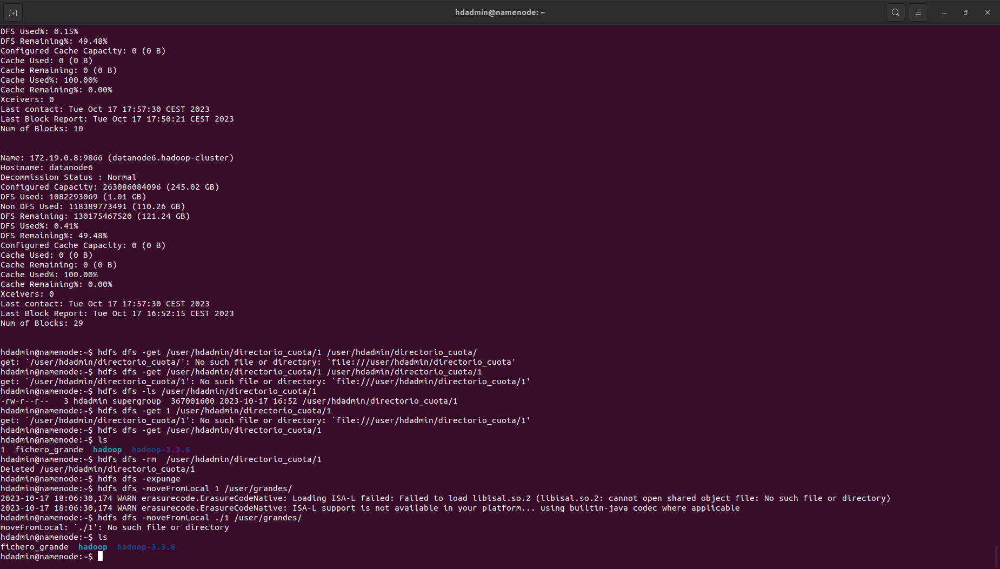</a>
        </kbd>


    4. Comprueba de nuevo el espacio ocupado en DFS y comparalo con el valor que había antes. Compara también el número de bloques en cada Datanode con lo que había antes ¿cuál es la diferencia entre los bloques actuales y los anteriores?

        - ANTES DEL PROTOCOLO
        
        <kbd>
        <a href="./images/3_2_4_antes.png" target="_blank">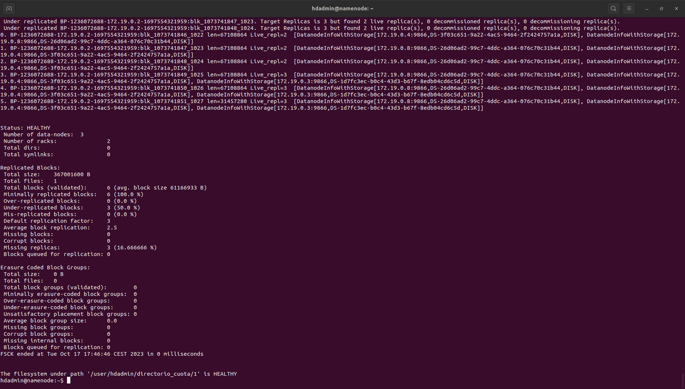</a>
        </kbd>

        - DESPUES DEL PROTOCOLO

        <kbd>
        <a href="./images/3_2_4_despues.png" target="_blank">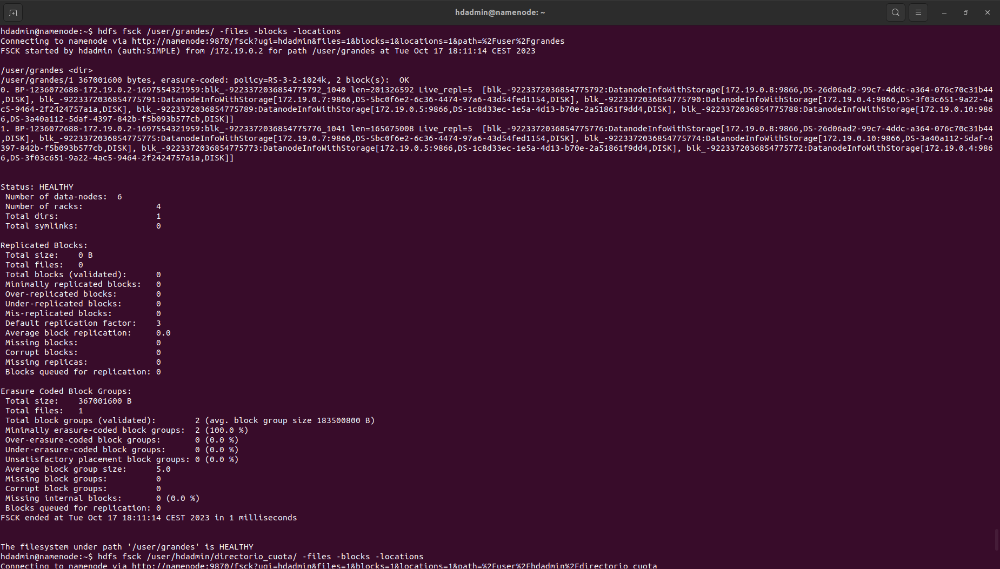</a>
        </kbd>