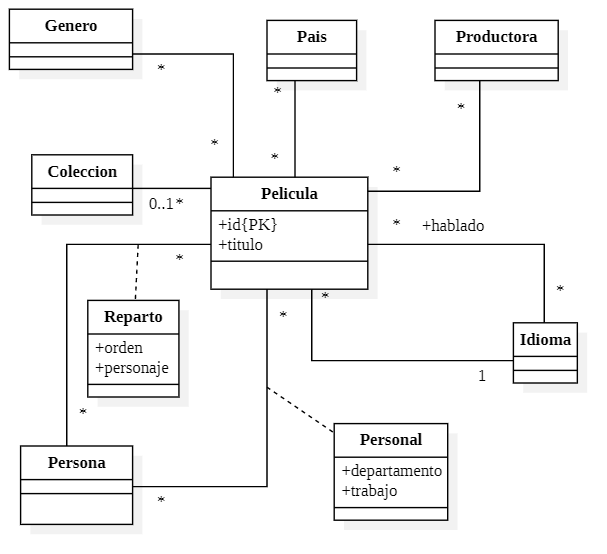

# 1.-Consulta de bases de datos relacionales con SQL

El objetivo de esta práctica es trabajar el uso del lenguaje SQL para resolver consultas sobre bases de datos relacionales. Usaremos la versión 13 del SGBDs PostgreSQL. La documentación puede consultarse aquí: https://www.postgresql.org/docs/13/index.html

Usamos la maquina virtual de GreiBD

### 1.1 Creación del esquema e inserción de datos

El esquema de la base de datos de ejemplo se encuentra en ./BDGE/datos/PeliculasSchema.sql. Si abrimos el archivo con un editor de texto podemos ver el código DDL de creación de cada tabla. El siguiente gráfico muestra el modelo conceptual de la base de datos.

<kbd>
  
</kbd>

Productora en este caso una pelicula tiene mas de una productora y las productoras mas de una pelicual al igual sigue el pais

hablado tabla intermedia por que una pelical se puide hablar varios idiomas y un idioma en varias peliculas pero luego hay una relación de 1 por que solo hay un idioma original

genres un a pelicual tiene varios generos tabal intermdeia 

colecion el codigo de la coleción estara en la pelicual estara en su codigo de coleción si no tiene estará nulo

lo ultimo que tenmos son las personsa que actuan pueden participar de manera distintas en reparto que seran pares el orden en el que aparecen en el reparto necesitan un orden que es importan y el personaje que es texto si una person actua en mas de un papel un monton de textos en una sola columna por otro lado la persona podria se del equipo de ayuda tipo el director con un departamento y el trabajo que hace ...

No tiene por que ser asi en todas las tecnologias este modelo hay que tranformarlo en tablas

###### Modelo conceptual de la base de datos

Después de crear una nueva base de datos en PostgreSQL llamada "bdge" ejecutar el siguiente comando para crear todas las tablas.
Esta tabla esta en el github en [PeliculasSchema.sql](../material/PeliculasSchema.sql) en la maquina virtual esta en /home/alumnogreibd/BDGE/datos/
Lo que va ejecutar el cliente psql es el usuario alumnogreibd en bdge y ejecuta todo el comando de home/alumnogreibd/BDGE/datos/PeliculasSchema.sql en la base de datos (para ello hay que crear la base de datos) para crear todas las tablas.

    psql -U alumnogreibd -d bdge -f /home/alumnogreibd/BDGE/datos/PeliculasSchema.sql

Las sentencias DML de inserción de datos de cada una de las tablas se encuentra en archivos .sql en la misma carpeta ./BDGE/datos. Ejecutar los siguientes comandos para importar todos los datos.

    psql -U alumnogreibd -d bdge -c "\copy colecciones from /home/alumnogreibd/BDGE/datos/colecciones.csv csv"
    psql -U alumnogreibd -d bdge -c "\copy generos from /home/alumnogreibd/BDGE/datos/generos.csv csv"
    psql -U alumnogreibd -d bdge -c "\copy idiomas from /home/alumnogreibd/BDGE/datos/idiomas.csv csv"
    psql -U alumnogreibd -d bdge -c "\copy paises from /home/alumnogreibd/BDGE/datos/paises.csv csv"
    psql -U alumnogreibd -d bdge -c "\copy personas from /home/alumnogreibd/BDGE/datos/personas.csv csv"
    psql -U alumnogreibd -d bdge -c "\copy productoras from /home/alumnogreibd/BDGE/datos/productoras.csv csv"
    psql -U alumnogreibd -d bdge -c "\copy peliculas from /home/alumnogreibd/BDGE/datos/peliculas.csv csv"
    psql -U alumnogreibd -d bdge -c "\copy pelicula_genero from /home/alumnogreibd/BDGE/datos/pelicula_genero.csv csv"
    psql -U alumnogreibd -d bdge -c "\copy pelicula_idioma_hablado from /home/alumnogreibd/BDGE/datos/pelicula_idioma_hablado.csv csv"
    psql -U alumnogreibd -d bdge -c "\copy pelicula_pais from /home/alumnogreibd/BDGE/datos/pelicula_pais.csv csv"
    psql -U alumnogreibd -d bdge -c "\copy pelicula_personal from /home/alumnogreibd/BDGE/datos/pelicula_personal.csv csv"
    psql -U alumnogreibd -d bdge -c "\copy pelicula_productora from /home/alumnogreibd/BDGE/datos/pelicula_productora.csv csv"
    psql -U alumnogreibd -d bdge -c "\copy pelicula_reparto from /home/alumnogreibd/BDGE/datos/pelicula_reparto.csv csv"

### 1.2 Consultas simples sobre una tabla (SELECT FROM T WHERE)

El triangulo ejecuta una linea tirangulo mas hace la ejecuón entera pero si falla no ejecuta nada el pergamino ejecutar como script (parecido a python)

1. Obtener los datos de las películas con idioma original Español y con unos ingresos superiores a 15 millones.

    - En este caso idioma original es solo uno  por lo que 1 a varios  no hace falta una tabla intermedia con lincar la id ya es suficiente

    Ejemplo 

        select *

        from peliculas

        where idioma_original ='es' and ingresos > 15000000

2. Obtener el título, sinopsis y lema de las películas que tengan la palabra "Pirate" en su título. Ordena el resultado de forma descendente por presupuesto
    -   En el where no "" por que es el postgress es para tablas por elso '%Pirate%' va con comillas simples where soporta cualquier valor booleano 
   
    Ejemplo

        select titulo, sinopsis, lema 

        from peliculas

        where titulo like '%Pirate%'

        order by presupuesto desc

   

3. Muestra los títulos de las 10 películas con mayor presupuesto con una duración inferior a 60.

    Ejemplo

        select titulo

        from peliculas

        where duracion < 60

        order by presupuesto desc 

        limit 10

Este modelo esta basado en la teoria de conjunto y si lo ordenais ya no debes poder usarlo por que pasa a ser una lista pero ya no es un conjunto

### 1.3 Consultas simples sobre varias tablas (SELECT FROM T1, T2, ... WHERE)

4. Para las películas en las que actuó "Penélope Cruz", muestra el título original de la película y el personaje que interpretó. Ordena las películas por popularidad de forma descendente.
    - Con el pelicualas no me llega hay que poner peliculas_reparto para sacar la id de la atriz pero da el nombre por eso tenemos que usar tambien personas para sacar el nombre  para esto el 'from' une las tablas y para eso combina las filas de una tala con otra filas de tablas por lo que usa el punto cartesiano haciendo todas las posibles relaciones si no coloco nada mas saca el producto cartesiano (combinatoria de las tablas de todas las filas) el lenjua es seguro que va sobre datos finitas pero tardará mucho por lo que hay que indicar las combinaciones que tengan sentido por lo cual usaremos las claves foraneas en mi fila grande id de la pelica tiene que se igual a la que aparece tabla pelicula y peliculas_reparto asi como el id de persona en pelicuas_reparto y persona. por lo que usamos un join lo que nos enlazaa (por las claves) pero en este caso usamos where para indicar la condiciṕon del join. En este caso es de varios a varios.

    1.  Por lo que cargamos las tablas 
    2.  Usamos  las claves primarias con las claves foraneas para lincar con el where

    Ejemplo

        select pel.titulo_original, pr.personaje 

        from peliculas pel, pelicula_reparto pr , personas per

        where pel.id = pr.pelicula 

        and pr.persona = per.id 

        and per.nombre = 'Penélope Cruz'

        order by pel.popularidad  desc

##### Ejercicio hecho en clase

5. Obtén un listado de las películas dirigidas por "Steven Spielberg" (el trabajo es "Director"). Para cada película muestra su título, presupuesto e ingresos. Ordena el listado por popularidad de forma descendente.

    - pelicula_personal pp  esto lo que hace es un alias a pelicula_personal y se pude poner asi tambien pelicula_personal as pp el pel.titulo_original para saber que queremos saber la columna de el titulo_original de la tabla pel

    Solución

        select pel.titulo_original , presupuesto , ingresos

        from peliculas pel, pelicula_personal pp , personas per

        where pel.id = pp.pelicula 

        and pp.persona = per.id 

        and per.nombre = 'Steven Spielberg'

        and pp.trabajo = 'Director'

        order by pel.popularidad  desc

### 1.4 Agregados (AVG, MIN, MAX, SUM, COUNT, etc.)

6. Obtén el máximo, mínimo y media del presupuesto e ingresos de las películas producidas en España. Muestra la media del presupuesto sin decimales.
    
    Ejemplo

        select max(presupuesto) as maximo_presupuesto, 

            min(presupuesto) as minimo_presupuesto,

            cast(avg(presupuesto) as integer) as media_presupuesto,

            max(ingresos) as maximo_ingresos, 

            min(ingresos) as minimo_ingresos,

            cast(avg(ingresos) as integer) as media_ingresos

        from peliculas pel, pelicula_pais pp

        where pel.id =pp.pelicula 

        and pp.pais ='ES'

7. Para las películas de la colección "Star Wars Collection", obtener el mínimo, máximo y media del beneficio obtenido (ingresos - presupuesto y los coeficientes de correlación entre presupuesto e ingresos), entre la popularidad y el presupuesto e ingresos, y entre la fecha de emisión y el presupuesto, ingresos y popularidad. 
    - Nota: Ver como poder aplicar la correlación a una fecha, transformándola a un número.
    Para transformar una fecha en un número en SQL, puedes utilizar la función específica de conversión de fechas proporcionada por el sistema de gestión de bases de datos que estés utilizando. A continuación, te mostraré cómo hacerlo en algunos de los sistemas de gestión de bases de datos más comunes:

    1. MySQL: En MySQL, puedes utilizar la función UNIX_TIMESTAMP() para convertir una fecha en un número que representa la cantidad de segundos transcurridos desde la "Época Unix" (1 de enero de 1970 a las 00:00:00 UTC).

            SELECT UNIX_TIMESTAMP(fecha_emision) AS fecha_emision_numerica FROM peliculas;

    2. PostgreSQL: En PostgreSQL, puedes utilizar la función EXTRACT() para extraer componentes específicos de una fecha y convertirlos en números. Por ejemplo, puedes extraer el año, mes y día de la fecha.

        Ejemplo para extraer el año:

            SELECT EXTRACT(YEAR FROM fecha_emision) AS anio_emision FROM peliculas;

    3. SQL Server: En SQL Server, puedes utilizar la función DATEDIFF() para calcular la diferencia entre dos fechas en una unidad específica, como días o segundos. También puedes utilizar CAST() para convertir una fecha en un número decimal.

        Ejemplo para obtener la diferencia en segundos desde una fecha específica (por ejemplo, '1970-01-01'):

            SELECT DATEDIFF(SECOND, '1970-01-01', fecha_emision) AS fecha_emision_numerica FROM peliculas;

    4. Oracle: En Oracle, puedes utilizar la función TO_NUMBER() para convertir una fecha en un número.

            SELECT TO_NUMBER(TO_CHAR(fecha_emision, 'YYYYMMDD')) AS fecha_emision_numerica FROM peliculas;

            SELECT  EXTRACT(YEAR FROM p.fecha_emision),DATE_PART('epoch', p.fecha_emision)::numeric ,c.nombre ,p.titulo

            FROM peliculas p , colecciones c 

            WHERE p.coleccion = c.id and c.nombre like 'Star Wars Collection';

    Solución
    
        SELECT 

            MIN(p.ingresos - p.presupuesto) AS min_beneficio,

            MAX(p.ingresos - p.presupuesto) AS max_beneficio,

            AVG(p.ingresos - p.presupuesto) AS media_beneficio,
            
            CORR(p.presupuesto, p.ingresos) AS correlacion_presupuesto_ingresos,

            CORR(p.popularidad, p.presupuesto) AS correlacion_popularidad_presupuesto,

            CORR(p.popularidad, p.ingresos) AS correlacion_popularidad_ingresos,

            CORR(EXTRACT(YEAR FROM p.fecha_emision), p.presupuesto) AS correlacion_ano_presupuesto,

            CORR(EXTRACT(YEAR FROM p.fecha_emision), p.ingresos) AS correlacion_ano_ingresos,

            CORR(EXTRACT(YEAR FROM p.fecha_emision), p.popularidad) AS correlacion_ano_popularidad,

            CORR(DATE_PART('epoch', p.fecha_emision)::NUMERIC, p.presupuesto) AS correlacion_fecha_presupuesto,

            CORR(DATE_PART('epoch', p.fecha_emision)::NUMERIC, p.ingresos) AS correlacion_fecha_presupuesto,

            CORR(DATE_PART('epoch', p.fecha_emision)::NUMERIC, p.popularidad) AS correlacion_fecha_presupuesto

        FROM peliculas p , colecciones c 

        WHERE p.coleccion = c.id and c.nombre like '%Star Wars Collection%';
    
### 1.5  Agregados sobre grupos (GROUP BY, HAVING)

8. Obtén un informe en el que se muestre para cada película de la colección "Star Wars Collection" el número de personas que han trabajado en cada departamento.

        select p.titulo, pp.departamento, count(distinct pp.persona) as personas

        from peliculas p, colecciones c, pelicula_personal pp 

        where p.coleccion = c.id 

        and p.id =pp.pelicula 

        and c.nombre = 'Star Wars Collection'
        
        group by p.titulo, pp.departamento

        order by p.titulo, pp.departamento 

9. Para las diez productoras que más películas tengan, muestra el nombre de la productora, el número de películas, el número distinto de idiomas originales de las películas, a suma de presupuesto, la suma de ingresos, el beneficio (resta de ingresos - presupuesto) y la primera y última fecha de emisión.

    Solución mal LA PLANTE MAL.

        select pro.nombre, count( pp.pelicula) as num_peliculas,  count( distinct pih.idioma ) as num_peliculas,

            sum(p.presupuesto) as sum_presupueste, sum(p.ingresos) as sum_ingresos, sum(p.ingresos-p.presupuesto) as sum_ingresos,

            min(p.fecha_emision) as primera_fecha_de_emision, max(p.fecha_emision) ultima_fecha_de_emision

        from peliculas p , productoras pro, pelicula_productora pp ,pelicula_idioma_hablado pih,idiomas i

        where pro.id = pp.productora 

        and p.id = pp.pelicula 

        and pih.pelicula= p.id

        and pih.idioma= i.id

        and i.nombre != p.idioma_original

        -- aqui estoy agrupando  por promotora lo cual solo toma si hay peliculas repetidas

        group by pro.nombre

        order by count( pp.pelicula)  desc 

        -- ahora limitamos la tabla a la visualización a 10
        
        limit 10

    sol del profesor en clase 

        select pr.nombre, count(*) as peliculas,

            count(distinct p.idioma_original) as idiomas,

            sum(p.presupuesto) as presupuesto,

            sum(p.ingresos) as ingresos,

            sum(p.ingresos-p.presupuesto) as beneficios,

            min(p.fecha_emision) as pelicula,

            max(p.fecha_emision) as ultima ,

        from productora pr, pelicula p , pelicula_productora pp

        where pr.id==pp.productora

            and pp.pelicula = p.id

        group by pr .id

        order by peliculas desc

        limit 10

10. Obtener la lista de directores cuyas películas hayan generado más de 1500 millones de ingresos. Para cada director, obtener el número de películas que ha dirigido, el total de ingresos y presupuesto, y el beneficio total. Mostrar también el número de idiomas originales y la lista separada por comas de los códigos de los idiomas (usar string_agg). Ordena el resultado en orden descendente por beneficio.

    Ejemplo

        select per.nombre as director,

            count(pel.id) as peliculas,

            sum(ingresos) as ingresos,

            sum(presupuesto) as presupuesto,

            sum(ingresos-presupuesto) as beneficio,

            count(distinct idioma_original) as num_idiomas,

            string_agg(distinct idioma_original,',') as idiomas

        from peliculas pel, pelicula_personal pp, personas per

        where pel.id = pp.pelicula 

        and per.id = pp.persona 

        and pp.trabajo = 'Director'

        group by per.id, per.nombre 

        having sum(pel.ingresos) > 1500000000

        order by beneficio desc

11. Para las películas producidas en España (ES), obtener las lista de actores/actrices que han participado en más de 15 películas distintas. Muestra el número de películas, la media de popularidad de las películas (con dos decimales) y ordena el resultado por este campo.

    Ver otro tipo de expresiones más complejas con funciones de agregado incluyendo (https://www.postgresql.org/docs/12/sql-expressions.html):

        Ordenación y filtrado durante el cálculo de agregados.
        Funciones de ventana (window functions).

    Ejemplo

        select p.nombre, count(pel.id) as numero_de_peliculas,

            AVG(pel.popularidad) AS media_de_popularidad,round(CAST(AVG(pel.popularidad) as  numeric), 2) as M

            
        from peliculas pel, pelicula_pais pp , pelicula_reparto pr ,personas p 

        where pel.id =pp.pelicula 

        and pel.id = pr.pelicula 

        and pr.persona = p.id 

        and pp.pais ='ES'

        group by p.nombre 

        having  COUNT(pel.id) > 15
        
        order  by media_de_popularidad desc 

### 1.6 Subconsultas en cláusula FROM

12. Para las 10 películas con más ingresos, muestra su título y el número de personas distintas del reparto, y los nombres separados por comas (ordenados por orden), el número de personas distintas del personal, y el número de departamentos y trabajos distintos de su personal. Muestra también la lista de sus directores (ordenados alfabéticamente). 

        select reparto.titulo, reparto.num_reparto, reparto.reparto,

        personal.num_personal, personal.departamentos, personal.trabajos, personal.directores

        from

        (select pel.id as id, pel.titulo as titulo, pel.ingresos as ingresos,

            count(distinct pr.persona) as num_reparto,

            string_agg(per.nombre,' ,' order by pr.orden) as reparto

        from peliculas pel, pelicula_reparto pr, personas per

        where pel.id =pr.pelicula and pr.persona = per.id 

        group by pel.id, pel.titulo) as reparto,

        (select pel.id as id,

            count(distinct pp.persona) as num_personal,

            count(distinct pp.departamento) as departamentos,
            
            count(distinct pp.trabajo) as trabajos,

            string_agg(per.nombre, ' ,' order by per.nombre) filter (where pp.trabajo = 
            
            'Director') as directores

        from peliculas pel, pelicula_personal pp, personas per

        where pel.id=pp.pelicula  and pp.persona = per.id 

        group by pel.id) as personal

        where reparto.id = personal.id

        order by reparto.ingresos desc 

        limit 10

### 1.7 Subconsultas en cláusulas SELECT y WHERE

13. Obtener el titulo, fecha de emisión y sinopsis de la película más reciente con un beneficio superior a 1000 millones.

    select titulo, fecha_emision, sinopsis

    from peliculas pel

    where (ingresos - presupuesto) > 1000000000

    and fecha_emision = (select max(fecha_emision) 

                        from peliculas pel1 

                        where (ingresos - presupuesto) > 1000000000)
                        

14. Obtener el título original, presupuesto e ingresos de las 10 película producidas solo en España con más ingresos. Obtener también los directores y el reparto.

### 1.8 Operaciones de conjuntos compatibles (UNION, INTERSECCIÓN y DIFERENCIA)

15. Para las películas en las que participó "Quentin Tarantino", como actor o como miembro del personal, muestra el titulo, fecha de emisión, y trabajo (actor en el caso de que fuese miembro del reparto. Ordena el resultado por fecha de emisión.

select pel.titulo, pel.fecha_emision, 'Actor: '||pr.personaje as trabajo
from peliculas pel, pelicula_reparto pr , personas per 
where pel.id =pr.pelicula  and pr.persona = per.id 
 and per.nombre = 'Quentin Tarantino'
union all
select pel.titulo, pel.fecha_emision, pp.trabajo as trabajo
from peliculas pel, pelicula_personal pp , personas per
where pel.id =pp.pelicula and pp.persona = per.id 
  and per.nombre = 'Quentin Tarantino'
order by fecha_emision, titulo 

### 1.9 Operaciones de Join

16. Para las 20 películas más populares del 2017 muestra el título, fecha de emisión, popularidad y colección.

select pels.titulo, pels.fecha_emision, pels.popularidad, c.nombre as coleccion
from peliculas pels, colecciones c 
where pels.coleccion = c.id 
  and extract('year' from fecha_emision) = 2017
order by popularidad desc
limit 20

Las películas sin colección no salen en el resultado. Cambia la consulta de arriba para que aparezcan también las películas sin colección.
Ejercicios

Realiza las siguientes consultas sobre la base de datos de películas y entrega el código SQL generado para cada consulta en un único archivo de texto a través del campus virtual.

E1.- Obtén un listado ordenado de forma descendente por beneficios (ingresos - presupuesto) de las películas en idioma italiano (it) del año 1960. Para cada película muestra su título, su título original, la fecha de emisión y su sinopsis.

E2.- Obtener el reparto de la película "Titanic" de 1997. Para cada miembro del reparto mostrar el orden, el nombre del actor/actriz y el personaje. Mostrar el resultado ordenado por orden.

E3.- Obtener un listado de países, en el que se muestre para cada país: i) El número de películas producidas, ii) La cantidad de beneficios producida, iii) La media de popularidad de las películas (con dos cifras decimales). Ordena el listado de forma descendente por beneficios producidos.

E4.- Obtener un listado de personas que hayan dirigido y actuado en alguna película. Mostrar el número de películas dirigidas y las fechas de la primera y última. Mostrar también el número de películas en las que actuó, y la fecha de la primera y última. Ordena el resultado por el producto del número de películas dirigidas por el número de películas en la que actuó.

E5.- Para cada género, muestra la popularidad media de sus películas, la suma de beneficios, el beneficio por película medio, el título de la película que generó más beneficios y el actor/actriz principal (entre los 5 primeros en orden) y el director que han generado más beneficios. Ordena el resultado por popularidad media de forma descendientes