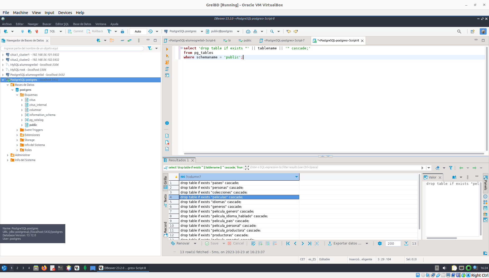
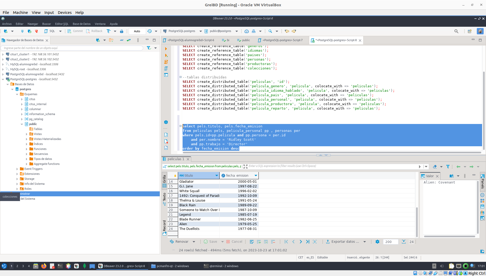

##### 1.- Probar el uso de la replicación. Para esto, borramos todas la tablas (en cascada) y las creamos de nuevo. Antes de crearlas modificar el script para eliminar las claves foráneas cláusulas references, ya que no se puede usar replicación en CITUS con claves foráneas. Antes de distribuir los datos, asignar el valor 2 a la variable de factor de replicación ("SET citus.shard_replication_factor = 2"). Cargar de nuevo los datos. Probar una de las consultas anteriores. Pausar una de las máquinas worker. Probar de nuevo la consulta. Intentar varias veces si es necesario, para que el coordinador se de cuenta que uno de los worker no responde. 

1. Primero eliminamos todas las tablas con, **si no funciona** eliminarlas desde el visualizaador de la base de datos DBeaver

  ```sql

  -- Inicia una consulta SQL
  SELECT 'drop table if exists "' || tablename || '" cascade;'
  -- La siguiente línea crea la parte de la instrucción SQL para eliminar la tabla
  -- 'drop table if exists "' inicia la instrucción SQL para eliminar una tabla, asegurando que solo se elimine si existe.
  -- tablename es el nombre de la tabla recuperado de la tabla pg_tables.
  -- " encierra el nombre de la tabla entre comillas dobles, necesario si el nombre de la tabla contiene caracteres especiales o letras mayúsculas/minúsculas mixtas.
  -- cascade; indica que se eliminarán todas las dependencias de la tabla de manera recursiva.

  -- Recuperar datos de la tabla pg_tables
  FROM pg_tables
  -- Filtrar para seleccionar solo las tablas en el esquema "public"
  WHERE schemaname = 'public';

  ``` 
  - Salida seria el contenido de las tablas 

    <kbd>
    <a href="./images/ejer_1_1.png" target="_blank"></a>
    </kbd>
  
2. Volvee a generar las tablas  mediante el script que se nos proporciona en el enunciado de esta entrega, modificándolo para eliminar las claves foráneas (en la cláusula references, /home/alumnogreibd/BDGE/datos/PeliculasSchema.sql ), ya que no se puede usar replicación en CITUS con claves foráneas. Estas son las partes del script que hay que modificar:

  ```sql

  CREATE TABLE peliculas (
    id int4 NOT NULL,
    titulo text ,
    -- coleccion int4 references colecciones(id),
    coleccion int4 ,
    para_adultos bool ,
    presupuesto int4 ,
    -- idioma_original text references idiomas(id),
    idioma_original text ,
    titulo_original text ,
    sinopsis text ,
    popularidad float8 ,
    fecha_emision date ,
    ingresos int8 ,
    duracion float8 ,
    lema text ,
    PRIMARY KEY (id)
  );

  CREATE TABLE pelicula_genero (
    --pelicula int4 NOT NULL references peliculas(id),
    --genero int4 NOT NULL references generos(id),
    pelicula int4 NOT NULL ,
    genero int4 NOT NULL ,
    PRIMARY KEY (pelicula, genero)
  );

  CREATE TABLE pelicula_idioma_hablado (
    --pelicula int4 NOT NULL references peliculas(id),
    --idioma text NOT NULL references idiomas(id),
    pelicula int4 NOT NULL ,
    idioma text NOT NULL ,
    PRIMARY KEY (pelicula, idioma)
  );

  CREATE TABLE pelicula_pais (
    --pelicula int4 NOT NULL references peliculas(id),
    --pais text NOT NULL references paises(id),
    pelicula int4 NOT NULL ,
    pais text NOT NULL ,
    PRIMARY KEY (pelicula, pais)
  );

  CREATE TABLE pelicula_personal (
    --pelicula int4 NOT NULL references peliculas(id),
    --persona int4 NOT NULL references personas(id),
    pelicula int4 NOT NULL ,
    persona int4 NOT NULL ,
    departamento text,
    trabajo text NOT NULL,
    PRIMARY KEY (pelicula, persona, trabajo)
  );

  CREATE TABLE pelicula_productora (
    --pelicula int4 NOT NULL references peliculas(id),
    --productora int4 NOT NULL references productoras(id),
    pelicula int4 NOT NULL ,
    productora int4 NOT NULL ,

    PRIMARY KEY (pelicula, productora)
  );

  CREATE TABLE pelicula_reparto (
    --pelicula int4 NOT NULL references peliculas(id),
    --persona int4 NOT NULL references personas(id),
    
    pelicula int4 NOT NULL ,
    persona int4 NOT NULL ,
    orden int4 NOT NULL,
    personaje text NOT NULL,
    PRIMARY KEY (pelicula, persona, personaje, orden)
  );

  ```
  - Ejecutamos el comando para volver a crear las tablas:

  ```bash
  chmod 664 /home/alumnogreibd/BDGE/datos/PeliculasSchema_mod.sql
  sudo -i -u postgres psql -f /home/alumnogreibd/BDGE/datos/PeliculasSchema_mod.sql

  ```
3. Establecemos el factor de replicación al valor 2 mediante la siguiente instrucción:

  ```sql
  SET citus.shard_replication_factor = 2;
  ```

4. Distribuir las tablas y ejecutar las instrucciones de inserción de datos.
  
  - Distrivución (ejecutamos en Dbearver)

    ``` sql

    --tablas de referencia
    SELECT create_reference_table('colecciones');
    SELECT create_reference_table('generos');
    SELECT create_reference_table('idiomas');
    SELECT create_reference_table('paises');
    SELECT create_reference_table('personas');
    SELECT create_reference_table('productoras');

    --tablas distribuídas
    SELECT create_distributed_table('peliculas', 'id');
    SELECT create_distributed_table('pelicula_genero', 'pelicula', colocate_with => 'peliculas');
    SELECT create_distributed_table('pelicula_idioma_hablado', 'pelicula', colocate_with => 'peliculas');
    SELECT create_distributed_table('pelicula_pais', 'pelicula', colocate_with => 'peliculas');
    SELECT create_distributed_table('pelicula_personal', 'pelicula', colocate_with => 'peliculas');
    SELECT create_distributed_table('pelicula_productora', 'pelicula', colocate_with => 'peliculas');
    SELECT create_distributed_table('pelicula_reparto', 'pelicula', colocate_with => 'peliculas');
    ```
  - Inserción (Ejecutamos en una termial)

    ```bash
    chmod 664 /home/alumnogreibd/BDGE/datos/*.csv
    sudo -i -u postgres psql -c "\copy colecciones from /home/alumnogreibd/BDGE/datos/colecciones.csv csv"
    sudo -i -u postgres psql -c "\copy generos from /home/alumnogreibd/BDGE/datos/generos.csv csv"
    sudo -i -u postgres psql -c "\copy idiomas from /home/alumnogreibd/BDGE/datos/idiomas.csv csv"
    sudo -i -u postgres psql -c "\copy paises from /home/alumnogreibd/BDGE/datos/paises.csv csv"
    sudo -i -u postgres psql -c "\copy personas from /home/alumnogreibd/BDGE/datos/personas.csv csv"
    sudo -i -u postgres psql -c "\copy productoras from /home/alumnogreibd/BDGE/datos/productoras.csv csv"
    sudo -i -u postgres psql -c "\copy peliculas from /home/alumnogreibd/BDGE/datos/peliculas.csv csv"
    sudo -i -u postgres psql -c "\copy pelicula_genero from /home/alumnogreibd/BDGE/datos/pelicula_genero.csv csv"
    sudo -i -u postgres psql -c "\copy pelicula_idioma_hablado from /home/alumnogreibd/BDGE/datos/pelicula_idioma_hablado.csv csv"
    sudo -i -u postgres psql -c "\copy pelicula_pais from /home/alumnogreibd/BDGE/datos/pelicula_pais.csv csv"
    sudo -i -u postgres psql -c "\copy pelicula_personal from /home/alumnogreibd/BDGE/datos/pelicula_personal.csv csv"
    sudo -i -u postgres psql -c "\copy pelicula_productora from /home/alumnogreibd/BDGE/datos/pelicula_productora.csv csv"
    sudo -i -u postgres psql -c "\copy pelicula_reparto from /home/alumnogreibd/BDGE/datos/pelicula_reparto.csv csv"

    ```
5. Probamos una query:

  ```sql
  --Obtener todas las películas dirigidas por "Ridley Scott". Ordena el resultado de forma descendiente por fecha de emisión.

  select pels.titulo, pels.fecha_emision 
  from peliculas pels, pelicula_personal pp , personas per 
  where pels.id=pp.pelicula and pp.persona = per.id 
    and per.nombre = 'Ridley Scott'
    and pp.trabajo = 'Director'
  order by fecha_emision desc
  ```
  -  resultado:

  <kbd>
    <a href="./images/ejer_1_query.png" target="_blank"></a>
  </kbd>
    
6. Ahora detenemod uno de los cluster pausando la maquina virtual y reejecutamos la query del apartado 5.

  - Detenemos el cluster 1 o 2 en este caso se detuvo el cluster 2
      - user : alumnogreibd
      - password: greibd2021

      ```bash
      # en una de las maquinas ejeutamos 
      sudo systemctl stop postgresql

      ```
  - Se ejecuta la query tras que  el coordinador se de cuenta de que uno de los nodos worker no responde

      - resultado: Si bien devuelve la tabla indica un error a la hora de ejecutar la query puesto que indica que el nodo  remató de manera abrupta por otro lado se pude obsevar que el tiempo de ejecución es mayor que cuando estan los dos cluster activos (200 ms mas ).

      <kbd>
        <a href="./images/ejer_1_query_stop_cluster_2.png" target="_blank"></a>
      </kbd>


##### 2.- Buscar información sobre el formato de almacenamiento columnar en citus  (https://docs.citusdata.com/en/v10.1/admin_guide/table_management.html#columnar-storage). Probar a crear la tabla "peliculas" en formato columnar y comprobar si hay ganancia en tiempo de ejecución en las consultas anteriores. 

**verison de citus:** Citus 10.0.8 on x86_64-pc-linux-gnu, compiled by gcc (Ubuntu 9.4.0-1ubuntu1~20.04.1) 9.4.0, 64-bit

- Primero volvemos a reactivar el cluster 2  

```bash
sudo systemctl star postgresql
```

1. Ejecutamos otra query aparte de la que ya ejecutaramos.

  ```sql
  -- Para cada actor/actriz principal (orden < 5), obtener el número de películas en las que participó y la cantidad de beneficios que han generados dichas películas. Devuelve solo las 10 primeras filas ordenas por beneficio.

  select per.nombre, count(pels.id) as peliculas, sum(pels.ingresos-pels.presupuesto) as beneficio
  from peliculas pels, pelicula_reparto pr, personas per 
  where pels.id=pr.pelicula and pr.persona=per.id
    and pr.orden<5
  group by per.nombre
  order by beneficio desc
  limit 10
  ```

2. Eliminamos la tabla pelicual y creamos la tabla peliculas de forma columnar , eliminamos la columna de prymary key usamos el formato columnnar
  ```sql 
  CREATE TABLE peliculas
  (
      id int4 NOT NULL,
      titulo text ,
      -- coleccion int4 references colecciones(id),
      coleccion int4 ,
      para_adultos bool ,
      presupuesto int4 ,
      -- idioma_original text references idiomas(id),
      idioma_original text ,
      titulo_original text ,
      sinopsis text ,
      popularidad float8 ,
      fecha_emision date ,
      ingresos int8 ,
      duracion float8 ,
      lema text ,
  ) USING columnar;  
  ```
  - Comando de ejecución de para crear el resto de tablas junto con la nueva tabla de peliculas, las otras tablas se dejan igules.
  ```bash
  sudo -i -u postgres psql -f /home/alumnogreibd/BDGE/datos/PeliculasSchema_columnar.sql
  ```
  - **NOTA** OTRAS MANERAS DE GENERAR LA TABLA EN FORMA COLUMNAR

    ```sql 
    -- Opción 1 
    -- Cambiamos entre columnar o row
    SELECT alter_table_set_access_method('peliculas', 'columnar');

    -- Opción 2 en este caso luego hjayq eu ejecutar 
    -- sudo -i -u postgres psql -c "\copy peliculas_columnar from /home/alumnogreibd/BDGE/datos/peliculas.csv csv"
    CREATE TABLE peliculas_columnar(LIKE peliculas) USING COLUMNAR;
    ```
3. Comprobamos las diferemncias re-ejecutando las querys

-   
    SELECT * FROM columnar.options;
    peliculas 	10000(chunck group limit )	150000 (stip row limit)	3 (compress level)	zstd(compression)

- resultados

    - Normal

    <kbd>
    <a href="./images/ejer_1_query.png" target="_blank"></a>
    </kbd>


    <kbd>
    <a href="./images/ejer_1_query_2.png" target="_blank"></a>
    </kbd>


    - Columnar

    <kbd>
    <a href="./images/ejer_1_query_columnar.png" target="_blank"></a>
    </kbd>


    <kbd>
    <a href="./images/ejer_1_query_2_columnar.png" target="_blank"></a>
    </kbd>


