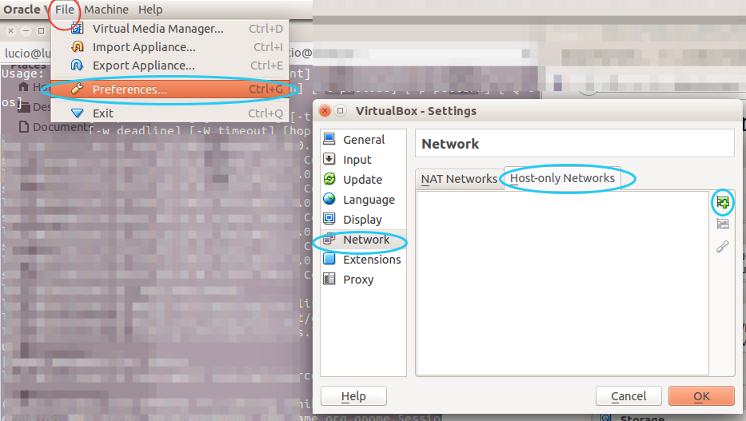
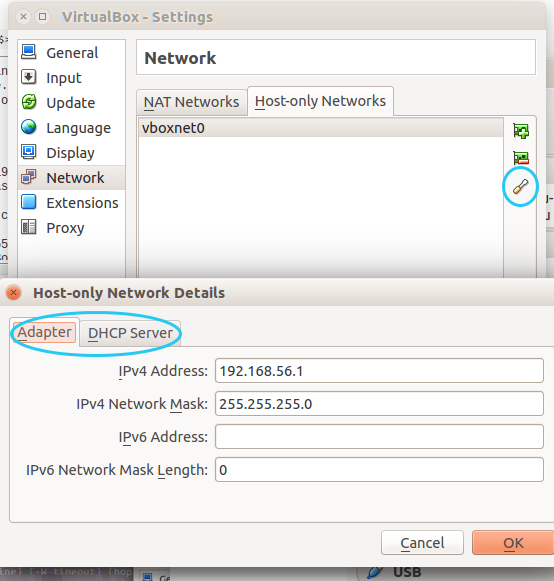

Probably, the virtual host-only network wasn't set up yet. Here's is how you can fix this if you have a version older than 2018:

    From the main menu, select File > Preferences (Ctrl+G) - NOT the settings of a single vm
    Select Network in the list on the left
    You should see an empty white box with "Host-only Networks" at the top. On the right, there are three buttons to manage them. Click the topmost one (with a green plus symbol). A new Host-only network will be created and added to the list.

<kbd>

</kbd>

Normally, the settings of the new network will be ok, but for completeness, I give the default values here. You can access the settings for the host-only network through the screwdriver button on the right.

<kbd>

</kbd>

ss2

    Adapter:
        IPv4 address: 192.168.56.1
        IPv4 Network Mask: 255.255.255.0
    DHCP server:
        Enable server: checked
        Server Address: 192.168.56.100
        Server Mask: 255.255.255.0
        Lower Address Bound: 192.168.56.101
        Upper Address Bound: 192.168.56.254

You can change these settings to your liking, as long as they're consistent.
