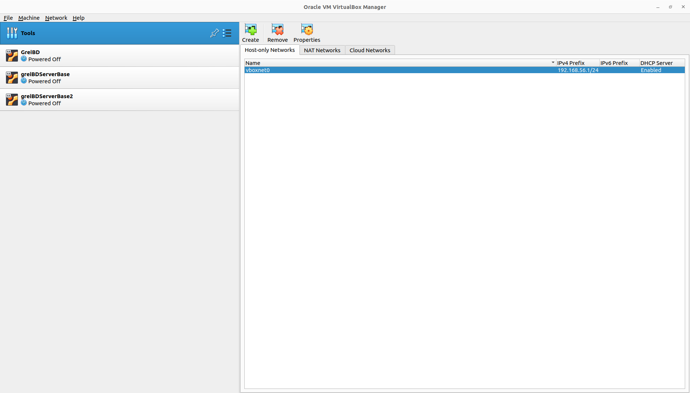
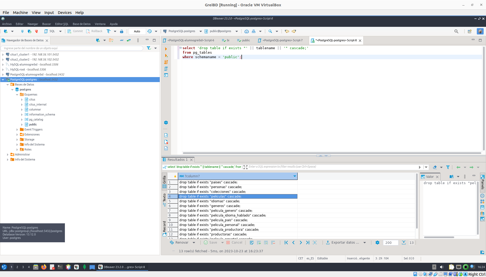
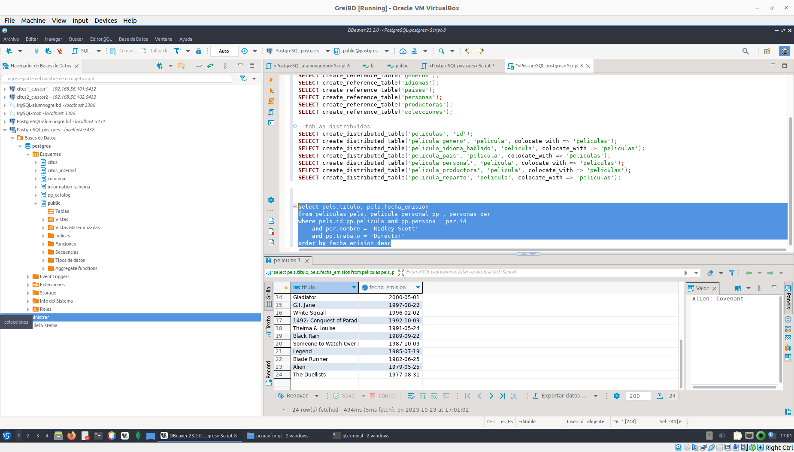
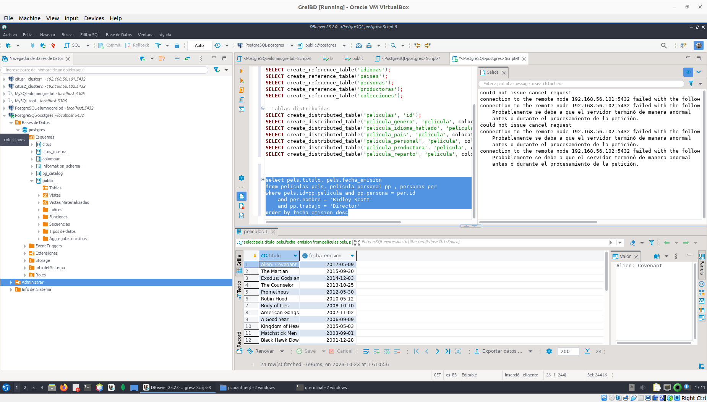

# Paso 0 

Descargar la maquina virtual de GreiBD Server Base

y En el virtual vox crear una nueva network

<kbd>
<a href="./images/create_network.png" target="_blank"></a>
</kbd>

Arrancamos las maquinas 

la de GreiBD , GreiBD Server (2 veces)

clonación 

Usuario: alumnogreibd
Contraseña: greibd2021


### 3.1 Instalación de Citus en Ubuntu (NO EN LA MAQUINA VIRTUAL)

Este paso no es necesario hacerlo, ya que Citus ya está instalado en las máquinas "GeiBD" y "GreiBDServerBase". Los pasos necesarios para la instalación son los siguientes. Primero configuramos el repositorio.

curl https://install.citusdata.com/community/deb.sh | sudo bash

Instalamos PostgreSQL y Citus.

sudo apt-get -y install postgresql-13-citus-10.0

 Configuramos la precarga de la extensión Citus en PostgreSQL. Se añade la extensión Citus a la lista de extensiones para precargar en el archivo "/etc/postgresql/13/main/postgresql.conf". El siguiente comando hace este paso.

sudo pg_conftool 13 main set shared_preload_libraries citus

 Configuramos las conexiones de red para PostgreSQL. Primero modificamos la variable "listen_addresses" en "/etc/postgresql/13/main/postgresql.conf".

sudo pg_conftool 13 main set listen_addresses '*'

Para simplificar la configuración, damos permisos para conexión a postgresql a cualquier usuario sin password (hay información en la documentación de citus para restringir estos accesos). Configuramos las siguientes líneas del archivo "/etc/postgresql/13/main/pg_hba.conf" (reemplazar abajo la base de la ip de la subred si fuese necesario 192.168.56.0).

sudo nano /etc/postgresql/13/main/pg_hba.conf

host all all 192.168.56.0/24 trust
host all all 127.0.0.1/32 trust

Reiniciamos el servidor para actualizar la configuración y habilitamos su inicio automático

sudo service postgresql restart
sudo update-rc.d postgresql enable

 Creamos la extensión citus en la base de datos postgres y habilitamos un password para el usuario postgres

sudo -i -u postgres psql -c "CREATE EXTENSION citus" <--Utilizaa el cliente psql para ejecutar crea una extensión citus en la base de datos posstgre s->
sudo -i -u postgres psql -c "ALTER USER postgres WITH PASSWORD 'greibd2021'"<--Esto cambia la contraseña -->


### 3.2 Creación del cluster virtual

Para crear el cluster utilizaremos la máquina virtual "GreiBD" como nodo coordinador y dos copias de "GreiBDServerBase" que clonaremos como nodos worker.

Para clonar la máquina elegir la opción "clonar" en Virtual Box, elegir un nombre para la máquina (citus2 y citus3), elegir una carpeta en donde almacenar la copia de la máquina y asegurarse de generar nueva dirección mac para la tarjeta de red (para no tener problemas a la hora de tener todas las máquinas en la misma red local). Elegir finalmente la opción de clonación completa.

Esto se ejcuta en las maquinas servidor
Después de clonar cada máquina, debemos cambiar el nombre y el identificador en el sistema operativo. Primero cambiamos el nombre de la máquina

sudo hostnamectl set-hostname citus2
sudo hostnamectl

Después borramos el identificador y volvemos a generarlo.   

sudo rm /etc/machine-id
sudo dbus-uuidgen --ensure=/etc/machine-id
dbus-uuidgen --ensure

Anotamos la IP de la máquina (consultar usando ifconfig) y reiniciamos.

sudo shutdown -r now

Repetimos estos pasos para las tres máquinas.

Ahora en Greibd 

Una vez tenemos las tres máquinas funcionando, para simplificar el acceso a las bases de datos vamos a configurar conexiones desde DBeaver.


----------------

citus2 ip  10.0.2.15 (targeta para abrir firefox) 192.168.56.102 (este tene que estar en el rango de dhcp 192.168.56.x)
citus2 ip  10.0.2.15 (targeta para abrir firefox) 192.168.56.101 (este tene que estar en el rango de dhcp 192.168.56.x)

ahora en greibd  añadimos en el virtual box la red que estamos usando 

Añadimos la IPs y puertos de los dos nodos worker (citus2 y citus3) al coordinador (GreiBD). Para esto ejecutamos las dos instrucciones siguientes (¡Reemplazar las ips de las máquinas!)

ahopa dentro de DBAVER (donde se hace el sql)

greibd  192.168.56.103

añadimos dos conexiones a citus 1 y otra a citus 2 en estas

el password seria greibd2021

luego en postgres ejecutamos 

#deberia salir citus_add_node

SELECT * from citus_add_node('192.168.56.102', 5432);
SELECT * from citus_add_node('192.168.56.101', 5432);


Verificamos que la instalación es correcta.

SELECT * FROM citus_get_active_worker_nodes();


### 3.3 Ejemplo de uso: base de datos de películas.

Primero creamos el esquema de la base de datos, para eso ejecutamos el siguiente comando. Podemos usar un cliente ssh que nos permita copiar y pegar para facilitar el trabajo.
**NOTA** en una terminal  del coordinador 
chmod 664 /home/alumnogreibd/BDGE/datos/PeliculasSchema.sql
sudo -i -u postgres psql -f /home/alumnogreibd/BDGE/datos/PeliculasSchema.sql

Ahora vamos a distribuir las tablas. Elegiremos el identificador de la película para distribuir la tabla de películas y las tablas de las relaciones. Las demás tablas serán tablas de referencias, que replicaremos en todos los nodos. Es importante seguir el orden correcto en la distribución de las tablas para evitar errores derivados de las claves foráneas.

--tablas de referencia
SELECT create_reference_table('colecciones');
SELECT create_reference_table('generos');
SELECT create_reference_table('idiomas');
SELECT create_reference_table('paises');
SELECT create_reference_table('personas');
SELECT create_reference_table('productoras');

--tablas distribuídas
SELECT create_distributed_table('peliculas', 'id');
SELECT create_distributed_table('pelicula_genero', 'pelicula', colocate_with => 'peliculas');
SELECT create_distributed_table('pelicula_idioma_hablado', 'pelicula', colocate_with => 'peliculas');
SELECT create_distributed_table('pelicula_pais', 'pelicula', colocate_with => 'peliculas');
SELECT create_distributed_table('pelicula_personal', 'pelicula', colocate_with => 'peliculas');
SELECT create_distributed_table('pelicula_productora', 'pelicula', colocate_with => 'peliculas');
SELECT create_distributed_table('pelicula_reparto', 'pelicula', colocate_with => 'peliculas');

**NOTA** por defecto son los sark que ya esta preparando por defecto  lo esta creando  que aparece el nombre de la tabla ocn una id pero en el controlado(el Greibd ) se siguen viendo iguales


Ya podemos ejecutar las instrucciones de inserción de datos (puede tardar un rato dada la cantidad de datos a insertar. Ahora la tabla de personas tiene que replicarla en dos nodos).

**NOTA** lo que esta hacinedo es insertar datos las tablkas son de mentira serian como links virtuales no se usa como un nodo mas solo hace coordinzación como los esta enviando esto tarda mas por que los bordes son mas lentos insertando (es decir todo va a traves del coordinador de tal manera que este no tiene datos locales en si sino que accede al contenido de los bordes(citus 1 y citus 2))

chmod 664 /home/alumnogreibd/BDGE/datos/*.csv
sudo -i -u postgres psql -c "\copy colecciones from /home/alumnogreibd/BDGE/datos/colecciones.csv csv"
sudo -i -u postgres psql -c "\copy generos from /home/alumnogreibd/BDGE/datos/generos.csv csv"
sudo -i -u postgres psql -c "\copy idiomas from /home/alumnogreibd/BDGE/datos/idiomas.csv csv"
sudo -i -u postgres psql -c "\copy paises from /home/alumnogreibd/BDGE/datos/paises.csv csv"
sudo -i -u postgres psql -c "\copy personas from /home/alumnogreibd/BDGE/datos/personas.csv csv"
sudo -i -u postgres psql -c "\copy productoras from /home/alumnogreibd/BDGE/datos/productoras.csv csv"
sudo -i -u postgres psql -c "\copy peliculas from /home/alumnogreibd/BDGE/datos/peliculas.csv csv"
sudo -i -u postgres psql -c "\copy pelicula_genero from /home/alumnogreibd/BDGE/datos/pelicula_genero.csv csv"
sudo -i -u postgres psql -c "\copy pelicula_idioma_hablado from /home/alumnogreibd/BDGE/datos/pelicula_idioma_hablado.csv csv"
sudo -i -u postgres psql -c "\copy pelicula_pais from /home/alumnogreibd/BDGE/datos/pelicula_pais.csv csv"
sudo -i -u postgres psql -c "\copy pelicula_personal from /home/alumnogreibd/BDGE/datos/pelicula_personal.csv csv"
sudo -i -u postgres psql -c "\copy pelicula_productora from /home/alumnogreibd/BDGE/datos/pelicula_productora.csv csv"
sudo -i -u postgres psql -c "\copy pelicula_reparto from /home/alumnogreibd/BDGE/datos/pelicula_reparto.csv csv"

Ahora podemos comprobar como se han almacenado las tablas en los dos workers (citus2 y citus3).

Como observación, podemos ver que el uso de agregación en el modelo objeto-relacional, o con XML o JSON, replica todos los datos que aquí estamos replicando con las tablas de referencia. En el caso de los datos agregados, los datos de referencia se repiten para cada película, mientras que aquí se replican para cada nodo worker. 

**NOTA** la función has puede ser que tablas esten vacias por el sark por otro lado como se comento antes 

Ahora podemos probar algunas de las consultas.

1.- Obtener todas las películas dirigidas por "Ridley Scott". Ordena el resultado de forma descendiente por fecha de emisión.

select pels.titulo, pels.fecha_emision 
from peliculas pels, pelicula_personal pp , personas per 
where pels.id=pp.pelicula and pp.persona = per.id 
  and per.nombre = 'Ridley Scott'
  and pp.trabajo = 'Director'
order by fecha_emision desc

 2.- Para cada actor/actriz principal (orden < 5), obtener el número de películas en las que participó y la cantidad de beneficios que han generados dichas películas. Devuelve solo las 10 primeras filas ordenas por beneficio.

select per.nombre, count(pels.id) as peliculas, sum(pels.ingresos-pels.presupuesto) as beneficio
from peliculas pels, pelicula_reparto pr, personas per 
where pels.id=pr.pelicula and pr.persona=per.id
  and pr.orden<5
group by per.nombre
order by beneficio desc
limit 10

Apagamos uno de los worker y comprobamos que el sistema ya no es capaz de responder a las consultas (podemos pausar la ejecución de la máquina virtual).


Ejercicios

Realiza estos ejercicios y genera un documento de texto de explicación de cada paso que hagas. Entrega el documento a través del campus virtual. 

##### 1.- Probar el uso de la replicación. Para esto, borramos todas la tablas (en cascada) y las creamos de nuevo. Antes de crearlas modificar el script para eliminar las claves foráneas cláusulas references, ya que no se puede usar replicación en CITUS con claves foráneas. Antes de distribuir los datos, asignar el valor 2 a la variable de factor de replicación ("SET citus.shard_replication_factor = 2"). Cargar de nuevo los datos. Probar una de las consultas anteriores. Pausar una de las máquinas worker. Probar de nuevo la consulta. Intentar varias veces si es necesario, para que el coordinador se de cuenta que uno de los worker no responde. 

1. Primero eliminamos todas las tablas con, **si no funciona** eliminarlas desde el visualizaador de la base de datos DBeaver

  ```sql

  -- Inicia una consulta SQL
  SELECT 'drop table if exists "' || tablename || '" cascade;'
  -- La siguiente línea crea la parte de la instrucción SQL para eliminar la tabla
  -- 'drop table if exists "' inicia la instrucción SQL para eliminar una tabla, asegurando que solo se elimine si existe.
  -- tablename es el nombre de la tabla recuperado de la tabla pg_tables.
  -- " encierra el nombre de la tabla entre comillas dobles, necesario si el nombre de la tabla contiene caracteres especiales o letras mayúsculas/minúsculas mixtas.
  -- cascade; indica que se eliminarán todas las dependencias de la tabla de manera recursiva.

  -- Recuperar datos de la tabla pg_tables
  FROM pg_tables
  -- Filtrar para seleccionar solo las tablas en el esquema "public"
  WHERE schemaname = 'public';

  ``` 
  - Salida seria el contenido de las tablas 

    <kbd>
    <a href="./images/ejer_1_1.png" target="_blank"></a>
    </kbd>
  
2. Volvee a generar las tablas  mediante el script que se nos proporciona en el enunciado de esta entrega, modificándolo para eliminar las claves foráneas (en la cláusula references, /home/alumnogreibd/BDGE/datos/PeliculasSchema.sql ), ya que no se puede usar replicación en CITUS con claves foráneas. Estas son las partes del script que hay que modificar:

  ```sql

  CREATE TABLE peliculas (
    id int4 NOT NULL,
    titulo text ,
    -- coleccion int4 references colecciones(id),
    coleccion int4 ,
    para_adultos bool ,
    presupuesto int4 ,
    -- idioma_original text references idiomas(id),
    idioma_original text ,
    titulo_original text ,
    sinopsis text ,
    popularidad float8 ,
    fecha_emision date ,
    ingresos int8 ,
    duracion float8 ,
    lema text ,
    PRIMARY KEY (id)
  );

  CREATE TABLE pelicula_genero (
    --pelicula int4 NOT NULL references peliculas(id),
    --genero int4 NOT NULL references generos(id),
    pelicula int4 NOT NULL ,
    genero int4 NOT NULL ,
    PRIMARY KEY (pelicula, genero)
  );

  CREATE TABLE pelicula_idioma_hablado (
    --pelicula int4 NOT NULL references peliculas(id),
    --idioma text NOT NULL references idiomas(id),
    pelicula int4 NOT NULL ,
    idioma text NOT NULL ,
    PRIMARY KEY (pelicula, idioma)
  );

  CREATE TABLE pelicula_pais (
    --pelicula int4 NOT NULL references peliculas(id),
    --pais text NOT NULL references paises(id),
    pelicula int4 NOT NULL ,
    pais text NOT NULL ,
    PRIMARY KEY (pelicula, pais)
  );

  CREATE TABLE pelicula_personal (
    --pelicula int4 NOT NULL references peliculas(id),
    --persona int4 NOT NULL references personas(id),
    pelicula int4 NOT NULL ,
    persona int4 NOT NULL ,
    departamento text,
    trabajo text NOT NULL,
    PRIMARY KEY (pelicula, persona, trabajo)
  );

  CREATE TABLE pelicula_productora (
    --pelicula int4 NOT NULL references peliculas(id),
    --productora int4 NOT NULL references productoras(id),
    pelicula int4 NOT NULL ,
    productora int4 NOT NULL ,

    PRIMARY KEY (pelicula, productora)
  );

  CREATE TABLE pelicula_reparto (
    --pelicula int4 NOT NULL references peliculas(id),
    --persona int4 NOT NULL references personas(id),
    
    pelicula int4 NOT NULL ,
    persona int4 NOT NULL ,
    orden int4 NOT NULL,
    personaje text NOT NULL,
    PRIMARY KEY (pelicula, persona, personaje, orden)
  );

  ```
  - Ejecutamos el comando para volver a crear las tablas:

  ```bash
  chmod 664 /home/alumnogreibd/BDGE/datos/PeliculasSchema_mod.sql
  sudo -i -u postgres psql -f /home/alumnogreibd/BDGE/datos/PeliculasSchema_mod.sql

  ```
3. Establecemos el factor de replicación al valor 2 mediante la siguiente instrucción:

  ```sql
  SET citus.shard_replication_factor = 2;
  ```

4. Distribuir las tablas y ejecutar las instrucciones de inserción de datos.
  
  - Distrivución (ejecutamos en Dbearver)

    ``` sql

    --tablas de referencia
    SELECT create_reference_table('colecciones');
    SELECT create_reference_table('generos');
    SELECT create_reference_table('idiomas');
    SELECT create_reference_table('paises');
    SELECT create_reference_table('personas');
    SELECT create_reference_table('productoras');

    --tablas distribuídas
    SELECT create_distributed_table('peliculas', 'id');
    SELECT create_distributed_table('pelicula_genero', 'pelicula', colocate_with => 'peliculas');
    SELECT create_distributed_table('pelicula_idioma_hablado', 'pelicula', colocate_with => 'peliculas');
    SELECT create_distributed_table('pelicula_pais', 'pelicula', colocate_with => 'peliculas');
    SELECT create_distributed_table('pelicula_personal', 'pelicula', colocate_with => 'peliculas');
    SELECT create_distributed_table('pelicula_productora', 'pelicula', colocate_with => 'peliculas');
    SELECT create_distributed_table('pelicula_reparto', 'pelicula', colocate_with => 'peliculas');
    ```
  - Inserción (Ejecutamos en una termial)

    ```bash
    chmod 664 /home/alumnogreibd/BDGE/datos/*.csv
    sudo -i -u postgres psql -c "\copy colecciones from /home/alumnogreibd/BDGE/datos/colecciones.csv csv"
    sudo -i -u postgres psql -c "\copy generos from /home/alumnogreibd/BDGE/datos/generos.csv csv"
    sudo -i -u postgres psql -c "\copy idiomas from /home/alumnogreibd/BDGE/datos/idiomas.csv csv"
    sudo -i -u postgres psql -c "\copy paises from /home/alumnogreibd/BDGE/datos/paises.csv csv"
    sudo -i -u postgres psql -c "\copy personas from /home/alumnogreibd/BDGE/datos/personas.csv csv"
    sudo -i -u postgres psql -c "\copy productoras from /home/alumnogreibd/BDGE/datos/productoras.csv csv"
    sudo -i -u postgres psql -c "\copy peliculas from /home/alumnogreibd/BDGE/datos/peliculas.csv csv"
    sudo -i -u postgres psql -c "\copy pelicula_genero from /home/alumnogreibd/BDGE/datos/pelicula_genero.csv csv"
    sudo -i -u postgres psql -c "\copy pelicula_idioma_hablado from /home/alumnogreibd/BDGE/datos/pelicula_idioma_hablado.csv csv"
    sudo -i -u postgres psql -c "\copy pelicula_pais from /home/alumnogreibd/BDGE/datos/pelicula_pais.csv csv"
    sudo -i -u postgres psql -c "\copy pelicula_personal from /home/alumnogreibd/BDGE/datos/pelicula_personal.csv csv"
    sudo -i -u postgres psql -c "\copy pelicula_productora from /home/alumnogreibd/BDGE/datos/pelicula_productora.csv csv"
    sudo -i -u postgres psql -c "\copy pelicula_reparto from /home/alumnogreibd/BDGE/datos/pelicula_reparto.csv csv"

    ```
5. Probamos una query:

  ```sql
  --Obtener todas las películas dirigidas por "Ridley Scott". Ordena el resultado de forma descendiente por fecha de emisión.

  select pels.titulo, pels.fecha_emision 
  from peliculas pels, pelicula_personal pp , personas per 
  where pels.id=pp.pelicula and pp.persona = per.id 
    and per.nombre = 'Ridley Scott'
    and pp.trabajo = 'Director'
  order by fecha_emision desc
  ```
  -  resultado:

  <kbd>
    <a href="./images/ejer_1_query.png" target="_blank"></a>
  </kbd>
    
6. Ahora detenemod uno de los cluster pausando la maquina virtual y reejecutamos la query del apartado 5.

  - Detenemos el cluster 1 o 2 en este caso se detuvo el cluster 2
      - user : alumnogreibd
      - password: greibd2021

      ```bash
      # en una de las maquinas ejeutamos 
      sudo systemctl stop postgresql

      ```
  - Se ejecuta la query tras que  el coordinador se de cuenta de que uno de los nodos worker no responde

      - resultado: Si bien devuelve la tabla indica un error a la hora de ejecutar la query puesto que indica que el nodo  remató de manera abrupta por otro lado se pude obsevar que el tiempo de ejecución es mayor que cuando estan los dos cluster activos (200 ms mas ).

      <kbd>
        <a href="./images/ejer_1_query_stop_cluster_2.png" target="_blank"></a>
      </kbd>


  
2.- Buscar información sobre el formato de almacenamiento columnar en citus  (https://docs.citusdata.com/en/v10.1/admin_guide/table_management.html#columnar-storage). Probar a crear la tabla "peliculas" en formato columnar y comprobar si hay ganancia en tiempo de ejecución en las consultas anteriores. 

- Primero volvemos a reactivar el cluster 2  

```bash
sudo systemctl star postgresql
```

1. Ejecutamos otra query aparte de la que ya ejecutaramos.

  ```sql
  -- Para cada actor/actriz principal (orden < 5), obtener el número de películas en las que participó y la cantidad de beneficios que han generados dichas películas. Devuelve solo las 10 primeras filas ordenas por beneficio.

  select per.nombre, count(pels.id) as peliculas, sum(pels.ingresos-pels.presupuesto) as beneficio
  from peliculas pels, pelicula_reparto pr, personas per 
  where pels.id=pr.pelicula and pr.persona=per.id
    and pr.orden<5
  group by per.nombre
  order by beneficio desc
  limit 10
  ```

2. Eliminamos la tabla pelicual y creamos la tabla peliculas de forma columnar , eliminamos la columna de prymary key usamos el formato columnnar
  ```sql 
  CREATE TABLE peliculas
  (
      id int4 NOT NULL,
      titulo text ,
      -- coleccion int4 references colecciones(id),
      coleccion int4 ,
      para_adultos bool ,
      presupuesto int4 ,
      -- idioma_original text references idiomas(id),
      idioma_original text ,
      titulo_original text ,
      sinopsis text ,
      popularidad float8 ,
      fecha_emision date ,
      ingresos int8 ,
      duracion float8 ,
      lema text ,
  ) USING columnar;  
  ```
  - Comando de ejecución de para crear el resto de tablas junto con la nueva tabla de peliculas, las otras tablas se dejan igules.
  ```bash
  sudo -i -u postgres psql -f /home/alumnogreibd/BDGE/datos/PeliculasSchema_columnar.sql
  ```

3. Comprobamos las diferemncias re-ejecutando las querys
Comprobamos la compresión de la tabla

VACUUM VERBOSE peliculas;

statistics for "peliculas":
storage id: -1
total file size: 0, total data size: 0
compression rate: 1.00x
total row count: 0, stripe count: 0, average rows per stripe: 0
chunk count: 0, containing data for dropped columns: 0


VACUUM VERBOSE peliculas;

«peliculas_columnar»: truncadas 999 a 2 páginas
statistics for "peliculas":
storage id: 10000000000
total file size: 16384, total data size: 0
compression rate: 1.00x
total row count: 0, stripe count: 0, average rows per stripe: 0
chunk count: 0, containing data for dropped columns: 0


```sql
-- Para cada actor/actriz principal (orden < 5), obtener el número de películas en las que participó y la cantidad de beneficios que han generados dichas películas. Devuelve solo las 10 primeras filas ordenas por beneficio.

select per.nombre, count(pels.id) as peliculas, sum(pels.ingresos-pels.presupuesto) as beneficio
from peliculas_columnar pels, pelicula_reparto pr, personas per 
where pels.id=pr.pelicula and pr.persona=per.id
  and pr.orden<5
group by per.nombre
order by beneficio desc
limit 10
```


/home/alumnogreibd/BDGE/datos/run.sh


SELECT alter_table_set_access_method('peliculas', 'columnar');
CREATE TABLE peliculas_columnar(LIKE peliculas) USING COLUMNAR;