# Boletin 1 

### 1. Dado el siguiente conjunto de datos de clasificación con 6 observaciones, 3 variables de entrada y una variable de salida:

| Observación | X1 | X2 | X3 |  Y  |
|-------------|----|----|----|-----|
|      1      |  0 |  3 |  2 |  1  |
|      2      |  3 |  0 |  3 |  0  |
|      3      |  0 |  3 | -1 |  0  |
|      4      |  3 |  0 |  0 |  1  |
|      5      |  1 |  2 |  1 |  1  |
|      6      |  2 |  1 |  0 |  0  |

Suponiendo que se quiere hacer la predicción de la variable de salida para X1=0, X2=0, X3=0 mediante KNN.

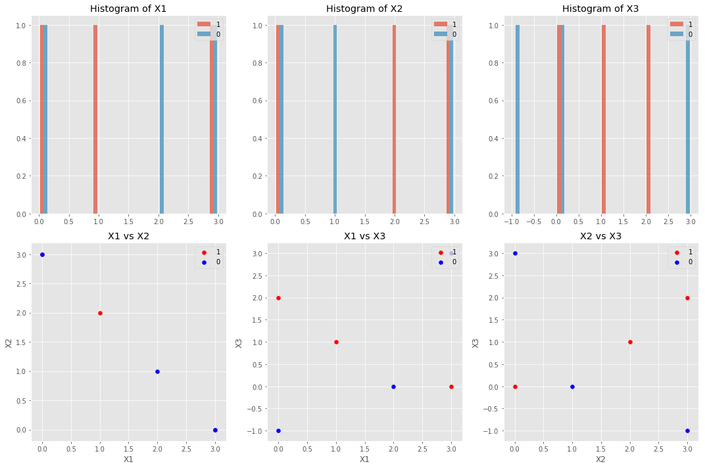

#### a) Computar la distancia entre cada observación y el punto de test.

**Ecuación**

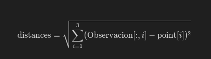

**Resultados**

|    | Distancia_Euclidiana | Etiqueta_Observacion | Observacion | Punto     |
|:--:|:--------------------:|:--------------------:|:-----------:|:---------:|
| 0  |      3.605551        |          1           |  (0, 3, 2)  | (0, 0, 0) |
| 1  |      4.242641        |          0           |  (3, 0, 3)  | (0, 0, 0) |
| 2  |      3.162278        |          0           | (0, 3, -1)  | (0, 0, 0) |
| 3  |      3.000000        |          1           |  (3, 0, 0)  | (0, 0, 0) |
| 4  |      2.449490        |          1           |  (1, 2, 1)  | (0, 0, 0) |
| 5  |      2.236068        |          0           |  (2, 1, 0)  | (0, 0, 0) |

**Resultados ordenados por distancia**

| Distancia_Euclidiana | Etiqueta_Observacion | Observacion | Punto     |
|:--------------------:|:--------------------:|:-----------:|:---------:|
|      2.236068        |          0           |  (2, 1, 0)  | (0, 0, 0) |
|      2.449490        |          1           |  (1, 2, 1)  | (0, 0, 0) |
|      3.000000        |          1           |  (3, 0, 0)  | (0, 0, 0) |
|      3.162278        |          0           | (0, 3, -1)  | (0, 0, 0) |
|      3.605551        |          1           |  (0, 3, 2)  | (0, 0, 0) |
|      4.242641        |          0           |  (3, 0, 3)  | (0, 0, 0) |

#### b) ¿Cuál es la predicción para K=1? ¿Por qué?

Prediction for K=1: 0

Como se observa en la tabla que antes generamos  el punto mas cercano al punto test es el (2,1,0) que está etiquetado como 0 esta es la razón de su clasificaicón.

#### c) ¿Cuál es la predicción para K=3? ¿Por qué?

Prediction for K=3: 1

Como se observa en la tabla que antes generamos  los 3 punto mas cercano al punto test son el (2,1,0) que está etiquetado como 0 (1,2,1) que está etiquetado como 1 y el (3,0,0) que está etiquetado como 1, por lo que haber 2 vecinos etiquetados como 1 etiqueta el punto como 1.

**Nota:** este ejercicio debe hacerse sin utilizar ninguna función de scikit-learn. No es necesario

### 2.Dado el problema de clasificación Blood Transfusion Service Center:

#### a) Analiza las características del conjunto de datos: número y tipo de variables de entrada y salida, número de instancias, número de clases y distribución de las mismas, correlación entre las variables, valores perdidos, etc.

**Tabla entera (748 rows × 5 columns)**

|   | Reciente | Frecuencia | Cantidad_Sangre | Tiempo | Donacion_marzo |
|---|:--------:|:----------:|:---------------:|:------:|:--------------:|
| 0 |    0     |     2      |        50       | 12500  |       1        |
| 1 |    1     |     0      |        13       | 3250   |       1        |
| 2 |    2     |     1      |        16       | 4000   |       1        |
|...|   ...    |    ...     |       ...       |  ...   |      ...       |
| 745 |  23    |     3      |        750      |  62    |       0        |
| 746 |  39    |     1      |        250      |  39    |       0        |
| 747 |  72    |     1      |        250      |  72    |       0        |

**Tipo del dato de cada columna:**

| Columna          | Tipo de Dato |
|------------------|--------------|
| Reciente         | int64        |
| Frecuencia       | int64        |
| Cantidad_Sangre  | int64        |
| Tiempo           | int64        |
| Donacion_marzo   | int64        |

**Cantidad de valores NaN en cada columna:**

| Columna          | Cantidad de NaN |
|------------------|-----------------|
| Reciente         | 0               |
| Frecuencia       | 0               |
| Cantidad_Sangre  | 0               |
| Tiempo           | 0               |
| Donacion_marzo   | 0               |

##### Histograma por cada clase y variable

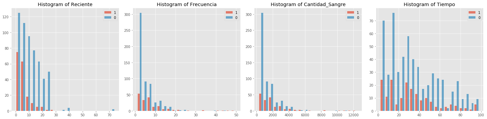

##### Relación entre variable por clase

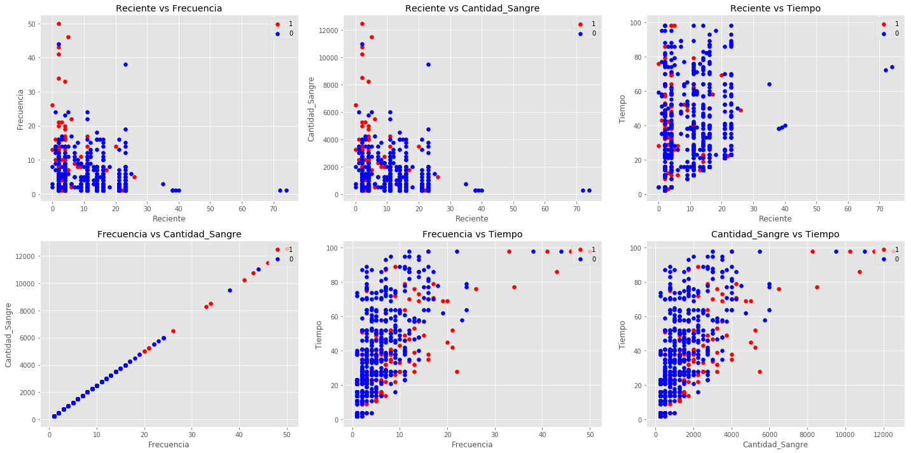

**Nota**

- **Desequilibrio de Clases**: La primera fila de histogramas muestra un claro desequilibrio de clases entre aquellos que donaron sangre en marzo de 2007 (etiqueta '1') y aquellos que no lo hicieron (etiqueta '0'). Esto puede afectar el rendimiento del modelo de aprendizaje automático, ya que puede sesgarse hacia la clase más frecuente. Se recomienda aplicar técnicas de balanceo de clases como sobremuestreo, submuestreo o generación de datos sintéticos para manejar este desequilibrio.

- **Relación entre 'Frequency' y 'Monetary'**: La correlación directa entre 'Frequency' y 'Monetary' es evidente en el gráfico de dispersión de la esquina inferior derecha, lo que indica una relación lineal casi perfecta. Esto es coherente con la naturaleza de las variables, dado que 'Monetary' es probablemente un múltiplo de 'Frequency' (cada donación tiene un volumen fijo de sangre). Esto sugiere que una de las dos variables podría ser redundante para el modelado predictivo, y se podría considerar eliminar una para simplificar el modelo sin perder información significativa.

- **Posible correlación entre 'Time' y otras variables**: Los gráficos de dispersión 'Reciente vs Tiempo' y 'Frecuencia vs Tiempo' no muestran una relación lineal clara, pero sí sugieren algún tipo de relación. Por ejemplo, en 'Reciente vs Tiempo', hay una tendencia de que aquellos con valores más bajos de 'Reciente' tienen una distribución más amplia en 'Tiempo', lo que podría sugerir que los donantes nuevos tienden a tener un historial más corto de donaciones. Sin embargo, esta observación necesita ser investigada más a fondo, posiblemente con análisis estadísticos para establecer la fuerza y la significancia de la correlación.

- **Dispersión de los datos**: Hay una dispersión considerable en los datos, especialmente en los gráficos de dispersión 'Reciente vs Frecuencia' y 'Reciente vs Cantidad_Sangre', lo que podría indicar que la variable 'Reciente' tiene una relación menos directa con la frecuencia y la cantidad de donaciones en comparación con la relación entre 'Frecuencia' y 'Cantidad_Sangre'.

#### b) Una de las clases que implementa el algoritmo KNN en scikit-learn sklearn.neighbors.KNeighborsClassifier. Revisa los parámetros y métodos que tiene.

El [sklearn.neighbors.KNeighborsClassifier](https://scikit-learn.org/stable/modules/generated/sklearn.neighbors.KNeighborsClassifier.html) en scikit-learn es un clasificador que implementa la votación de los k-vecinos más cercanos. Aquí están sus parámetros y métodos basados en la documentación oficial de scikit-learn:

Parámetros:

- `n_neighbors` (int, por defecto=5): Número de vecinos a utilizar para consultas de kneighbors.
- `weights` ({'uniform', 'distance'} o callable, por defecto='uniform'): Función de peso utilizada en la predicción.
- `algorithm` ({'auto', 'ball_tree', 'kd_tree', 'brute'}, por defecto='auto'): Algoritmo utilizado para calcular los vecinos más cercanos.
- `leaf_size` (int, por defecto=30): Tamaño de hoja pasado a BallTree o KDTree.
- `p` (float, por defecto=2): Parámetro de potencia para la métrica de Minkowski.
- `metric` (str o callable, por defecto='minkowski'): La métrica de distancia a utilizar para el árbol.
- `metric_params` (dict, por defecto=None): Argumentos adicionales de palabras clave para la función métrica.
- `n_jobs` (int, por defecto=None): El número de trabajos paralelos a ejecutar para la búsqueda de vecinos.

Métodos:

- `fit`(X, y): Ajustar el clasificador a partir del conjunto de datos de entrenamiento.
- `get_metadata_routing`(): Obtener el enrutamiento de metadatos del objeto.
- `get_params`([deep]): Obtener los parámetros para este estimador.
- `kneighbors`([X, n_neighbors, return_distance]): Encontrar los K-vecinos de un punto.
- `kneighbors_graph`([X, n_neighbors, mode]): Calcular el grafo (ponderado) de k-Vecinos para los puntos en X.
- `predict`(X): Predecir las etiquetas de clase para los datos proporcionados.
- `predict_proba`(X): Devolver las estimaciones de probabilidad para los datos de prueba X.
- `score`(X, y[, sample_weight]): Devolver la precisión media en los datos de prueba y etiquetas proporcionados.
- `set_params`(**params): Establecer los parámetros de este estimador.
- `set_score_request`(*[, sample_weight]): Solicitar metadatos pasados al método `score`.

#### c) Divide los datos en entrenamiento (80%) y test (20%).

#### d) Realiza la experimentación con KNN (KNeighborsClassifier) usando como hiper-parámetro el número de vecinos.

Muestra la gráfica del error de entrenamiento con validación cruzada (5-CV) frente al valor
del hiper-parámetro. 

- Odenador personal:

    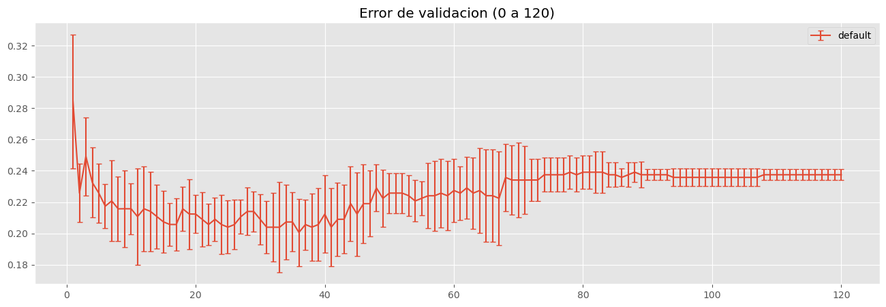

- Odenador cesga:

    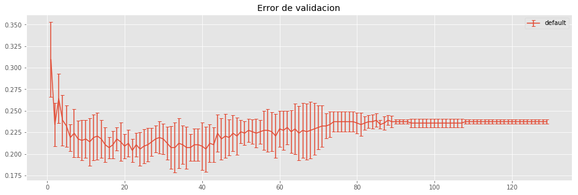

**¿Cuál es el menor error de validación cruzada, su desviación estándar y el valor del hiper-parámetro para el que se consigue?**

El error viene descrito por 1-mean_test_score

- Odenador personal:

    | param_n_neighbors | mean_test_score | std_test_score | error_test_score | rank_test_score |
    |:-----------------:|:---------------:|:--------------:|:----------------:|:---------------:|
    |        36         |     0.79937     |    0.021447    |     0.20063      |        1        |

- Odenador cesga:

    | param_n_neighbors | mean_test_score | std_test_score | error_test_score | rank_test_score |
    |:-----------------:|:---------------:|:--------------:|:----------------:|:---------------:|
    |        22         |     0.795987    |    0.013456    |     0.204013     |        1        |

**¿Cuál es el valor del hiperparámetro si se aplicase la regla de una desviación estándar?**

- Odenador personal:

    Gráfica que usamos para decidir los valores de los hiper-parámetros (mediante la regla de una desviación estándar), supongamos que cualquier valor que en su desviación cruce com la linea generada en color azul , e un valor a tener encuenta, tambien permitimos que visualizar el error minimo obtenido en verde:

    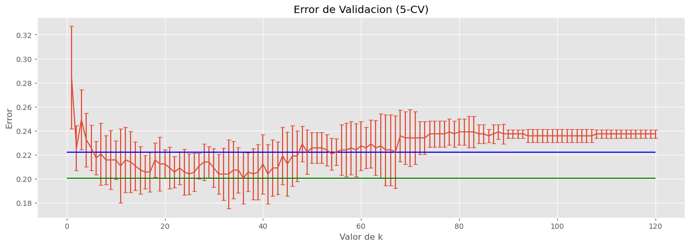

    | param_n_neighbors | mean_test_score | std_test_score | error_test_score | rank_test_score |
    |:-----------------:|:---------------:|:--------------:|:----------------:|:---------------:|
    |        55         |     0.779286    |    0.013208    |     0.220714     |       42        |

- Odenador cesga:

    Gráfica que usamos para decidir los valores de los hiper-parámetros (mediante la regla de una desviación estándar), supongamos que cualquier valor que en su desviación cruce com la linea generada en color azul , e un valor a tener encuenta, tambien permitimos que visualizar el error minimo obtenido en verde:

    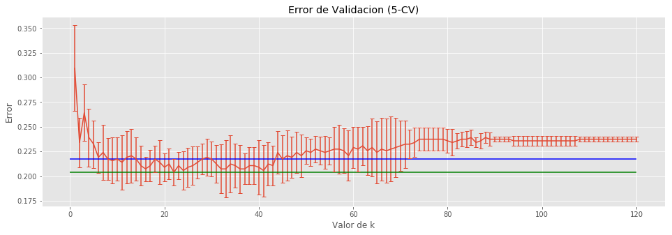

    | param_n_neighbors | mean_test_score | std_test_score | error_test_score | rank_test_score |
    |:-----------------:|:---------------:|:--------------:|:----------------:|:---------------:|
    |        45         |     0.782609 	  |    0.024229    |     0.217391     |        28       |

**En caso de que haya varios modelos con error mínimo, debe seleccionarse siempre el más simple.**

Muestra la gráfica del error de test frente al valor del hiper-parámetro, y valora si la gráfica del error de entrenamiento con validación cruzada ha hecho una buena estimación delAprendizaje Estadístico Máster en Big Data. Universidad de Santiago de Compostela error de test. 

- Odenador personal:

    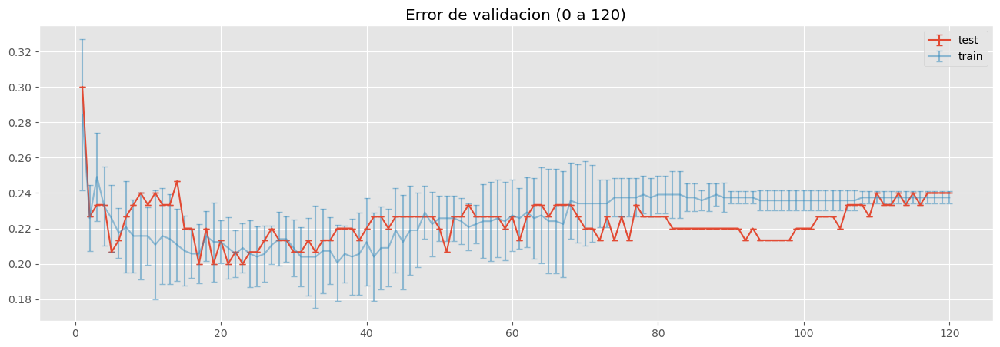

- Odenador cesga:

    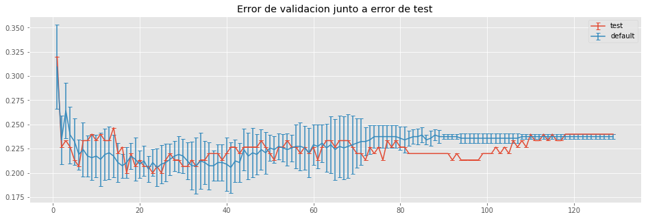

**¿Cuál es el error de test para el valor del hiper-parámetro seleccionado por la validación cruzada?**

- Mejores ordenador personal test:

    | param_n_neighbors | mean_test_score | std_test_score | error_test_score | rank_test_score |
    |:-----------------:|:---------------:|:--------------:|:----------------:|:---------------:|
    |        16         |       17        |      0.8       |       0.2        |        1        |
    |        22         |       23        |      0.8       |       0.2        |        1        |
    |        24         |       25        |      0.8       |       0.2        |        1        |

- Odenador personal:

    | param_n_neighbors | mean_test_score | error_test_score | rank_test_score |
    |:-----------------:|:---------------:|:----------------:|:---------------:|
    |        36         |     0.799370    |     0.20063      |        1        |
    |        55         |     0.773333    |     0.226667     |        42       |

- Mejores ordenador cesga test:

    | param_n_neighbors | mean_test_score | std_test_score | rank_test_score |
    |:-----------------:|:---------------:|:--------------:|:---------------:|
    |        17         |       0.8       |       0.0      |        1        |
    |        23         |       0.8       |       0.0      |        1        |
    |        25         |       0.8       |       0.0      |        1        |

- Odenador cesga:

    | param_n_neighbors | mean_test_score | error_test_score | rank_test_score |
    |:-----------------:|:---------------:|:----------------:|:---------------:|
    |        22         |     0.793333    |     0.206667     |        4        |
    |        45         |     0.773333    |     0.226667     |       61        |

### 3. Repite el ejercicio 2 pero para el problema de regresión Energy Efficiency con la variable de salida cooling load. Al ser un problema de regresión deberás utilizar KNeighborsRegressor, y como medida de error de entrenamiento y test el MSE.

**Nota.** Al ser un problema de regresión, para estimar tanto el error de entrenamiento como el de test (MSE) es necesario desestandarizar los errores calculados. Para desestandarizar el campo `mean_test_score`, únicamente será necesario multiplicar cada valor por la varianza (cuadrado de la desviación estándar) de las observaciones de Y del conjunto de entrenamiento. No se debe restar la media, ya que los campos `splitX_test_score` se calculan como la diferencia entre el valor de groundtruth y la predicción para cada dato de test, por lo que todas las operaciones de adición o substracción ya se han tenido en cuenta. De forma similar, para desestandarizar el campo `std_test_score`, únicamente será necesario multiplicar cada valor por la varianza de las
observaciones de Y del conjunto de entrenamiento.

#### a) Analiza las características del conjunto de datos: número y tipo de variables de entrada y salida, número de instancias, número de clases y distribución de las mismas, correlación entre las variables, valores perdidos, etc.

**Tabla entera (768 rows × 9 columns)**

|    |  X1  |   X2  |   X3  |   X4   |  X5  | X6 |  X7  | X8 |   Y2   |
|----|------|-------|-------|--------|------|----|------|----|--------|
| 0  | 0.98 | 514.5 | 294.0 | 110.25 | 7.0  |  2 | 0.0  |  0 | 21.33  |
| 1  | 0.98 | 514.5 | 294.0 | 110.25 | 7.0  |  3 | 0.0  |  0 | 21.33  |
| 2  | 0.98 | 514.5 | 294.0 | 110.25 | 7.0  |  4 | 0.0  |  0 | 21.33  |
|... | ...  | ...   | ...   | ...    | ...  |... | ...  |... | ...    |
| 765| 0.62 | 808.5 | 367.5 | 220.50 | 3.5  |  3 | 0.4  |  5 | 17.11  |
| 766| 0.62 | 808.5 | 367.5 | 220.50 | 3.5  |  4 | 0.4  |  5 | 16.61  |
| 767| 0.62 | 808.5 | 367.5 | 220.50 | 3.5  |  5 | 0.4  |  5 | 16.03  |

**Tipo del dato de cada columna:**

| Columna | Tipo de Dato |
|---------|--------------|
| X1      | float64      |
| X2      | float64      |
| X3      | float64      |
| X4      | float64      |
| X5      | float64      |
| X6      | int64        |
| X7      | float64      |
| X8      | int64        |
| Y1      | float64      |
| Y2      | float64      |

**Cantidad de valores NaN en cada columna:**

| Columna | Cantidad de NaN |
|---------|-----------------|
| X1      | 0               |
| X2      | 0               |
| X3      | 0               |
| X4      | 0               |
| X5      | 0               |
| X6      | 0               |
| X7      | 0               |
| X8      | 0               |
| Y1      | 0               |
| Y2      | 0               |

##### Histograma por cada clase y variable

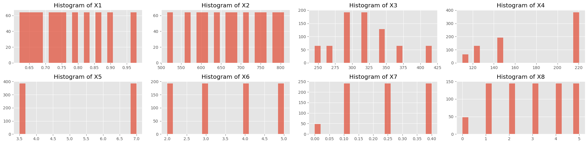

##### Relación entre variable por clase

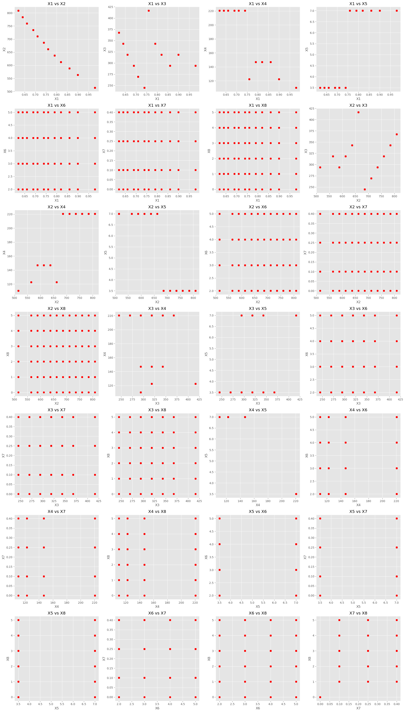

**NOTA**

Se puede observar una cierta relación inversamente proporcional entre X1 Y X2  para otras variables no se opserva relaciones entre ellas.

#### b) Una de las clases que implementa el algoritmo KNN en scikit-learn sklearn.neighbors.KNeighborsClassifier. Revisa los parámetros y métodos que tiene.

El [sklearn.neighbors.KNeighborsRegressor](https://scikit-learn.org/stable/modules/generated/sklearn.neighbors.KNeighborsRegressor.html) es un regresor que implementa la regresión basada en los k-vecinos más cercanos.

### Parámetros

- **n_neighbors** (int, default=5): Número de vecinos a utilizar.
- **weights** ({'uniform', 'distance'} o callable, default='uniform'): Función de peso utilizada en la predicción.
- **algorithm** ({'auto', 'ball_tree', 'kd_tree', 'brute'}, default='auto'): Algoritmo para calcular los vecinos más cercanos.
- **leaf_size** (int, default=30): Tamaño de hoja para BallTree o KDTree.
- **p** (float, default=2): Parámetro de potencia para la métrica de Minkowski.
- **metric** (str o callable, default='minkowski'): Métrica de distancia a utilizar.
- **metric_params** (dict, default=None): Argumentos adicionales para la función métrica.
- **n_jobs** (int, default=None): Número de trabajos paralelos para la búsqueda de vecinos.

### Métodos

- **fit(X, y)**: Ajustar el modelo a los datos de entrenamiento.
- **get_params([deep])**: Obtener los parámetros del estimador.
- **kneighbors([X, n_neighbors, return_distance])**: Encontrar los K-vecinos de un punto.
- **kneighbors_graph([X, n_neighbors, mode])**: Calcular el grafo de k-Vecinos.
- **predict(X)**: Predecir los valores objetivo.
- **score(X, y[, sample_weight])**: Coeficiente de determinación \( R^2 \) de la predicción.
- **set_params(**params)**: Establecer los parámetros del estimador.

#### c) Divide los datos en entrenamiento (80%) y test (20%).

#### d) Realiza la experimentación con KNN (KNeighborsClassifier) usando como hiper-parámetro el número de vecinos.

**¿Cuál es el menor error de validación cruzada, su desviación estándar y el valor del hiper-parámetro para el que se consigue?**

Muestra la gráfica del error de entrenamiento con validación cruzada (5-CV) frente al valor
del hiper-parámetro. 

- Odenador personal:

    
    

- Odenador cesga:

    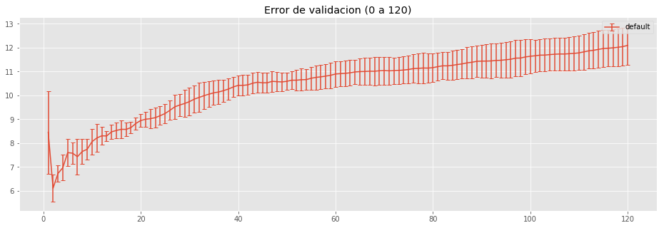

- Odenador personal :

    | param_n_neighbors | mean_test_score | std_test_score | destandardized_mean_test_score | destandardized_std_test_score | rank_test_score |
    |:-----------------:|:---------------:|:--------------:|:------------------------------:|:-----------------------------:|:---------------:|
    | 2                 | -0.068327       | 0.006294       | 6.105909                       | 0.688360                      | 1               |

- Odenador cesga:

    | param_n_neighbors | mean_test_score | std_test_score | destandardized_mean_test_score | destandardized_std_test_score | rank_test_score |
    |:-----------------:|:---------------:|:--------------:|:------------------------------:|:-----------------------------:|:---------------:|
    |         2         |    -0.068437    |    0.006468    |            6.115758            |           0.577994            |        1        |

**¿Cuál es el valor del hiperparámetro si se aplicase la regla de una desviación estándar?**

En este caso se seleciona  el mismo que en el de validadación cruzada

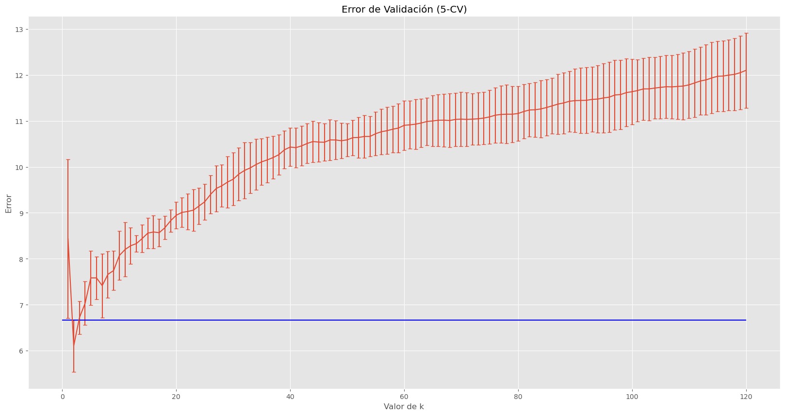

- Odenador personal:

   
    | param_n_neighbors | mean_test_score | std_test_score | destandardized_mean_test_score | destandardized_std_test_score | rank_test_score |
    |:-----------------:|:---------------:|:--------------:|:------------------------------:|:-----------------------------:|:---------------:|
    | 2                 | -0.068327       | 0.006294       | 6.105909                       | 0.562449                      | 1               |

- Odenador cesga:

    | param_n_neighbors | mean_test_score | std_test_score | destandardized_mean_test_score | destandardized_std_test_score | rank_test_score |
    |:-----------------:|:---------------:|:--------------:|:------------------------------:|:-----------------------------:|:---------------:|
    | 2                 | -0.068437       | 0.006468       | 6.115758                       | 0.577994                      | 1               |

**En caso de que haya varios modelos con error mínimo, debe seleccionarse siempre el más simple.**

Muestra la gráfica del error de test frente al valor del hiper-parámetro, y valora si la gráfica del error de entrenamiento con validación cruzada ha hecho una buena estimación delAprendizaje Estadístico Máster en Big Data. Universidad de Santiago de Compostela error de test. 

**¿Cuál es el error de test para el valor del hiper-parámetro seleccionado por la validación cruzada?**

- Mejores ordenador personal test:
    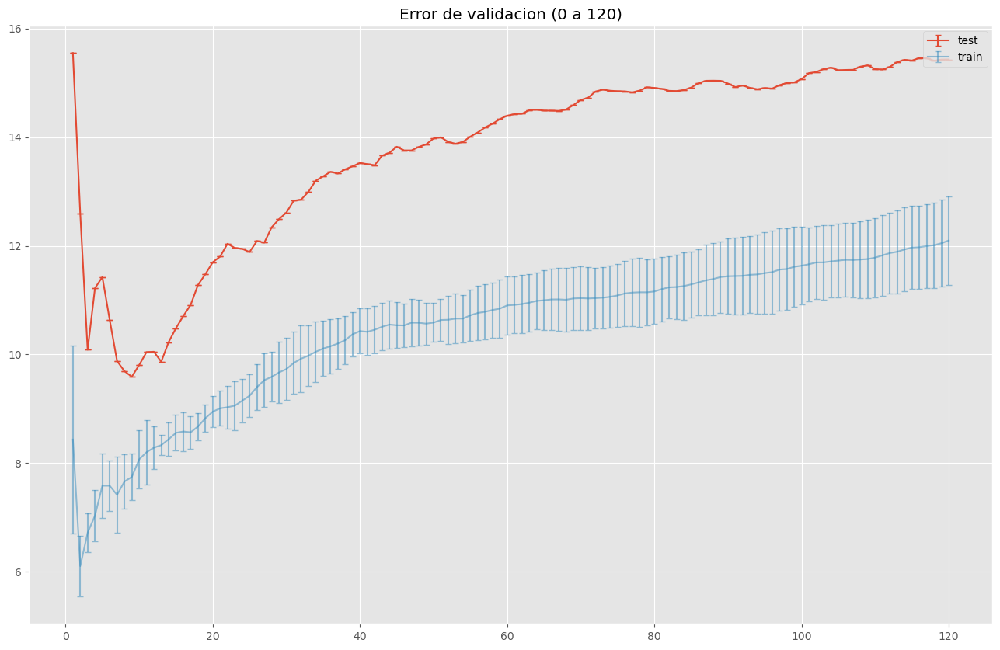

    | param_n_neighbors | mean_test_score | destandardized_mean_test_score | rank_test_score |
    |:-----------------:|:---------------:|:------------------------------:|:---------------:|
    |         9         |    -0.107319    |            9.590359            |        1        |
    |         8         |    -0.108471    |            9.693278            |        2        |
    |        10         |    -0.109729    |            9.805713            |        3        |
    |        13         |    -0.110416    |            9.867141            |        4        |
    |         7         |    -0.110563    |            9.880232            |        5        |

- Odenador personal:

    
    | param_n_neighbors | mean_test_score | destandardized_mean_test_score | rank_test_score |
    |:-----------------:|:---------------:|:------------------------------:|:---------------:|
    |         2         |    -0.140871    |           12.588656            |       28        |

- Mejores ordenador cesga test:

    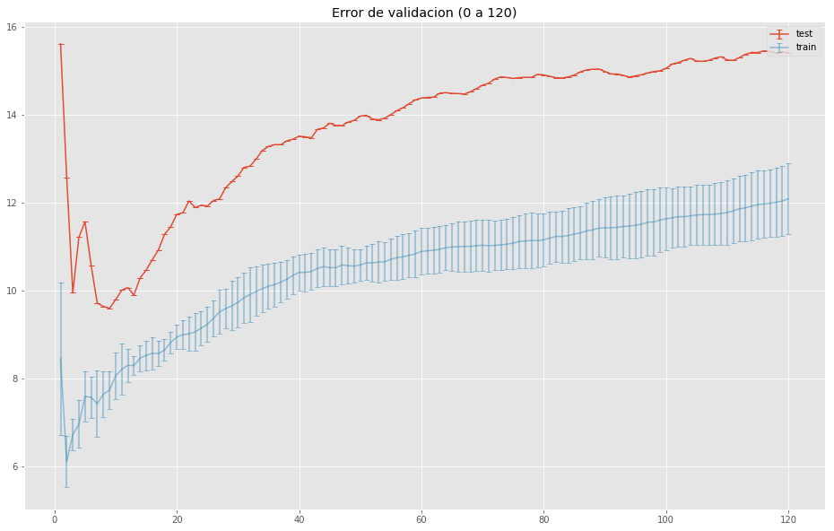

    | param_n_neighbors | mean_test_score | destandardized_mean_test_score | rank_test_score |
    |:-----------------:|:---------------:|:------------------------------:|:---------------:|
    |         9         |    -0.107463    |            9.603207            |        1        |
    |         8         |    -0.107991    |            9.650452            |        2        |
    |         7         |    -0.108821    |            9.724561            |        3        |
    |        10         |    -0.109666    |            9.800067            |        4        |
    |        13         |    -0.110855    |            9.906309            |        5        |

- Odenador cesga:

    | param_n_neighbors | mean_test_score | destandardized_mean_test_score | rank_test_score |
    |:-----------------:|:---------------:|:------------------------------:|:---------------:|
    |         2         |    -0.140871    |           12.588656            |       28        |

