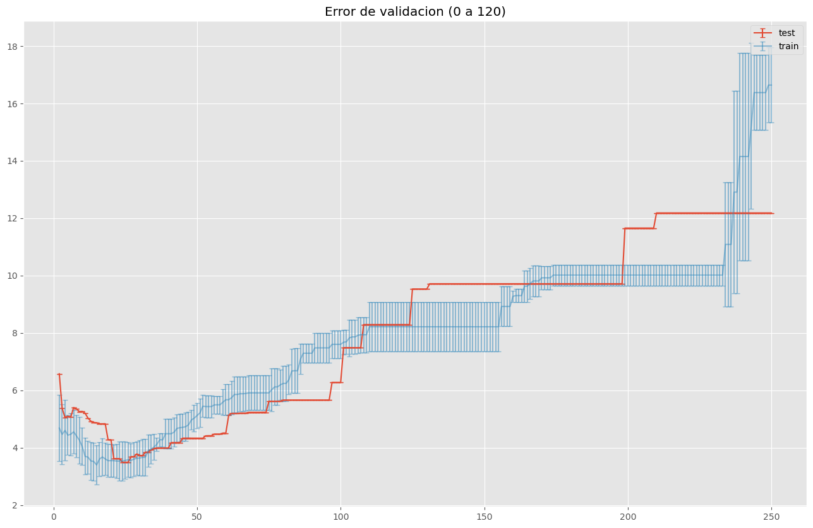

# Boletin 1 

### 1. Dado el siguiente conjunto de datos de clasificación con 6 observaciones, 3 variables de entrada y una variable de salida:

| X1 | X2 | X3 | Y |
|----|----|----|---|
| 4  | 3  | -1 | 1 |
| -3 | -1 | -1 | 0 |
| 3  | -2 | 0  | 0 |
| 1  | 4  | 0  | 1 |
| -2 | 3  | 1  | 0 |
| -3 | 5  | 5  | 0 |

#### a) Construye el árbol de clasificación (sin podar) mediante CART y utilizando como criterio la entropía.
La condición de parada debe ser que los nodos hoja sean puros (todos los ejemplos son de la misma clase). En cada nodo del árbol se debe indicar:
- La variable y su valor umbral.
- La entropía correspondiente.
- En los nodos hoja, la clase del nodo y los ejemplos que pertenecen al mismo.

**Nota:** este ejercicio debe hacerse sin utilizar ninguna función de scikit-learn.

**Ecuación**

ecuación de entropia:

$$ H(X) = -\sum_{i=1}^{n} P(x_i) \log_2 P(x_i) $$

- H(X) representa la entropía del nodo.

- P(xi​) es la probabilidad de cada clase ii, y la sumatoria se realiza sobre todas las clases nn en el conjunto de datos.

Para saber cual es la mejor división se usa esta ecuación

$$ H(X) = entropia_{right} \times numitems_{right} + numitems_{left} \times entropia_{left} $$

- H(X) representa la entropía del de la división- H(X) representa la entropía del árbol.

Arbol sin scikit-learn

Arbol de scikit-learn

**Nota:** este ejercicio debe hacerse sin utilizar ninguna función de scikit-learn. No es necesario

### 2.Dado el problema de clasificación Blood Transfusion Service Center:

#### a) La clase que implementa el algoritmo CART en problemas de clasificación en scikit-learn es sklearn.tree.DecisionTreeClassifier. Revisa los parámetros y métodos que tiene.

La clase  [`sklearn.tree.DecisionTreeClassifier`](https://scikit-learn.org/stable/modules/generated/sklearn.tree.DecisionTreeClassifier.html) en scikit-learn implementa el algoritmo de Árbol de Clasificación y Regresión (CART) para problemas de clasificación.

Parámetros:

- `criterion`: La función para medir la calidad de una división ("gini", "entropy" o "log_loss").
- `splitter`: La estrategia utilizada para elegir la división en cada nodo ("best" o "random").
- `max_depth`: La profundidad máxima del árbol.
- `min_samples_split`: El número mínimo de muestras requeridas para dividir un nodo interno.
- `min_samples_leaf`: El número mínimo de muestras requeridas para estar en un nodo hoja.
- `min_weight_fraction_leaf`: La fracción ponderada mínima del total de pesos requerida para estar en un nodo hoja.
- `max_features`: El número de características a considerar al buscar la mejor división.
- `random_state`: Controla la aleatoriedad del estimador.
- `max_leaf_nodes`: Crecer un árbol con el número máximo especificado de nodos hoja.
- `min_impurity_decrease`: Un nodo se dividirá si esta división induce una disminución de la impureza mayor o igual a este valor.
- `class_weight`: Pesos asociados con las clases.
- `ccp_alpha`: Parámetro de complejidad utilizado para la Poda de Costo-Complejidad Mínima.

Métodos:

- `fit`: Construir un clasificador de árbol de decisión a partir del conjunto de entrenamiento (X, y).
- `predict`: Predecir la clase para X.
- `predict_proba`: Predecir las probabilidades de clase de las muestras de entrada X.
- `predict_log_proba`: Predecir las log-probabilidades de clase de las muestras de entrada X.
- `score`: Devolver la precisión media en los datos de prueba y etiquetas dados.
- `get_params`: Obtener parámetros para este estimador.
- `set_params`: Establecer los parámetros de este estimador.
- `apply`: Devolver el índice de la hoja que se predice para cada muestra.
- `decision_path`: Devolver la ruta de decisión en el árbol.
- `get_depth`: Devolver la profundidad del árbol de decisión.
- `get_n_leaves`: Devolver el número de hojas del árbol de decisión.

##### datos

**Tabla entera (748 rows × 5 columns)**

|   | Reciente | Frecuencia | Cantidad_Sangre | Tiempo | Donacion_marzo |
|---|:--------:|:----------:|:---------------:|:------:|:--------------:|
| 0 |    0     |     2      |        50       | 12500  |       1        |
| 1 |    1     |     0      |        13       | 3250   |       1        |
| 2 |    2     |     1      |        16       | 4000   |       1        |
|...|   ...    |    ...     |       ...       |  ...   |      ...       |
| 745 |  23    |     3      |        750      |  62    |       0        |
| 746 |  39    |     1      |        250      |  39    |       0        |
| 747 |  72    |     1      |        250      |  72    |       0        |

**Tipo del dato de cada columna:**

| Columna          | Tipo de Dato |
|------------------|--------------|
| Reciente         | int64        |
| Frecuencia       | int64        |
| Cantidad_Sangre  | int64        |
| Tiempo           | int64        |
| Donacion_marzo   | int64        |

**Cantidad de valores NaN en cada columna:**

| Columna          | Cantidad de NaN |
|------------------|-----------------|
| Reciente         | 0               |
| Frecuencia       | 0               |
| Cantidad_Sangre  | 0               |
| Tiempo           | 0               |
| Donacion_marzo   | 0               |

##### Histograma por cada clase y variable

##### Relación entre variable por clase

#### b) Divide los datos en entrenamiento (80%) y test (20%).

#### c) Realiza la experimentación con  (DecisionTreeClassifier) usando como hiper-parámetro el número mínimo de muestras requeridas para dividir un nodo interno..

Muestra la gráfica del error de entrenamiento con validación cruzada (5-CV) frente al valor
del hiper-parámetro. 

- Odenador personal:

    

- Odenador cesga:

    
    

**¿Cuál es el menor error de validación cruzada, su desviación estándar y el valor del hiper-parámetro para el que se consigue?**

El error viene descrito por 1-mean_test_score

- Odenador personal:

    | param_min_samples_split | mean_test_score | std_test_score | error_test_score | rank_test_score |
    |:-----------------:|:---------------:|:--------------:|:----------------:|:---------------:|
    |        119        |     0.794356	  |    0.021129    ||     0.205644     |       1        |

- Odenador cesga:

    | param_min_samples_split | mean_test_score | std_test_score | error_test_score | rank_test_score |
    |:-----------------:|:---------------:|:--------------:|:----------------:|:---------------:|
    |        119        |     0.797659	  |    0.015857    |     0.202341     |       1        |

**¿Cuál es el valor del hiperparámetro si se aplicase la regla de una desviación estándar?**

- Odenador personal:

    Gráfica que usamos para decidir los valores de los hiper-parámetros (mediante la regla de una desviación estándar), supongamos que cualquier valor que en su desviación cruce com la linea generada en color azul , e un valor a tener encuenta, tambien permitimos que visualizar el error minimo obtenido en verde:

    

    | param_min_samples_split | mean_test_score | std_test_score | error_test_score | rank_test_score |
    |:-----------------:|:---------------:|:--------------:|:----------------:|:---------------:|
    |        121         |     0.794356	  |   0.021129    |     0.205644     |        63       |

- Odenador cesga:

    Gráfica que usamos para decidir los valores de los hiper-parámetros (mediante la regla de una desviación estándar), supongamos que cualquier valor que en su desviación cruce com la linea generada en color azul , e un valor a tener encuenta, tambien permitimos que visualizar el error minimo obtenido en verde:

    

    | param_min_samples_split | mean_test_score | std_test_score | error_test_score | rank_test_score |
    |:-----------------:|:---------------:|:--------------:|:----------------:|:---------------:|
    |        121         |     0.785953	  |   0.036438    |     0.214047      |        63       |

  
**En caso de que haya varios modelos con error mínimo, debe seleccionarse siempre el más simple.**

Muestra la gráfica del error de test frente al valor del hiper-parámetro, y valora si la gráfica del error de entrenamiento con validación cruzada ha hecho una buena estimación delAprendizaje Estadístico Máster en Big Data. Universidad de Santiago de Compostela error de test. 

- Odenador personal:

    

- Odenador cesga:

    

**¿Cuál es el error de test para el valor del hiper-parámetro seleccionado por la validación cruzada?**

- Mejores ordenador personal test:

    | param_min_samples_split | mean_test_score | error_test_score | rank_test_score |
    |:-----------------:|:---------------:|:----------------:|:---------------:|
    |        155         |       0.766667	 |       0.233333         |        1        |
    |        155         |       0.766667	 |       0.233333         |        1        |
    |        156	     |       0.766667	 |       0.233333         |        1        |

- Odenador personal:

    | param_min_samples_split | mean_test_score | error_test_score | rank_test_score |
    |:-----------------:|:---------------:|:----------------:|:---------------:|
    |        119         |     0.746667    |     0.253333      |        461       |
    |        121         |     0.746667    |     0.253333      |        461       |

- Mejores ordenador cesga test:

    | param_min_samples_split | mean_test_score | error_test_score | rank_test_score |
    |:-----------------:|:---------------:|:----------------:|:---------------:|
    |        155         |       0.766667	 |       0.233333         |        1        |
    |        155         |       0.766667	 |       0.233333         |        1        |
    |        156	     |       0.766667	 |       0.233333         |        1        |

- Odenador cesga:

    | param_min_samples_split | mean_test_score | error_test_score | rank_test_score |
    |:-----------------:|:---------------:|:----------------:|:---------------:|
    |        119         |     0.746667    |     0.253333      |       461        |
    |        121         |     0.746667    |     0.253333      |       461        |

### 3. Repite el ejercicio 2 pero para el problema de regresión Energy Efficiency con la variable de salida cooling load. Al ser un problema de regresión deberás utilizar KNeighborsRegressor, y como medida de error de entrenamiento y test el MSE.

**Nota.** Al ser un problema de regresión, para estimar tanto el error de entrenamiento como el de test (MSE) es necesario desestandarizar los errores calculados. Para desestandarizar el campo `mean_test_score`, únicamente será necesario multiplicar cada valor por la varianza (cuadrado de la desviación estándar) de las observaciones de Y del conjunto de entrenamiento. No se debe restar la media, ya que los campos `splitX_test_score` se calculan como la diferencia entre el valor de groundtruth y la predicción para cada dato de test, por lo que todas las operaciones de adición o substracción ya se han tenido en cuenta. De forma similar, para desestandarizar el campo `std_test_score`, únicamente será necesario multiplicar cada valor por la varianza de las
observaciones de Y del conjunto de entrenamiento.

#### a) Analiza las características del conjunto de datos: número y tipo de variables de entrada y salida, número de instancias, número de clases y distribución de las mismas, correlación entre las variables, valores perdidos, etc.

**Tabla entera (768 rows × 9 columns)**

|    |  X1  |   X2  |   X3  |   X4   |  X5  | X6 |  X7  | X8 |   Y2   |
|----|------|-------|-------|--------|------|----|------|----|--------|
| 0  | 0.98 | 514.5 | 294.0 | 110.25 | 7.0  |  2 | 0.0  |  0 | 21.33  |
| 1  | 0.98 | 514.5 | 294.0 | 110.25 | 7.0  |  3 | 0.0  |  0 | 21.33  |
| 2  | 0.98 | 514.5 | 294.0 | 110.25 | 7.0  |  4 | 0.0  |  0 | 21.33  |
|... | ...  | ...   | ...   | ...    | ...  |... | ...  |... | ...    |
| 765| 0.62 | 808.5 | 367.5 | 220.50 | 3.5  |  3 | 0.4  |  5 | 17.11  |
| 766| 0.62 | 808.5 | 367.5 | 220.50 | 3.5  |  4 | 0.4  |  5 | 16.61  |
| 767| 0.62 | 808.5 | 367.5 | 220.50 | 3.5  |  5 | 0.4  |  5 | 16.03  |

**Tipo del dato de cada columna:**

| Columna | Tipo de Dato |
|---------|--------------|
| X1      | float64      |
| X2      | float64      |
| X3      | float64      |
| X4      | float64      |
| X5      | float64      |
| X6      | int64        |
| X7      | float64      |
| X8      | int64        |
| Y1      | float64      |
| Y2      | float64      |

**Cantidad de valores NaN en cada columna:**

| Columna | Cantidad de NaN |
|---------|-----------------|
| X1      | 0               |
| X2      | 0               |
| X3      | 0               |
| X4      | 0               |
| X5      | 0               |
| X6      | 0               |
| X7      | 0               |
| X8      | 0               |
| Y1      | 0               |
| Y2      | 0               |

##### Histograma por cada clase y variable

##### Relación entre variable por clase

#### a) La clase que implementa el algoritmo CART en problemas de clasificación en scikit-learn es sklearn.tree.DecisionTreeRegressor. Revisa los parámetros y métodos que tiene.

La clase [`sklearn.tree.DecisionTreeRegressor`](https://scikit-learn.org/stable/modules/generated/sklearn.tree.DecisionTreeRegressor.html) en scikit-learn implementa el algoritmo CART (Classification and Regression Trees) para problemas de regresión.

Parámetros:

- `criterion`: El criterio para evaluar la calidad de una división. Opciones típicas incluyen "mse" (error cuadrático medio), "friedman_mse" (error cuadrático medio con mejora por Friedman) y "mae" (error absoluto medio).
- `splitter`: Estrategia para elegir la división en cada nodo, puede ser "best" para la mejor división o "random" para la mejor división aleatoria.
- `max_depth`: Profundidad máxima del árbol. Si es `None`, los nodos se expanden hasta que todas las hojas son puras o contienen menos muestras que `min_samples_split`.
- `min_samples_split`: Número mínimo de muestras necesarias para dividir un nodo interno.
- `min_samples_leaf`: Número mínimo de muestras necesarias para estar en un nodo hoja.
- `min_weight_fraction_leaf`: Fracción ponderada mínima de la suma total de pesos necesaria para estar en un nodo hoja.
- `max_features`: Número de características a considerar al buscar la mejor división.
- `random_state`: Controla la aleatoriedad del estimador.
- `max_leaf_nodes`: Número máximo especificado de nodos hoja.
- `min_impurity_decrease`: Un nodo se dividirá si esta división induce una disminución de la impureza mayor o igual a este valor.

Métodos:

- `fit`: Ajustar el modelo de regresión de árbol de decisión a los datos.
- `predict`: Predecir el valor para las muestras de entrada.
- `score`: Devolver el coeficiente de determinación \( R^2 \) de la predicción.
- `get_params`: Obtener parámetros para este estimador.
- `set_params`: Establecer los parámetros de este estimador.
- `apply`: Devolver el índice de la hoja que se predice para cada muestra.
- `decision_path`: Devolver la ruta de decisión en el árbol.

#### b) Divide los datos en entrenamiento (80%) y test (20%).

#### c) Realiza la experimentación con DecisionTreeRegressor usando como hiper-parámetro el número mínimo de muestras necesarias para dividir un nodo.

**¿Cuál es el menor error de validación cruzada, su desviación estándar y el valor del hiper-parámetro para el que se consigue?**

Muestra la gráfica del error de entrenamiento con validación cruzada (5-CV) frente al valor
del hiper-parámetro. 

- Odenador personal:

    
    

- Odenador cesga:

    

- Odenador personal:

   
    | param_min_samples_split | mean_test_score | std_test_score | destandardized_mean_test_score | destandardized_std_test_score | rank_test_score |
    |:-----------------:|:---------------:|:--------------:|:------------------------------:|:-----------------------------:|:---------------:|
    | 15                 | -0.038047       | 0.007703       | 3.400035                       | 0.688360                      | 1               |

- Odenador cesga:

    | param_n_neighbors | mean_test_score | std_test_score | destandardized_mean_test_score | destandardized_std_test_score | rank_test_score |
    |:-----------------:|:---------------:|:--------------:|:------------------------------:|:-----------------------------:|:---------------:|
    | 15                 | -0.038057       | 0.007705      | 3.400928                       | 0.688564                     | 1               |

**¿Cuál es el valor del hiperparámetro si se aplicase la regla de una desviación estándar?**

- Odenador personal:

   
    | param_min_samples_split | mean_test_score | std_test_score | destandardized_mean_test_score | destandardized_std_test_score | rank_test_score |
    |:-----------------:|:---------------:|:--------------:|:------------------------------:|:-----------------------------:|:---------------:|
    | 35                 | -0.045034       | 0.005034       | 4.024361                       | 0.449845                     | 25               |

- Odenador cesga:

    | param_n_neighbors | mean_test_score | std_test_score | destandardized_mean_test_score | destandardized_std_test_score | rank_test_score |
    |:-----------------:|:---------------:|:--------------:|:------------------------------:|:-----------------------------:|:---------------:|
    | 35                 | -0.045031       | 0.005037      | 4.024066                       | 0.450152                     | 25               |

**En caso de que haya varios modelos con error mínimo, debe seleccionarse siempre el más simple.**

Muestra la gráfica del error de test frente al valor del hiper-parámetro, y valora si la gráfica del error de entrenamiento con validación cruzada ha hecho una buena estimación del Aprendizaje Estadístico Máster en Big Data. Universidad de Santiago de Compostela error de test. 

**¿Cuál es el error de test para el valor del hiper-parámetro seleccionado por la validación cruzada?**

- Mejores ordenador personal test:
    
    

    | param_n_neighbors | mean_test_score | destandardized_mean_test_score | rank_test_score |
    |:-----------------:|:---------------:|:------------------------------:|:---------------:|
    |        24         |    -0.039077    |            3.492052	           |        1        |
    |        25         |    -0.039077    |            3.492052            |        1        |
    |        26         |    -0.039077    |            3.492052            |        3        |
    |        21         |    -0.040491    |            3.618426	           |        4        |
    |        23         |    -0.040495    |            3.618776            |        5        |

- Odenador personal:

    
    | param_n_neighbors | mean_test_score | destandardized_mean_test_score | rank_test_score |
    |:-----------------:|:---------------:|:------------------------------:|:---------------:|
    |         15         |   -0.054498    |           4.87007	            |       46        |
    |         35         |   -0.044436	  |           3.970903	            |       15        |

- Mejores ordenador cesga test:

    

    | param_n_neighbors | mean_test_score | destandardized_mean_test_score | rank_test_score |
    |:-----------------:|:---------------:|:------------------------------:|:---------------:|
    |        24         |    -0.039077    |            3.492052	           |        1        |
    |        25         |    -0.039077    |            3.492052            |        1        |
    |        26         |    -0.039077    |            3.492052            |        3        |
    |        21         |    -0.040491    |            3.618426	           |        4        |
    |        23         |    -0.040495    |            3.618776            |        5        |

- Odenador cesga:

    | param_n_neighbors | mean_test_score | destandardized_mean_test_score | rank_test_score |
    |:-----------------:|:---------------:|:------------------------------:|:---------------:|
    |         15         |   -0.054498    |           4.87007	            |       46        |
    |         35         |   -0.044436	  |           3.970903	            |       15        |

