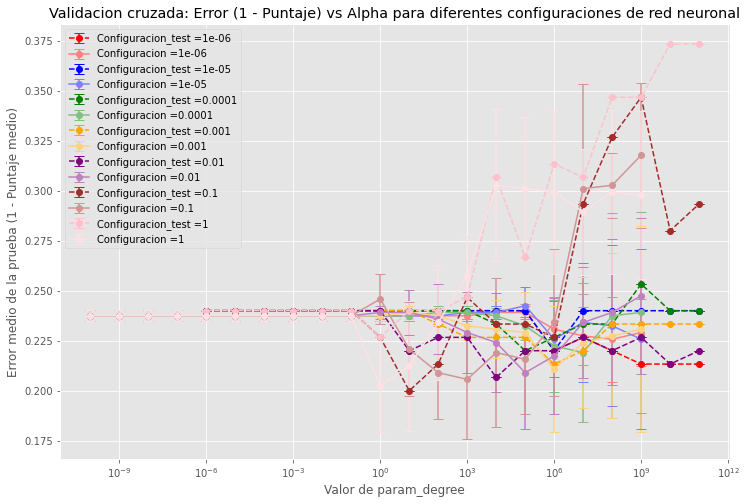
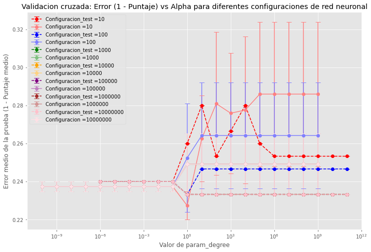
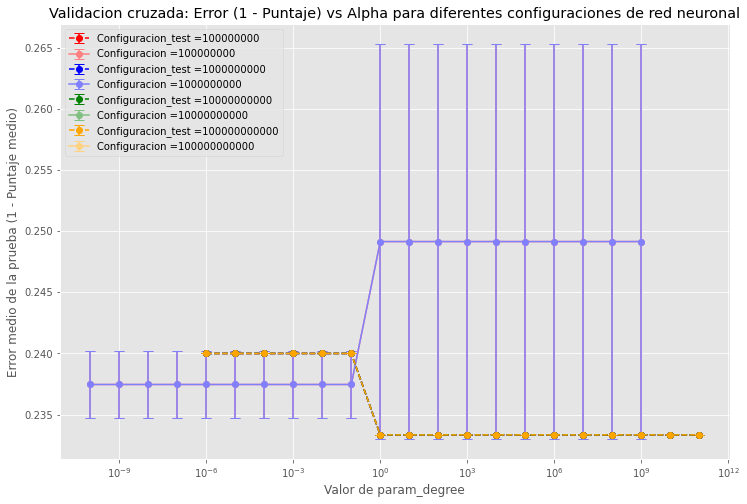
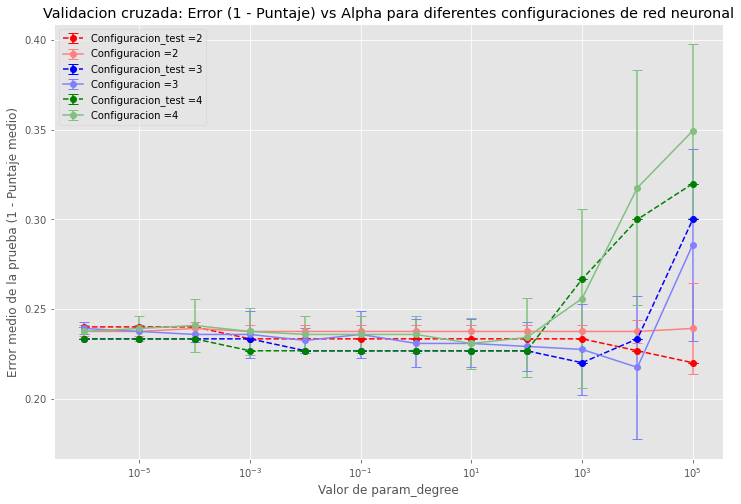
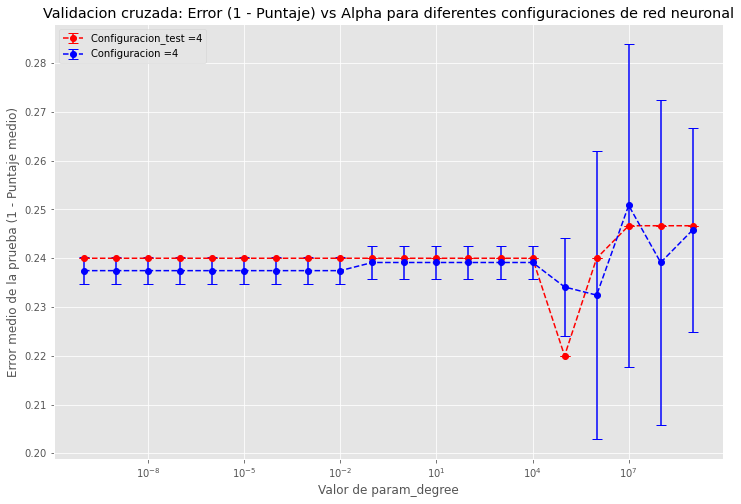

# Boletín 5: Máquinas de Soporte Vectorial

Para la realización de las prácticas correspondientes a este boletín se utilizará `scikit-learn` en el CESGA.

**Nota:** Utilizaremos un `SEED_VALUE=1`.

## Ejercicio

Dado el siguiente conjunto de datos de clasificación con 16 observaciones, 2 variables de entrada y una variable de salida, mediante una SVM lineal con C=1 se han obtenido los coeficientes αi indicados en la última columna:

| Observación | X1 | X2 | Y | αi      |
|-------------|----|----|---|---------|
| 1           | 2  | 6  | 1 | 0       |
| 2           | 4  | 3  | 1 | 1       |
| 3           | 4  | 4  | 1 | 0.3333  |
| 4           | 4  | 6  | 1 | 0       |
| 5           | 6  | 3  | 1 | 1       |
| 6           | 7  | 7  | 1 | 0.1667  |
| 7           | 8  | 4  | 1 | 1       |
| 8           | 9  | 8  | 1 | 1       |
| 9           | 2  | 1  | -1| 1       |
| 10          | 6  | 2  | -1| 0.5     |
| 11          | 7  | 4  | -1| 1       |
| 12          | 8  | 8  | -1| 1       |
| 13          | 9  | 1  | -1| 0       |
| 14          | 10 | 3  | -1| 0       |
| 15          | 10 | 6  | -1| 1       |
| 16          | 12 | 4  | -1| 0       |

Se pide:

1. Identificar los vectores de soporte y cuáles de ellos están en el límite del margen.

    - En este caso, los vectores de soporte son aquellos valores en los que αi (alpha_i) es mayor que 0. Los siguientes son los vectores de soporte identificados:

        | Observación | X1 | X2 | Y  | αi     |
        |-------------|----|----|----|--------|
        | 2           | 4  | 3  | 1  | 1.0000 |
        | 3           | 4  | 4  | 1  | 0.3333 |
        | 5           | 6  | 3  | 1  | 1.0000 |
        | 6           | 7  | 7  | 1  | 0.1667 |
        | 7           | 8  | 4  | 1  | 1.0000 |
        | 8           | 9  | 8  | 1  | 1.0000 |
        | 9           | 2  | 1  | -1 | 1.0000 |
        | 10          | 6  | 2  | -1 | 0.5000 |
        | 11          | 7  | 4  | -1 | 1.0000 |
        | 12          | 8  | 8  | -1 | 1.0000 |
        | 15          | 10 | 6  | -1 | 1.0000 |

    -  y los vectores de limite seran los que los que esten entre (0,C) en este caso C = 1

        | Observación | X1 | X2 | Y  | αi     |
        |-------------|----|----|----|--------|
        | 3           | 4  | 4  | 1  | 0.3333 |
        | 6           | 7  | 7  | 1  | 0.1667 |
        | 10          | 6  | 2  | -1 | 0.5000 |

2. Determinar los coeficientes del hiperplano (β y β0) y el valor de M.

    **Nota** Calculamos beta a partir de la Ecuación 4. calculamos beta_0 a partir de la ecuación 1 utilizando los vectores de soporte que se encuentran en el margen. Para por ultimo, calcularemos el valor de M a partir de los valores de beta que obtengamos.

    Las condiciones de Karush-Kuhn-Tucker (KKT) para el problema de optimización de la SVM son las siguientes:

    - Condiciones de Complementariedad:
    $$\alpha_i, \mu_i, \xi_i \geq 0 \quad \forall i$$
    
    - La multiplicación del coeficiente de Lagrange \( \alpha_i \) por la restricción de margen debe ser igual a cero:
    $$(1) \quad \alpha_i [y_i (\mathbf{x}_i^T \beta + \beta_0) - (1 - \xi_i)] = 0$$

    - La multiplicación del coeficiente de Lagrange \( \mu_i \) por la restricción de holgura \( \xi_i \) debe ser igual a cero:
    $$(2) \quad \mu_i \xi_i = 0$$

    - La restricción de margen debe ser siempre mayor o igual a cero:
    $$(3) \quad y_i (\mathbf{x}_i^T \beta + \beta_0) - (1 - \xi_i) \geq 0$$

    - La expresión para el cálculo de \( \beta \) es la suma ponderada de los vectores de soporte:
    $$(4) \quad \beta = \sum_{i=1}^{N} \alpha_i y_i \mathbf{x}_i$$

    - La relación entre los multiplicadores de Lagrange \( \alpha_i \) y \( \mu_i \) es la siguiente:
    $$(5) \quad \alpha_i = C - \mu_i \quad \forall i$$

    Donde \( C \) es el parámetro de penalización de la SVM.

    - Coeficientes de β: `[-0.4999, 0.5001]`
    - Coeficiente de β0: `[0.9992]`
    - Valor de M: `1.4142135340888247`

3. Calcular los valores de εi y señalar las observaciones incorrectamente clasificadas.

    - epsilon:
        `[0.00000, 0.50010, 0.00000, 0.00000, 1.49990, 0.00000, 1.99960, 0.49910, 1.49950, 0.00000, 0.50030, 2.00080, 0.00000, 0.00000, 0.00080, 0.00000]`
    - Los datos incorrectamente clasificados son los siguientes:

        | Observación | X1 | X2 | Y  | αi   |
        |-------------|----|----|----|------|
        | 5           | 6  | 3  | 1  | 1.0  |
        | 7           | 8  | 4  | 1  | 1.0  |
        | 9           | 2  | 1  | -1 | 1.0  |
        | 12          | 8  | 8  | -1 | 1.0  |

**Nota:** Este ejercicio debe hacerse sin utilizar ninguna función de `scikit-learn`.

### 2.Dado el problema de clasificación Blood Transfusion Service Center:

##### a)  La clase que implementa las SVM en problemas de clasificación en scikit-learn es sklearn.svm.SVC (existen otras dos clases, pero nos centraremos en ésta). Revisa los parámetros y métodos que tiene

La clase [`sklearn.svm.SVC`](https://scikit-learn.org/stable/modules/generated/sklearn.svm.SVC.html) en scikit-learn implementa un clasificador de Máquinas de Soporte Vectorial para problemas de clasificación.

#### Parámetros:

- **C**: Parámetro de regularización. La fuerza de la regularización es inversamente proporcional a C.
- **kernel**: Especifica el tipo de kernel a utilizar en el algoritmo ("linear", "poly", "rbf", "sigmoid", "precomputed").
- **degree**: Grado del polinomio para el kernel 'poly'. Ignorado por otros kernels.
- **gamma**: Coeficiente para 'rbf', 'poly', y 'sigmoid'. Si es 'auto', se utiliza 1/n_features.
- **coef0**: Término independiente en la función del kernel. Es significativo solo en 'poly' y 'sigmoid'.
- **shrinking**: Si usar la heurística de shrinking.
- **probability**: Si habilitar estimaciones de probabilidad.
- **tol**: Tolerancia para el criterio de parada.
- **cache_size**: Tamaño del caché del kernel (en MB).
- **class_weight**: Ponderaciones de las clases en la forma `{class_label: weight}`.
- **verbose**: Habilitar salida detallada.
- **max_iter**: Límite duro en las iteraciones dentro del solucionador, o -1 para sin límite.
- **decision_function_shape**: 'ovo', 'ovr' o None.
- **break_ties**: Si `decision_function_shape` es 'ovr' y `true`, `decision_function_shape` se ajustará a 'ovr'.
- **random_state**: Semilla del generador pseudoaleatorio.

#### Métodos:

- `fit`: Entrenar el modelo con datos `X` y etiquetas `y`.
- `predict`: Predecir las etiquetas para muestras en `X`.
- `score`: Devolver la precisión media en las etiquetas de prueba y predicciones para `X`.
- `decision_function`: Evaluar la función de decisión para las muestras en `X`.
- `get_params`: Obtener parámetros para este estimador.
- `set_params`: Establecer parámetros para este estimador.

##### b) Divide los datos en entrenamiento (80%) y test (20%)

##### c)  Realiza la experimentación con SVC usando los valores por defecto de los parámetros, excepto para los siguientes hiper-parámetros: 

- i. kernel en donde deberás probar el ‘linear’, ‘poly’ (con gamma=1) y ‘rbf’.

- ii. C, parámetro de regularización (para todos los kernels). Prueba potencias enteras de 10 (…; 0,01; 0,1; 1; 10; 100; …). Valores muy grandes de C provocan tiempos de cómputo muy elevados. No pruebes en ningún caso valores superiores a 10^11.

- iii. degree: grado del polinomio en el kernel polinómico. Debe ser mayor que 1, si no sería lineal. No pruebes valores superiores a 5. En estos casos debes limitar aún más el valor máximo de C para que el cómputo se haga en un tiempo razonable.

- iv. gamma en el caso del kernel rbf. Prueba potencias enteras de 10 (…; 0,01; 0,1; 1; 10; 100; …). Para el kernel polinómico utiliza gamma=1.

Muestra la gráfica del error de entrenamiento con validación cruzada (5-CV) frente al valor del hiper-parámetro. En el caso del kernel rbf muestra la gráfica frente a C para algunos valores de gamma —los que consideres más representativos. De forma equivalente, para degree con el kernel polinomial. Justifica la elección del valor más apropiado.

###### Para cada tipo de kernel, ¿cuál es el menor error de validación cruzada, su desviación estándar y el valor de los hiper-parámetros para el que se consigue?

- RBF:

    | param_C | param_gamma | mean_test_score | std_test_score | rank_test_score | error_test |
    |---------|-------------|-----------------|----------------|-----------------|------------|
    | 1       | 1           | 0.797659        | 0.023503       | 1               | 0.202341   |

- Poly:

    | param_C | param_degree | param_gamma | mean_test_score | std_test_score | rank_test_score | error_test |
    |---------|--------------|-------------|-----------------|----------------|-----------------|------------|
    | 10000   | 3            | 1           | 0.782609        | 0.040126       | 1               | 0.217391   |

- Linear:

    | param_C | param_gamma | mean_test_score | std_test_score | rank_test_score | error_test |
    |---------|-------------|-----------------|----------------|-----------------|------------|
    | 1       | 1           | 0.767559        | 0.029548       | 1               | 0.232441   |

###### Muestra la gráfica del error de test frente al valor del hiper-parámetro, y valora si la gráfica del error de entrenamiento con validación cruzada ha hecho una buena estimación del error de test.

- RBF:
   

    | param_C | param_gamma | mean_test_score | std_test_score | rank_test_score | error_test |
    |---------|-------------|-----------------|----------------|-----------------|------------|
    | 10      | 0.1         | 0.8             | 0.0            | 1               | 0.2        |

    
    
    
    
- Poly:

    | param_C | param_degree | param_gamma | mean_test_score | std_test_score | rank_test_score | error_test |
    |---------|--------------|-------------|-----------------|----------------|-----------------|------------|
    | 1000    | 3            | 1           | 0.78            | 0.0            | 1               | 0.22       |
    | 100000  | 2            | 1           | 0.78            | 0.0            | 1               | 0.22       |

    

- Linear:

    | param_C | mean_test_score | std_test_score | rank_test_score | error_test |
    |---------|-----------------|----------------|-----------------|------------|
    | 100000  | 0.78            | 0.0            | 1               | 0.22       |

    

##### Para cada tipo de kernel, ¿cuál es el error de test para el valor de los hiper-parámetros seleccionados por la validación cruzada?

- RBF:

    | param_C | param_gamma | mean_test_score | std_test_score | rank_test_score | error_test |
    |---------|-------------|-----------------|----------------|-----------------|------------|
    | 1       | 1           | 0.773333        | 0.0            | 19              | 0.226667   |

- Poly:

    | param_C | param_degree | param_gamma | mean_test_score | std_test_score | rank_test_score | error_test |
    | 10000   | 3            | 1           | 0.766667        | 0.0            | 15              | 0.233333   |

- Linear: 

    | param_C | mean_test_score | std_test_score | rank_test_score | error_test |
    |---------|-----------------|----------------|-----------------|------------|
    | 1000000 | 0.76            | 0.0            | 2               | 0.24       |
