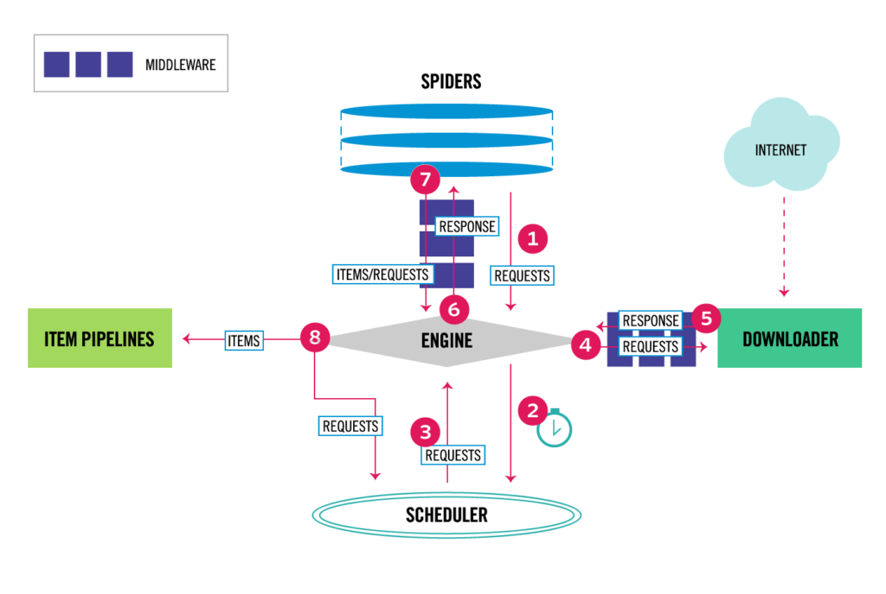

## Scrapy 

Scrapy no es una librería como pudiera parecer, sino un completo framework de web scraping para Python. En la siguiente imagen se muestra la arquitectura de Scrapy con todos sus componentes.

<kbd>
  
</kbd>
    

A grandes rasgos, el funcionamiento de Scrapy es el siguiente:

- En primer lugar, el Engine recibe las peticiones (Requests) iniciales que le envía la araña (Spider), las programa en el scheduler y solicita las siguientes peticiones a rastrear.
- El Scheduler va enviando las peticiones a procesar al Engine y este a su vez las envía al componente Downloader.
- La página es descargada y se crea una respuesta (Response) de esta página que el Engine se encarga de enviar a la araña para que sea procesada.
- Es entonces cuando la araña o rastreador devuelve al Engine los ítems (Items) con la información extraída de la página.
- Después, estos ítems son enviados a los Pipelines para procesar y almacenar la información.
- El proceso se repite hasta que el Scheduler se quede sin peticiones.

Una de las principales ventajas de este framework es que las peticiones se procesan y programan de manera asíncrona. Debido a ello, Scrapy no espera a que termine una petición para enviar otra y se pueden ejecutar a la vez de forma concurrente, acelerando el proceso en gran medida. Además, si una petición falla, el resto de las peticiones seguirán ejecutándose.
